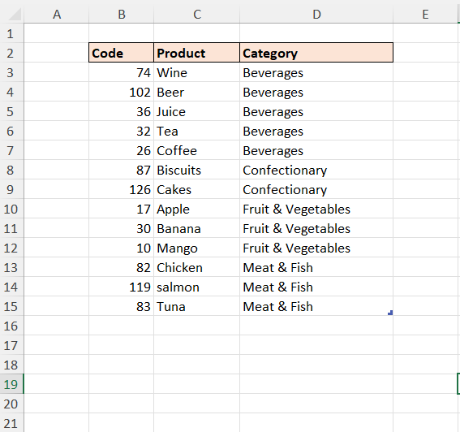
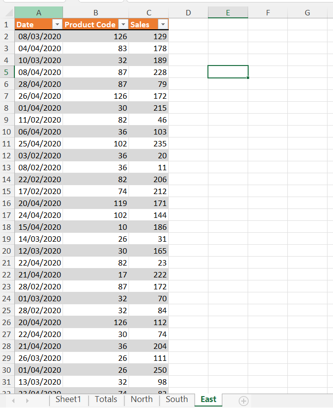
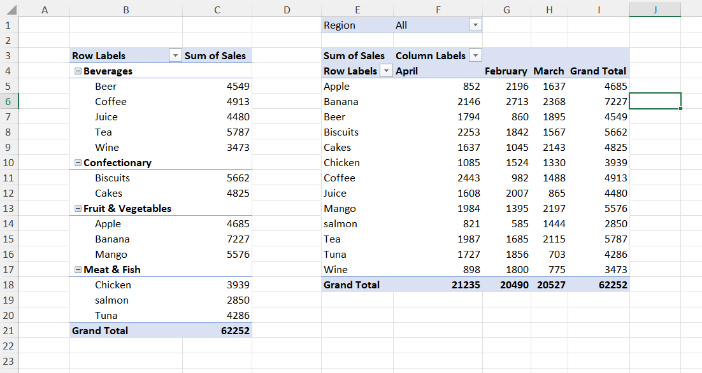
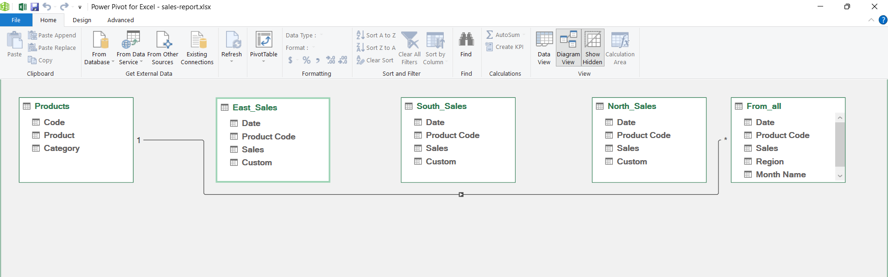
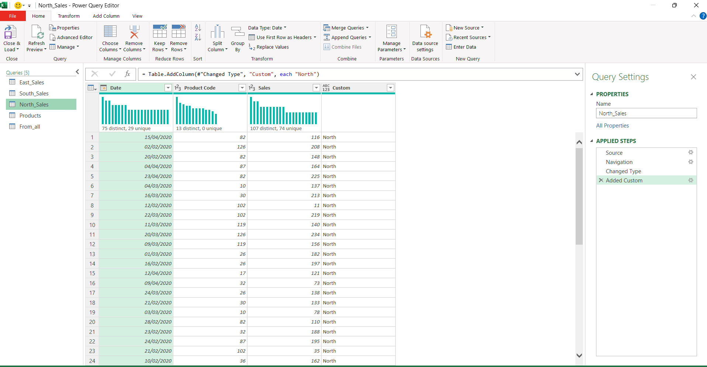
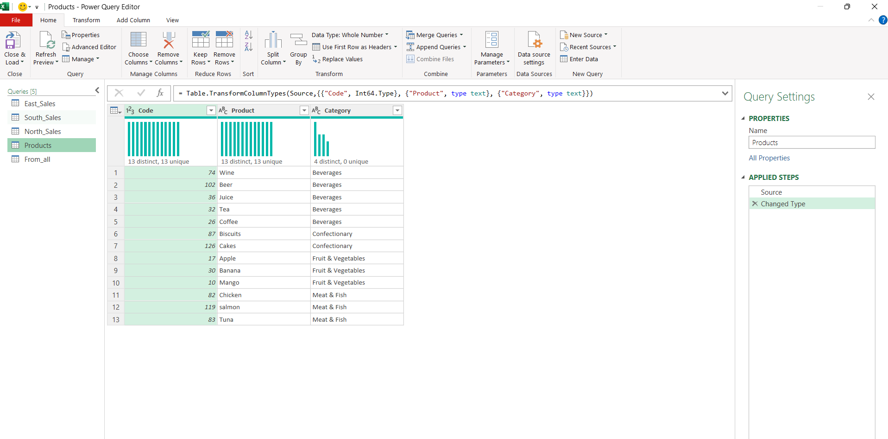
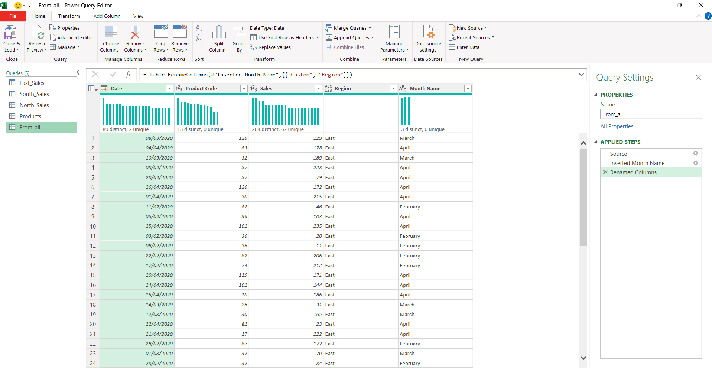

# Excel Challenge #3: Power Query and Pivot Tables

This repository contains my solution to the Excel Challenge #3 from GoSkills[cite: 3]. This challenge tests the integration of advanced **Power Query** features (data consolidation, joining, and conditional logic) with **Pivot Tables** to build dynamic multi-dimensional reports[cite: 3].

## 📋 Task Overview

The project requires consolidating and analyzing multi-source sales reports split across different files[cite: 3]:
* **`sales-report.xlsx`:** Contains a baseline `products` reference table with `Code`, `Product`, and `Category`[cite: 3].
* **`sales-data.xlsx`:** Contains three region-specific sheets: `North_Sales`, `South_Sales`, and `East_Sales`[cite: 3].

### 🎯 Key Objectives:
1. **Consolidate & Stack:** Import only the three regional sales tables from the external workbook and append (stack) them into a single consolidated list, ignoring all other content[cite: 3].
2. **Relational Data Merge:** Extract corresponding product details (`Name`, `Category`) by joining the consolidated sales records with the master `products` table[cite: 3].
3. **Dynamic Meta-data Extraction:** Add a custom region column automatically derived from the original source table names[cite: 3].
4. **Conditional Grouping:** Create a conditional segmentation column that groups sales volumes into distinct brackets: `0-49`, `50-99`, `100-199`, and `200+`[cite: 3].
5. **Future-Proof Automation:** Ensure the model dynamically imports new regional entries (e.g., `West_Sales`) upon clicking **Refresh**[cite: 3].
6. **Reporting:** Build two distinct Pivot Tables summarizing performance across various intersections of metrics[cite: 3].

---

## 🛠️ Data Engineering & Analysis Steps

* **External Data Connection:** Configured a Power Query data source linking directly to the external `sales-data.xlsx` workbook[cite: 3].
* **Table Appending:** Combined regional data sheets into a unified data array, isolating structural tracking attributes.
* **Query Merging:** Executed a Join operation between the appended sales query and the local product dimension schema based on the unique `Code` attribute[cite: 3].
* **Conditional Column Logic:** Added an evaluation step to automatically flag sales scale intervals based on quantity tiers[cite: 3].
* **Pivot Table Architecture:** Structured summary data layouts focusing on hierarchical categorization, monthly breakdowns, and regional slicing filters[cite: 3].

---

## 🏆 FINAL SOLUTION

