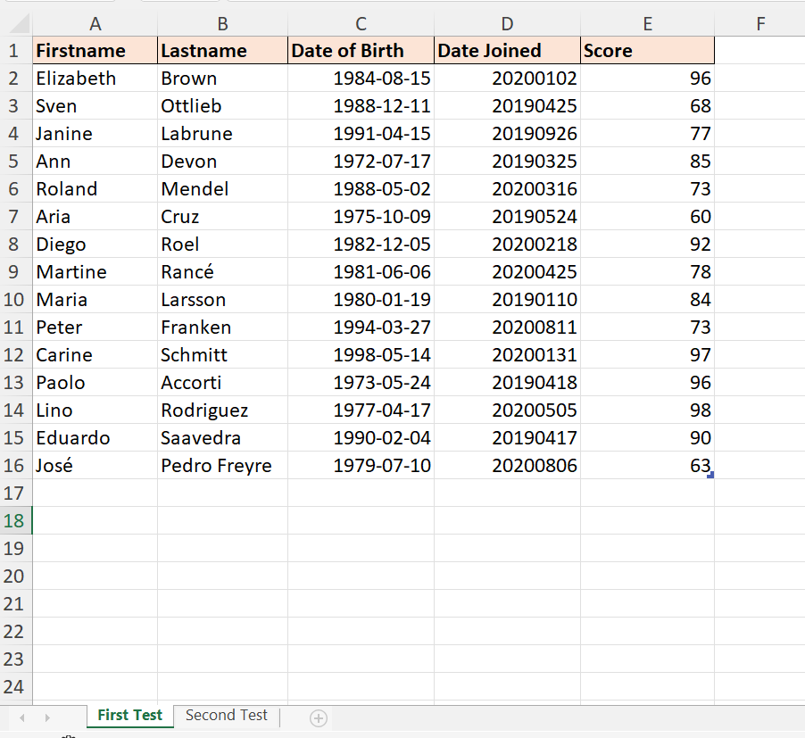
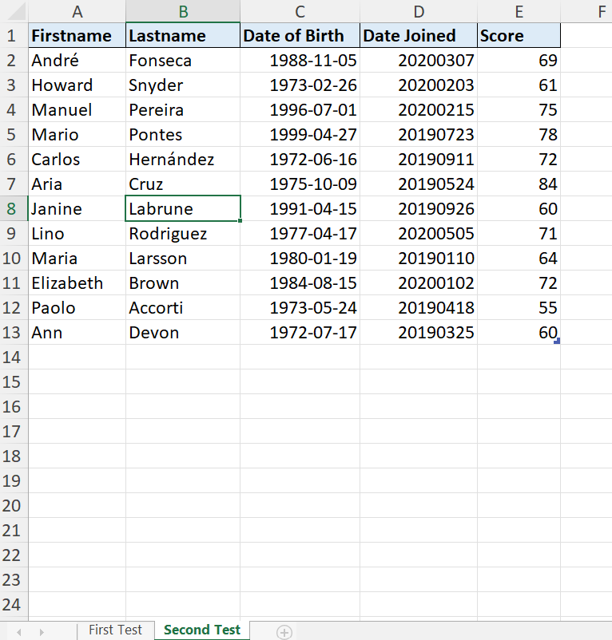
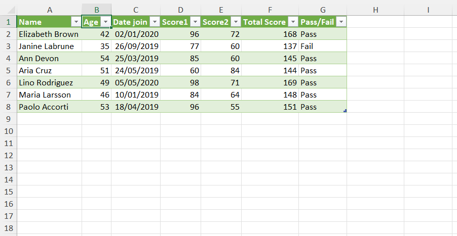

# Excel Challenge #4: Analyze Data With Power Query

This repository contains my solution to the Excel Challenge #4 from GoSkills. This challenge focuses on utilizing advanced data modeling techniques inside **Power Query** to shape, group, and analyze raw datasets according to specific corporate reporting requirements.

## 📋 Task Overview

The challenge simulates a real-world business request where a manager requires a customized, structured summary table from a raw data export using Power Query.

### 🎯 Key Objectives:
1. **Data Connection & Import:** Successfully connect to and extract the challenge source dataset.
2. **Advanced Shifting & Transformation:** Restructure the unformatted columns and records into a clean, normalized relational database format.
3. **Data Aggregation & Grouping:** Group and analyze specific metrics to meet precise business analytical requirements.
4. **Dynamic Refresh Automation:** Ensure the entire query pipeline is fully dynamic, automatically processing any new transactions added to the underlying source data upon hitting **Refresh**.

---

## 🛠️ Data Engineering & Analysis Steps

* **Query Design:** Established an ETL (Extract, Transform, Load) workflow inside the Power Query editor to minimize manual spreadsheet adjustments.
* **Data Cleansing:** Standardized text cases, fixed data types (Dates, Values, and Categories), and eliminated redundant rows or null markers.
* **Advanced Grouping:** Leveraged the `Group By` feature to aggregate complex attributes into a simplified, high-level business table.
* **Automated Data Pipeline:** Configured the queries to remain dynamic, allowing seamless scalability when new rows or test scenarios are appended.

---

## 🏆 FINAL SOLUTION

