# Excel Challenge #5: Formula Super Challenge

This repository contains my solution to the Excel Challenge #5 from GoSkills. This challenge is a comprehensive diagnostic exercise focused on auditing, troubleshooting, and repairing broken spreadsheet logic across a wide variety of functional models.

## 📋 Task Overview

The project consists of **12 distinct formula problems**, each hosted on a dedicated worksheet. The data contains logical errors, structural breakdown bugs, and native runtime warning messages that compromise reporting integrity.

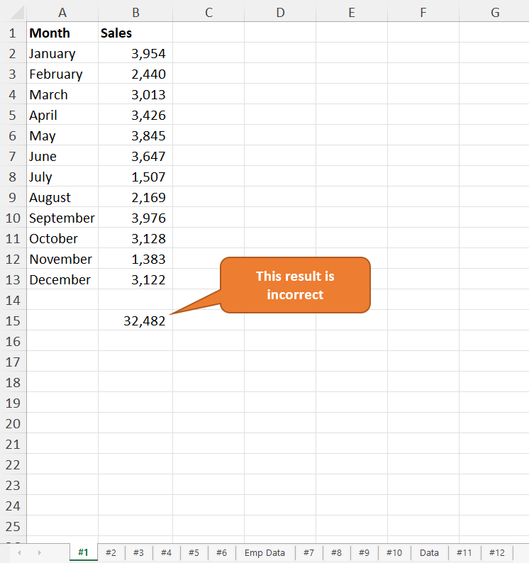
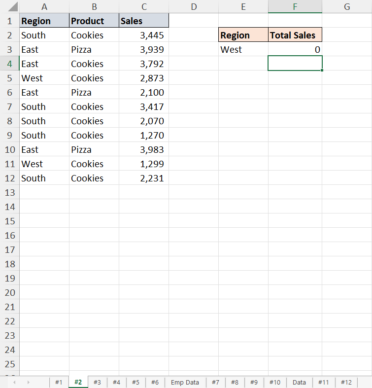
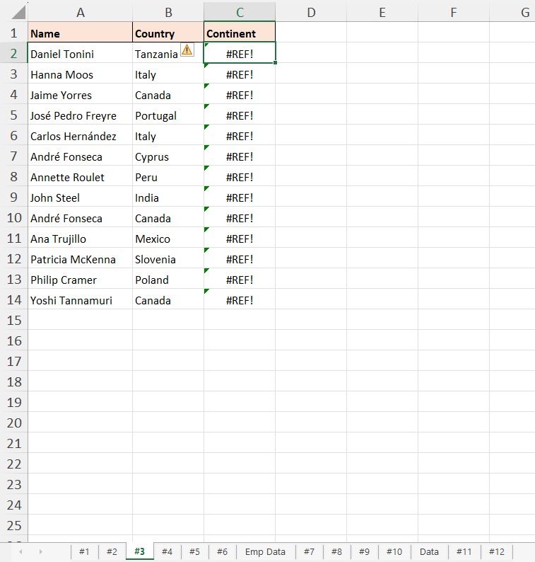
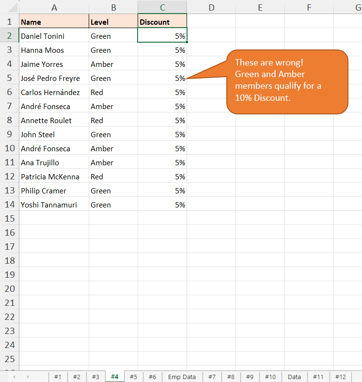
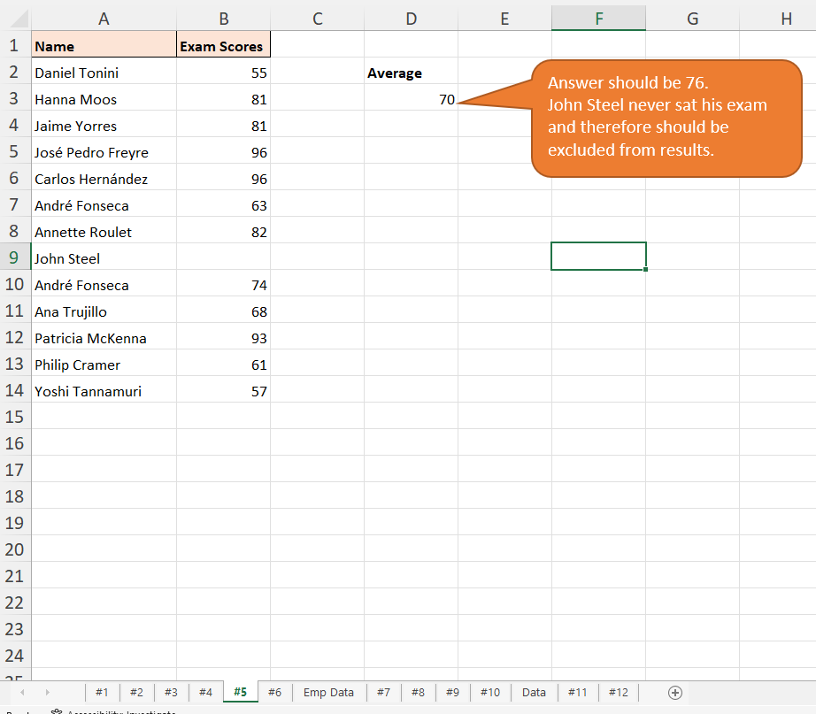
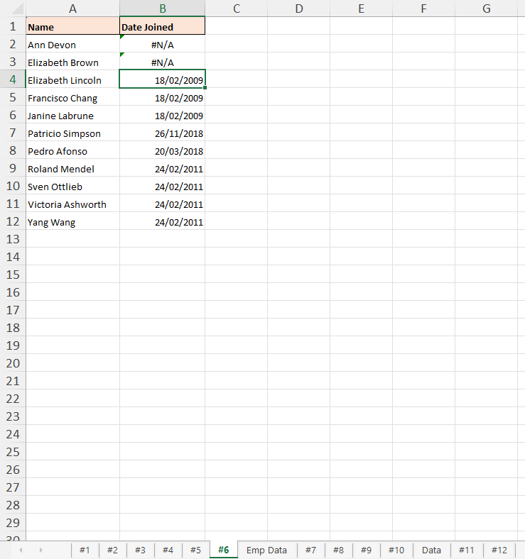
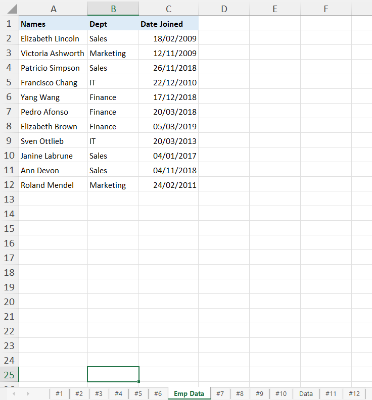
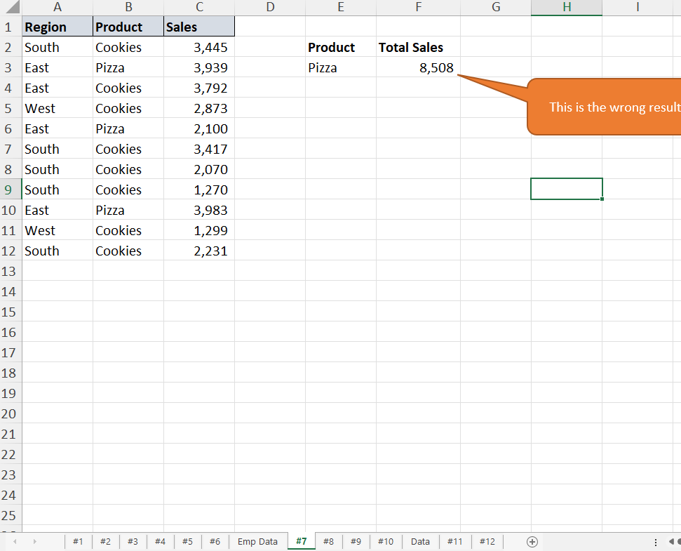
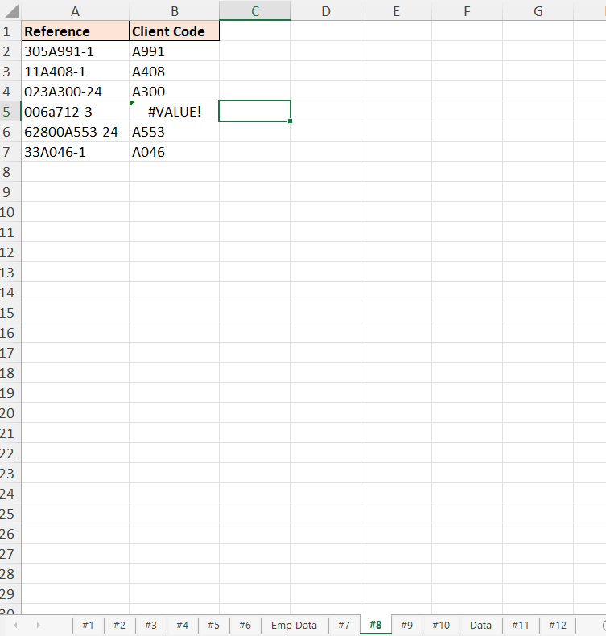
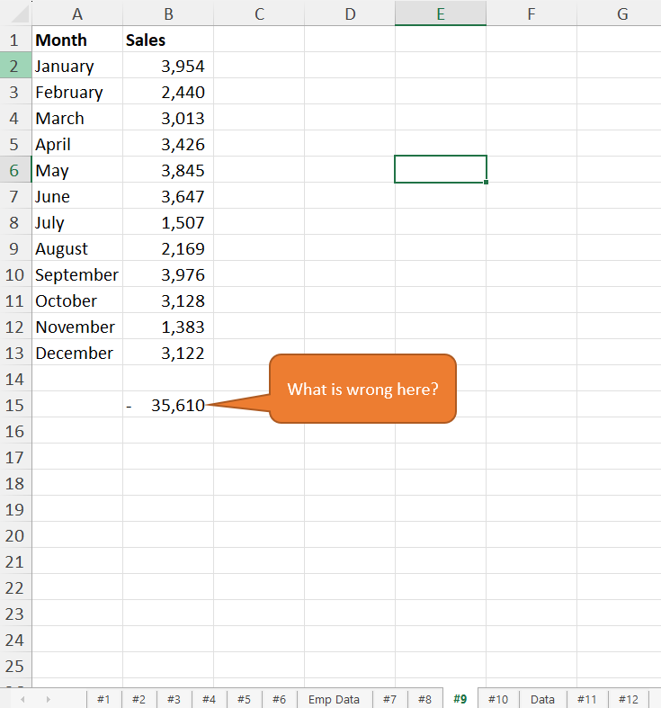
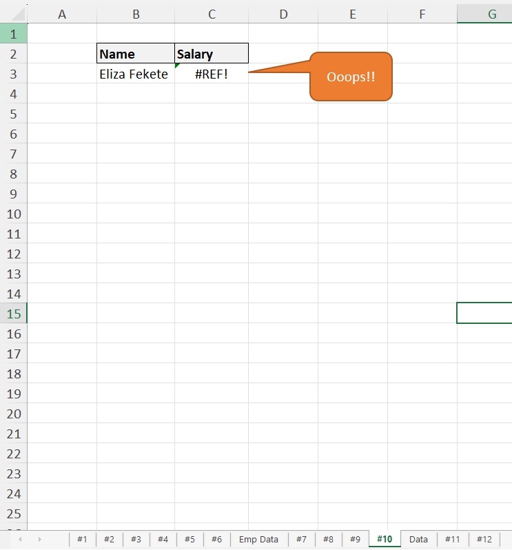

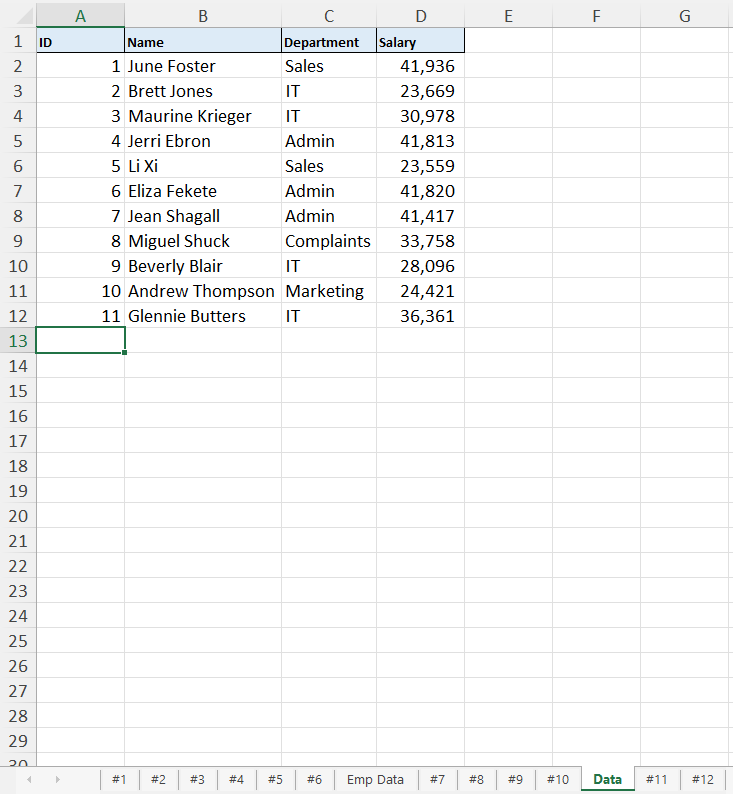
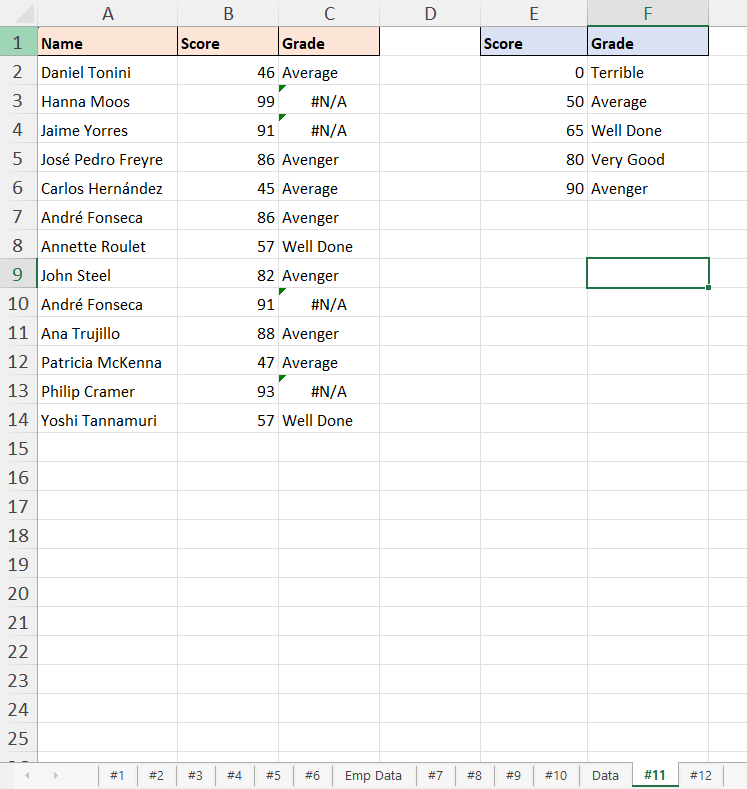
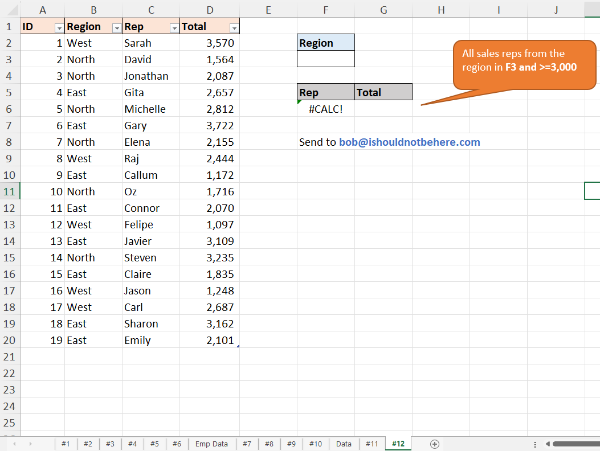

### 🎯 Key Objectives:
1. **Error Diagnosis:** Audit 12 structurally unique spreadsheet defects causing broken computations or incorrect aggregation results.
2. **Formula Refactoring:** Correct syntax configurations, reference masks, and evaluation parameters without disrupting source data layouts.
3. **Bug Resolution:** Debug runtime syntax failures, including standard Excel errors such as `#VALUE!`, `#REF!`, `#N/A`, and `#NAME?`.
4. **Time Optimization:** Build an optimal execution strategy to trace dependency pathways and fix broken formulas across all operational worksheets efficiently.

---

## 🛠️ Data Engineering & Analysis Steps

* **Logical Auditing:** Leveraged Excel’s Formula Auditing toolkit (`Trace Dependents`, `Trace Precedents`, and `Evaluate Formula`) to pinpoint execution failures.
* **Syntax Optimization:** Repaired logical argument misalignments, fixed string absolute path boundaries, and updated broken reference lookups.
* **Error Handling Isolation:** Wrapped structural dependencies with validation functions to cleanly intercept structural data gaps.
* **Calculated Field Calibration:** Standardized date formats, text strings, and numerical types to ensure fluid data aggregation across downstream tables.
