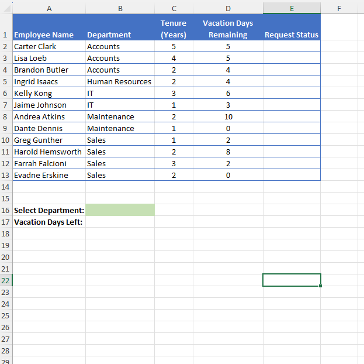
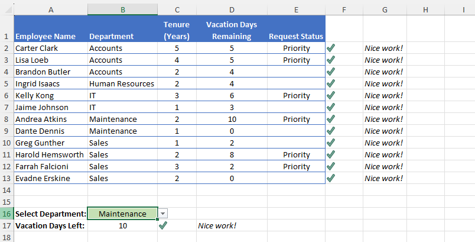

# Excel Challenge #6: Using Basic Logical Functions

[cite_start]This repository contains my solution to the Excel Challenge #6 from GoSkills[cite: 752, 772]. [cite_start]This challenge focuses on applying conditional logic and statistical criteria aggregation using native spreadsheet functions to solve an HR priority routing workflow[cite: 762, 773, 777].

## 📋 Task Overview

[cite_start]The project simulates a year-end Human Resources operational scenario where employees are rushing to claim remaining vacation days[cite: 776, 777]. [cite_start]The HR Department requires an automated matrix to prioritize vacation approvals based on employee tenure and remaining leave balances[cite: 777].

### 🎯 Key Objectives:
1. [cite_start]**Priority Evaluation:** Write a logical formula in column E to mark an employee as "Priority" if they have more than 5 vacation days remaining OR if their company tenure is 3 years or more[cite: 780, 781].
2. [cite_start]**Blank State Formatting:** Ensure that if neither condition is met, the cell remains entirely blank[cite: 782].
3. [cite_start]**Departmental Criteria Querying:** Build an analytical lookup formula in cell B17 that dynamically aggregates total remaining vacation days based on a department selected from a B16 drop-down list[cite: 783, 784].

---

## 🛠️ Data Engineering & Analysis Steps

* [cite_start]**Nested Logical Arguments:** Implemented a combination of `IF` and `OR` functions to construct a multi-conditional evaluation layer for the request status routing[cite: 762].
* [cite_start]**Conditional Criteria Aggregation:** Leveraged the `SUMIF` function to dynamically sum remaining vacation balances matching variable department filter states[cite: 762, 784, 788].
* [cite_start]**Interface Alignment:** Integrated data collection boundaries using the cell B16 data validation list to trigger responsive updates in the dashboard calculations[cite: 784].

---

## 🏆 FINAL SOLUTION

You can review and download the completed workbook containing the conditional evaluation logic and departmental summaries here:

👉 [Download excel-challenge-6-FINAL.xlsx](./6-Challenge_UsingBasicLogicalFunctions/excel-challenge-6-FINAL.xlsx)