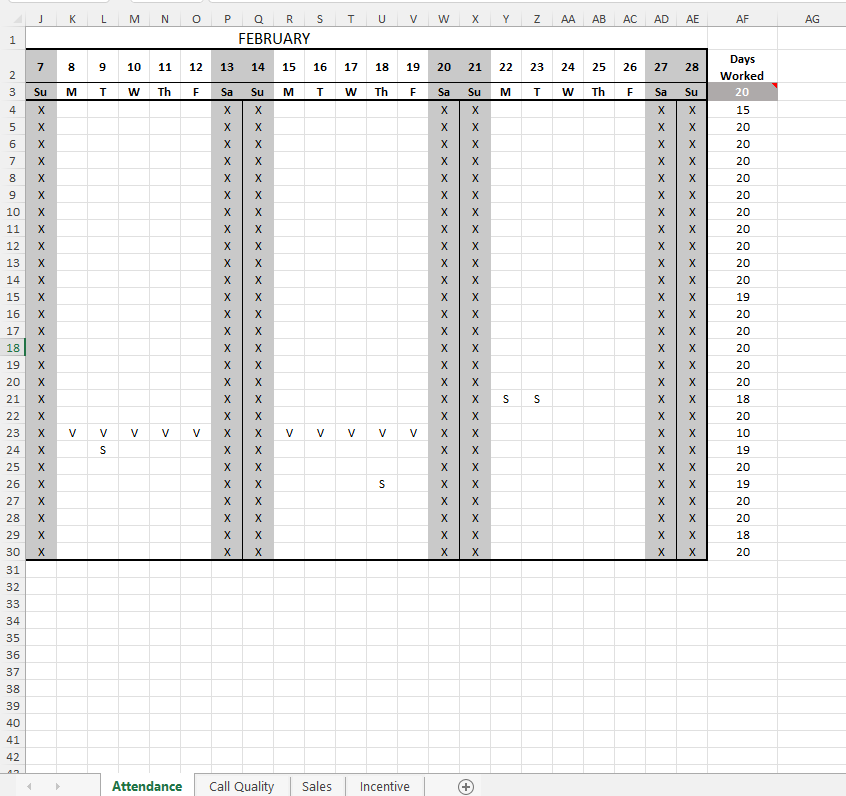
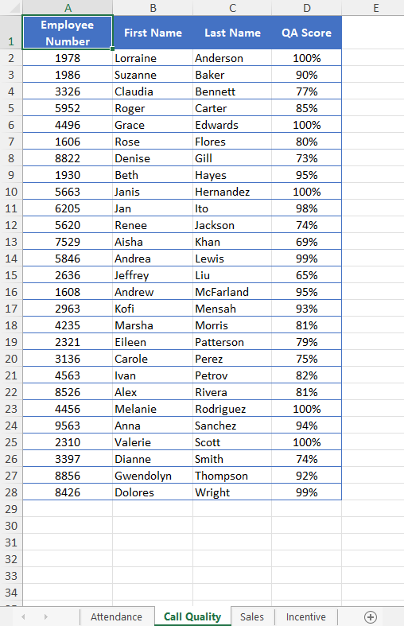
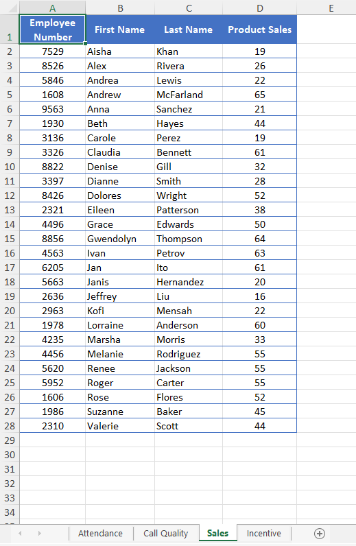
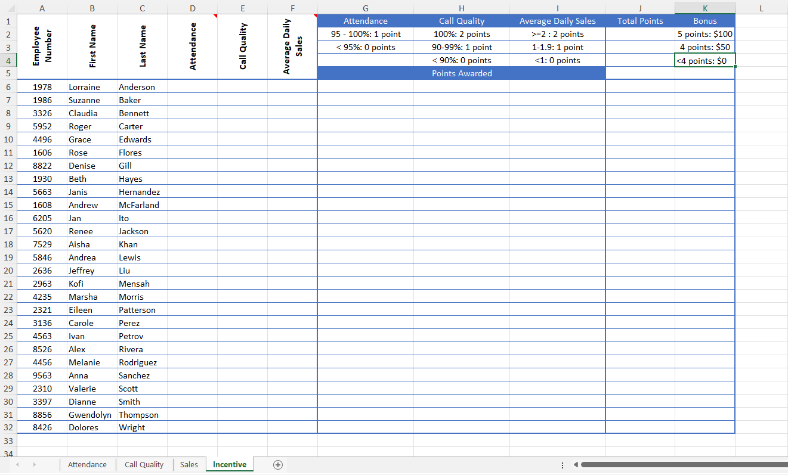
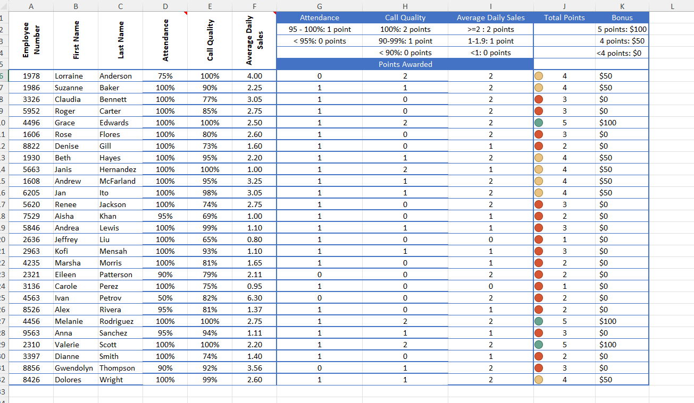

# Excel Challenge #8: Create a Performance Incentive Worksheet

This repository contains my solution to the Excel Challenge #8 from GoSkills. This challenge focuses on data aggregation from multiple sub-sheets, conditional performance scoring, and data visualization via icon sets to compile an automated contact center incentive report.

## 📋 Task Overview

The workbook consists of four tables: `Attendance`, `Call Quality`, `Sales`, and `Incentive`. The first three sheets contain raw agent metrics, while the main sheet consolidates this data to evaluate bonus payouts against a 5-point maximum system.

### 🎯 Key Objectives:
1. **Attendance Point Logic:** Calculate the attendance percentage and reward 1 point if it reaches 95% or higher, and 0 points if below.
2. **Call Quality Grading:** Pull metrics from Quality Assurance to award 2 points for a perfect 100% score, 1 point for 90%–99%, and 0 points for scores below 90%.
3. **Sales Performance Calculations:** Evaluate total sales against days worked. Award 2 points for averaging 2+ sales per day, 1 point for an average between 1 and 2 sales, and 0 points for averages below 1.
4. **Conditional Formatting KPI Icons:** Apply a visual system in Column J using green indicators for 5 points, amber for 4 points, and red for anything lower.
5. **Bonus Mapping Allocation:** Automate the final bonus calculation row to award a $100 bonus to agents with 5 points, and $50 to agents with 4 points.

---

## 🛠️ Data Engineering & Analysis Steps

* **Multi-Sheet Data Gathering:** Utilized cross-sheet references and lookup arrays (`VLOOKUP` / `XLOOKUP`) to compile disparate source metrics into a single table interface.
* **Nested Logical Formulas:** Developed customized nested `IF` statements to evaluate tiered point systems and step-distribution bonus scales.
* **Conditional Formatting Thresholds:** Configured native KPI indicator rule-masks to automatically tag performance scores into distinct colored alert brackets.

---

## 🏆 FINAL SOLUTION

You can review and download the completed workbook containing the consolidated agent incentive performance system here:

👉 [Download excel-challenge-8-FINAL.xlsx](./8-Challenge_CreateAPerformanceIncentiveWorksheet/excel-challenge-8-FINAL.xlsx)