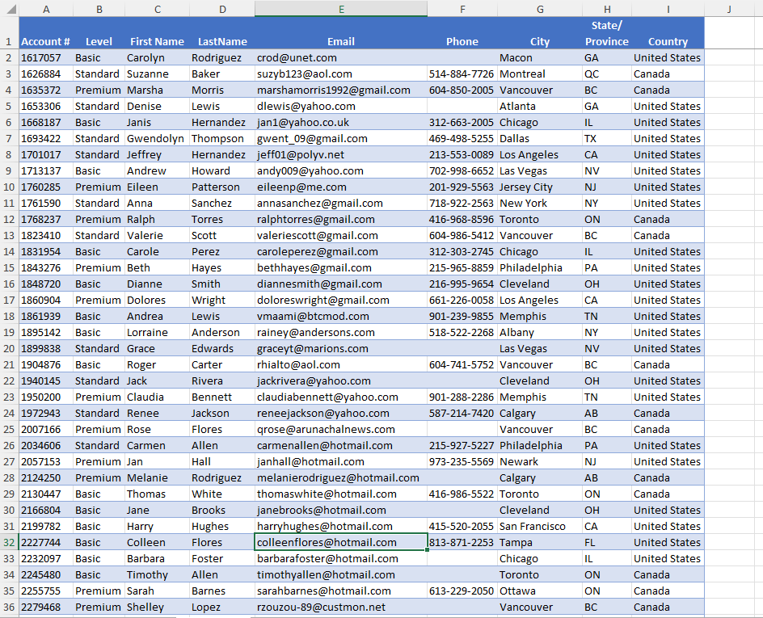
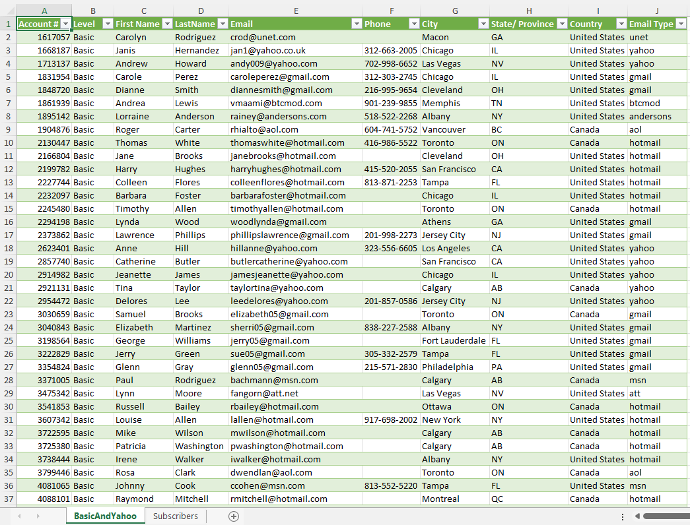
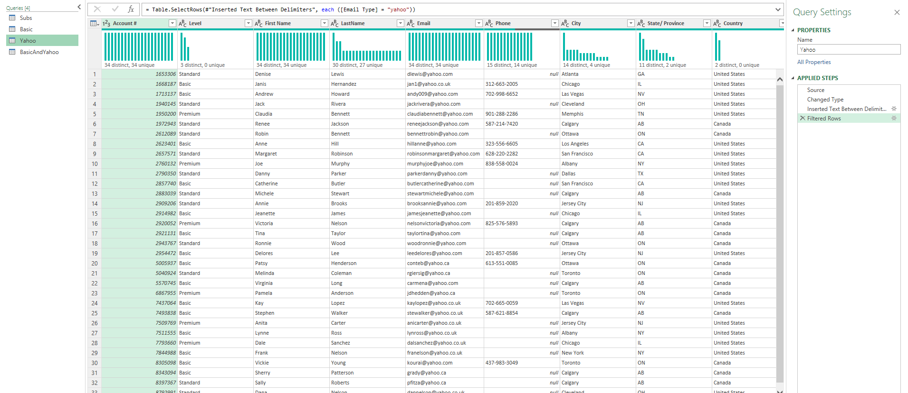

# Excel Challenge #13: Use Partial Match to Find Multiple Criteria

This repository contains my solution to the Excel Challenge #13 from GoSkills. This challenge focuses on data filtration methodologies, advanced criteria matching, and the deployment of wildcard sorting tokens within relational customer databases.

## 📋 Task Overview

The project handles an operational dataset from an online video streaming service tracking its global customer database. The company wants to target a marketing promotion specifically to customers who hold a "Basic" tier subscription level OR those who utilize a Yahoo email domain.

### 🎯 Key Objectives:
1. **Multi-Criteria Data Extraction:** Isolate specific customer profiles matching variable conditions across non-adjacent columns.
2. **Partial String Matching:** Formulate a logic layer to search inside email strings to locate sub-string domain patterns (e.g., matching any address ending in "@yahoo.com").
3. **Advanced Filter Deployment:** Configure advanced filter queries to handle logical `OR` conditions across separate attributes simultaneously.
4. **Database Record Extraction:** Extract the complete corresponding rows for all filtered targets without altering the original database structure.

---

## 🛠️ Data Engineering & Analysis Steps

* **Wildcard Token Implementation:** Leveraged partial match wildcard characters (such as `*yahoo*`) to capture target email variables irrespective of username variations.
* **Advanced Filter Criteria Matrix:** Constructed a standalone query criteria range block using row-stacked variables to enforce non-exclusive logical `OR` filtering arrays.
* **Database Slicing:** Processed the customer ledger using structured filters to isolate compliant accounts while maintaining core ledger dependencies.

---

## 🏆 FINAL SOLUTION

You can review and download the completed workbook containing the filtered customer database and wildcard search strings here:

👉 [Download excel-challenge-13-FINAL.xlsx](./13-Challenge_UsePartialMatchToFindMultipleCriteria/excel-challenge-13-FINAL.xlsx)