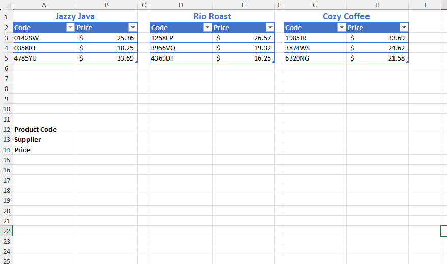
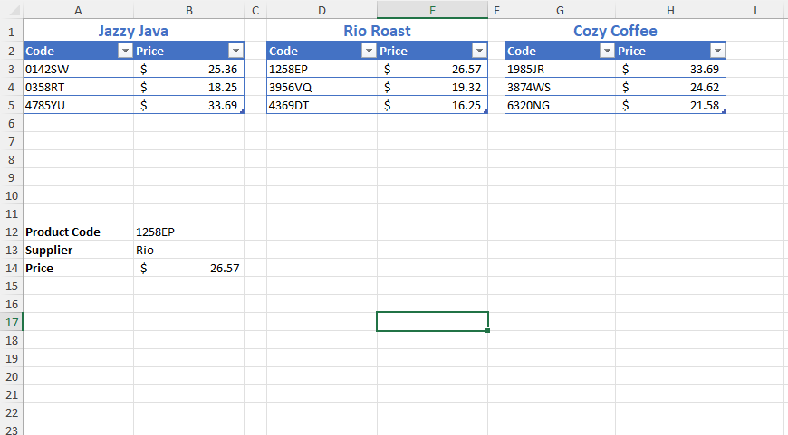
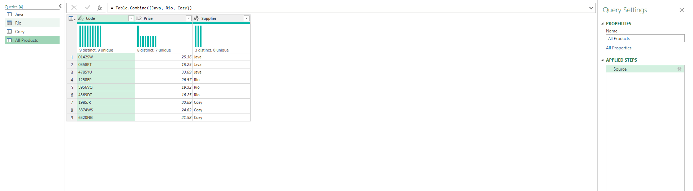

# Excel Challenge #14: Perform a Lookup From Multiple Sources

This repository contains my solution to the Excel Challenge #14 from GoSkills. This challenge focuses on relational data mapping across disjointed tables, dynamic data validation consolidation, and advanced multi-source lookup workflows using Dynamic Arrays or Power Query.

## 📋 Task Overview

The project simulates an operational scenario for a coffee shop that receives its inventory supplies from three independent manufacturers. Each supplier's catalog is formatted as a standalone table containing unique product codes and associated price structures.

### 🎯 Key Objectives:
1. **Dynamic Dropdown Consolidation:** Build a single, unified product code selection dropdown list that aggregates records from all three discrete supplier tables.
2. **Multi-Source Attribute Extraction:** Formulate a search lookup query to dynamically return both the correct supplier name and the item price once a product code is selected.
3. **Dynamic Table Expansion:** Ensure that all dropdown indexes, analytical lookup formulas, and downstream results update automatically whenever items are appended to or removed from any of the manufacturer sheets.
4. **Scalable Architecture:** Optimize the calculation pipeline using modern spreadsheet features like Dynamic Array formulas or Power Query ETL connections.

---

## 🛠️ Data Engineering & Analysis Steps

* **Multi-Table Data Consolidation:** Leveraged advanced arrays or Power Query stacking queries to append separate supplier datasets into a single relational reference index.
* **Complex Data Extraction:** Programmed multi-source lookup arrays utilizing flexible logical boundaries to cross-reference entries and extract matching attributes across variable grid coordinates.
* **Dynamic Range Referencing:** Applied structural table references and anchor operators to guarantee automated index scaling when product tables expand or contract.

---

## 🏆 FINAL SOLUTION

You can review and download the completed workbook containing the consolidated data model, master dropdown validation, and multi-source lookup engine here:

👉 [Download excel-challenge-14-FINAL.xlsx](./14-Challenge_PerformALookupFromMultipleSources/excel-challenge-14-FINAL.xlsx)