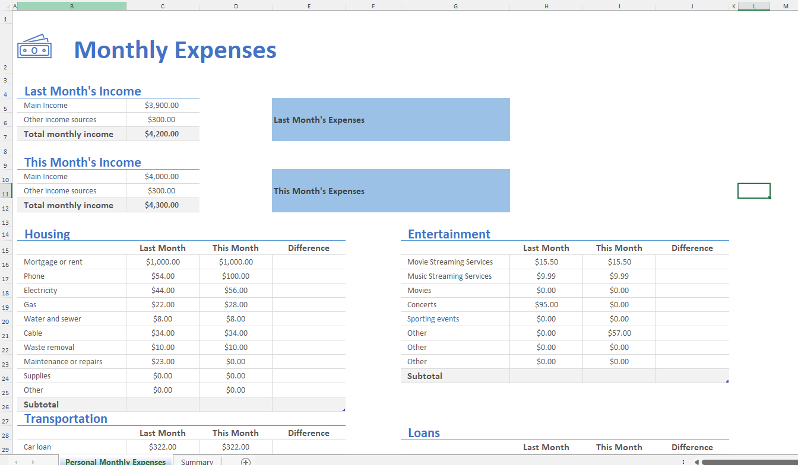
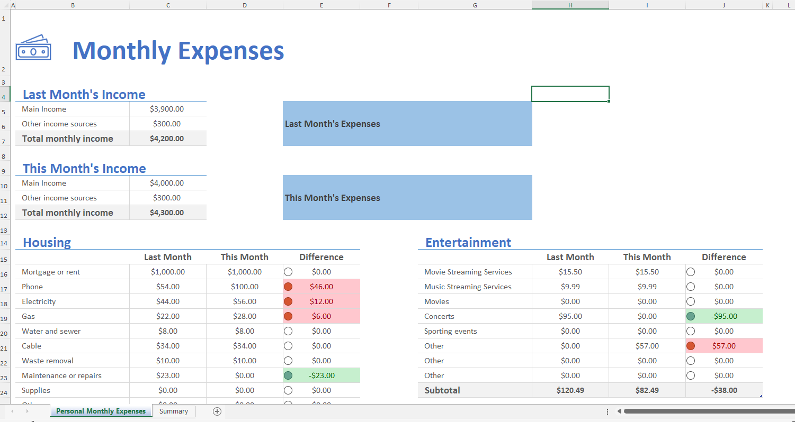
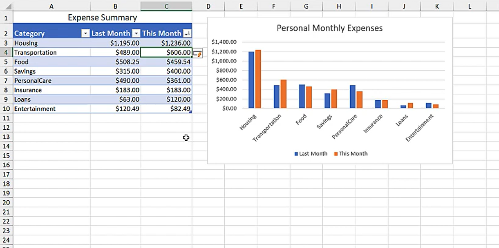

# Excel Challenge #15: Track Expenses with Data Visualization

This repository contains my solution to the Excel Challenge #15 from GoSkills. This challenge focuses on financial expense tracking, the integration of bidirectional conditional formatting rules, and structural data visualization configurations using dynamic reporting charts.

## 📋 Task Overview

The project handles a monthly expense tracking dataset split across multiple categorical matrices, including Transportation and Insurance. Each cost line-item evaluates performance using a comparative "Last Month" vs. "This Month" baseline ledger structure where variance gaps must be isolated inside a Difference column.

### 🎯 Key Objectives:
1. **Variance Calculations:** Formulate tracking logic to calculate expenditure changes between the current period and the previous baseline.
2. **Bi-Chromatic Conditional Formatting:** Enforce strict visual formatting rules where font properties automatically color green for favorable decreases (spending less) and turn red for negative budget overruns (spending more).
3. **KPI Indicator Integration:** Embed native traffic light conditional icon sets inside the Difference column to signal expenditure performance states at a glance.
4. **Cross-Sheet Aggregation Summary:** Structure a master Summary worksheet that dynamically consolidates subtotal expense groups for both periods across all operational categories.
5. **Dynamic Data Visualization:** Generate a column chart or bar graph mapping subtotal changes over time, ensuring the data range scales seamlessly when new category records are appended to the main summary board.

---

## 🛠️ Data Engineering & Analysis Steps

* **Favorable Delta Logic:** Configured inverse variance parameters to align formatting highlights with financial expenditure rules where cost containment represents positive progress.
* **Multi-Layered Formatting Masking:** Applied conditional logical parameters combining string color overrides with structural three-tier status icons.
* **Dynamic Range Interfacing:** Converted raw analytical cells into official structured Excel Tables to establish dynamic dashboard anchors.
* **Scalable Chart Modeling:** Bound the chart engine to self-expanding structural data sources to guarantee immediate chart updating upon category insertions.

---

## 🏆 FINAL SOLUTION

You can review and download the completed workbook containing the automated expense tracker, conditional status thresholds, and dynamic summary dashboard here:

👉 [Download excel-challenge-15-FINAL.xlsx](./15-Challenge_TrackExpensesWithDataVisualization/excel-challenge-15-FINAL.xlsx)