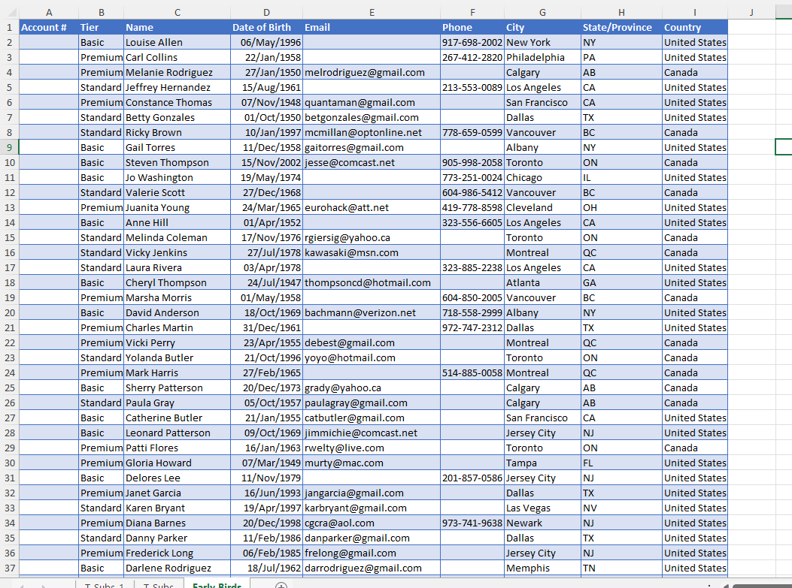
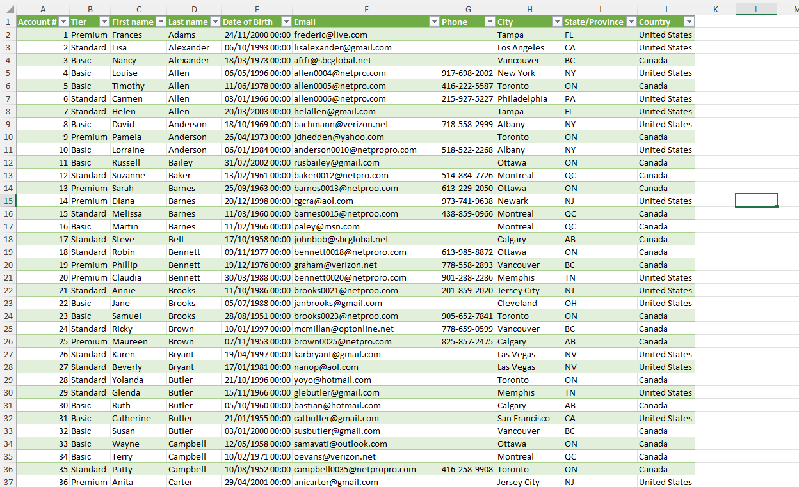
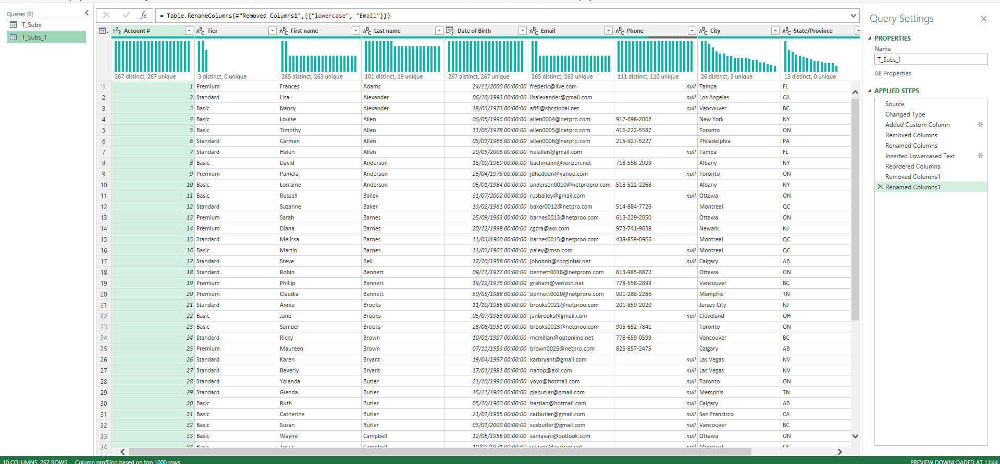

# Excel Challenge #16: Techniques for Manipulating Text

This repository contains my solution to the Excel Challenge #16 from GoSkills. This challenge focuses on text string manipulation, alphanumeric sequence formatting, conditional data generation, and custom record sorting within customer databases.

## 📋 Task Overview

The project handles an Early Bird promotion sign-up dataset containing 284 new subscribers for an internet service provider called "Netpro". The raw data requires systemic sorting, custom account token assignment, and conditional email address generation based on a standardized corporate schema.

### 🎯 Key Objectives:
1. **Alphabetical Record Sorting:** Sort the entire customer dataset alphabetically using the customers' last names as the primary sorting boundary.
2. **Sequential Alphanumeric Padding:** Dynamically assign fixed four-digit account numbers so the first sorted record starts at `0001` and the final subscriber maps precisely to `0284`.
3. **Conditional Email Generation:** Identify records that are missing an email address and dynamically generate a customized corporate email address for them.
4. **Standardized Format Masking:** Structure new email creations to strictly follow the corporate syntax profile: `lastname + accountnumber + @netpro.com` (e.g., `surname0123@netpro.com`).

---

## 🛠️ Data Engineering & Analysis Steps

* **Database Matrix Sorting:** Applied standard A-to-Z execution parameters across the ledger data structure, setting the surname column as the structural priority index.
* **String Padded Sequencing:** Leveraged native cell formatting tools or custom text expressions (such as the `TEXT` function or advanced Autofill patterns) to enforce the `0000` text padding layout on sequential digits.
* **String Concat Logic:** Implemented text compilation functions (`CONCAT`, `CONCATENATE`, or `&` operators) to cleanly merge customer surnames, padded numeric tokens, and the fixed domain string.
* **Conditional Data Filling:** Applied logical evaluation checks to ensure existing client emails remained untouched while empty data gaps were systematically filled.

---

## 🏆 FINAL SOLUTION

You can review and download the completed workbook containing the processed Netpro database, padded account lists, and generated email fields here:

👉 [Download excel-challenge-16-FINAL.xlsx](./16-Challenge_TechniquesForManipulatingText/excel-challenge-16-FINAL.xlsx)