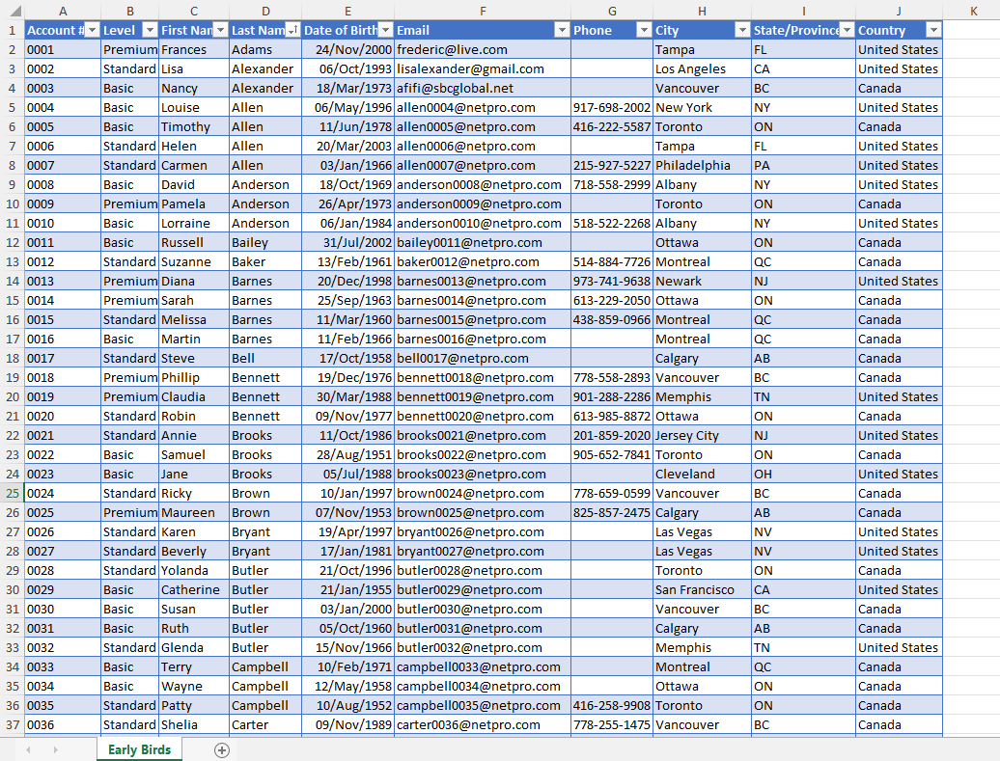
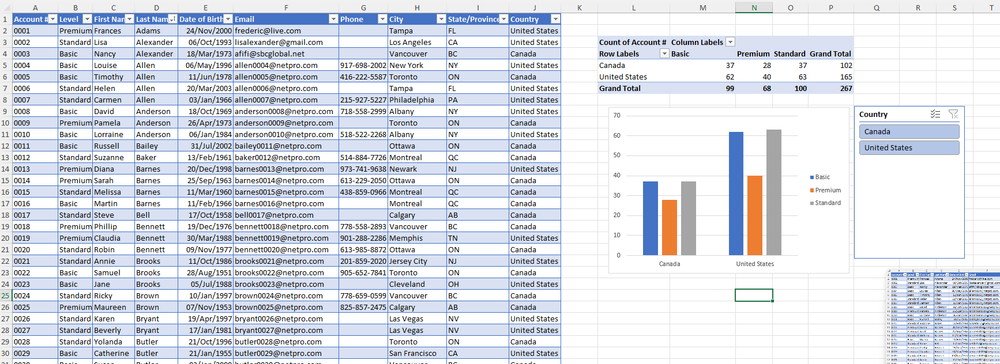

# Excel Challenge #17: Summarize Data with Interactive PivotTables and Charts

This repository contains my solution to the Excel Challenge #17 from GoSkills. This challenge focuses on data aggregation, multi-dimensional database summarization, and the construction of interactive dashboard charts to provide high-level stakeholder reporting overview.

## 📋 Task Overview

The project addresses a scenario where a large customer ledger contains too much operational detail for the General Manager, who requires a clean, high-level business summary. The objective is to restructure this extensive database into an interactive layout mapping the volume of customers in each country, broken down dynamically by subscription tiers.

### 🎯 Key Objectives:
1. **Interactive Data Summarization:** Construct a master Pivot Table and matching Pivot Chart that rolls up the detailed client list into a clean regional overview.
2. **Multi-Level Dimension Breakdown:** Group customer distributions by country as the primary attribute, with segmented columns showing subscription tiers.
3. **Interactive Slicing Controls:** Configure the chart architecture to allow the manager to expand, collapse, or filter specified countries or subscription categories on demand.
4. **Custom Sort Sequence Mapping:** Enforce a non-alphabetical, logical ordering rule for the tier classification to display categories strictly in the custom sequence: `Basic` > `Standard` > `Premium`.

---

## 🛠️ Data Engineering & Analysis Steps

* **Pivot Cache Generation:** Loaded the raw customer database table into an active Pivot Cache to initiate dynamic multidimensional matrix summaries.
* **Hierarchical Row/Column Layout:** Configured spatial grid attributes by placing country markers on the row axis layer and subscription tiers across the column field map.
* **Custom List Indexing:** Overrode standard ascending string sorts to apply an intentional manual sort order ranking sequence (`Basic`, `Standard`, `Premium`).
* **Interactive Chart Integration:** Generated a dynamic Pivot Chart tied directly to the matrix fields, ensuring seamless structural updates when slicers or filter dropdowns are modified by stakeholders.

---

## 🏆 FINAL SOLUTION

You can review and download the completed workbook containing the interactive Pivot Table summary and customized tracking chart here:

👉 [Download excel-challenge-17-FINAL.xlsx](./17-Challenge_SummarizeDataWithInteractivePivotTablesAndCharts/excel-challenge-17-FINAL.xlsx)