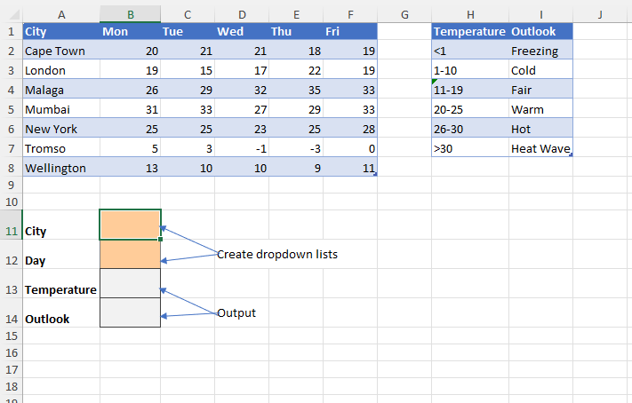
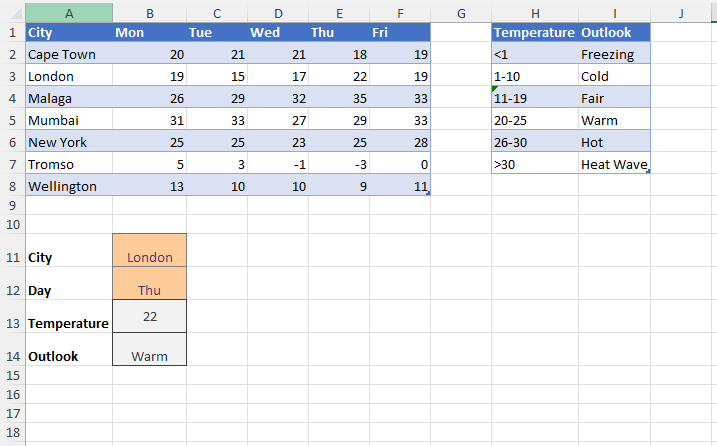

# Excel Challenge #18: Perform a Two-Way Lookup and Approximate Match

This repository contains my solution to the Excel Challenge #18 from GoSkills[cite: 17]. This challenge focuses on bidirectional matrix data retrieval, multi-layered lookup functions, data validation controls, and numeric range categorization using approximate matching algorithms.

## 📋 Task Overview

The project handles a weather analysis dashboard consisting of two distinct reference models:
* **Temperature Forecast Table:** A multidimensional grid tracking 5-day forecasted temperatures for seven international cities.
* **Temperature Outlook Scale:** A secondary data reference mapping numerical temperature intervals to descriptive textual weather definitions (e.g., Freezing, Cold, Fair, Warm, Hot, Heat Wave).

### 🎯 Key Objectives:
1. **Interactive Control Interfacing:** Create dedicated data validation dropdown lists for both the `City` and `Day` input cells to eliminate data entry typos.
2. **Two-Way Coordinate Extraction:** Formulate a bidirectional matrix lookup query to search the grid intersections and return the specific temperature matching the chosen city and day.
3. **Approximate Value Mapping:** Route the extracted temperature value through the reference scale to find and output the corresponding weather outlook condition based on numerical ranges.
4. **Fault-Tolerant Logical Scaling:** Ensure the formula model scales cleanly across dynamic data combinations without requiring hardcoded static cell shifts.

---

## 🛠️ Data Engineering & Analysis Steps

* **Dropdown Constraints Enforcement:** Programmed source arrays to populate user validation pick-lists, restricting input boundaries strictly to predefined city entities and day columns.
* **Matrix Intersection Slicing:** Combined matrix reference commands (utilizing nested `INDEX` and `MATCH` coordinates or advanced multi-criteria `XLOOKUP` functions) to isolate specific grid intersections.
* **Range Classification Mapping:** Configured lookup match modes to execute an approximate tier sweep (`Match Mode: -1` or `1` depending on sort orientation) to evaluate exact bracket positions.
* **Dashboard Logic Layering:** Structured separate functional output fields to divide the raw scalar extraction phase cleanly from the downstream string lookup evaluation.

---

## 🏆 FINAL SOLUTION

You can review and download the completed workbook containing the interactive dropdown matrices, cross-directional lookups, and range-based outlook rules here:

👉 [Download excel-challenge-18-FINAL.xlsx](./18-Challenge_TwoWayLookupAndApproximateMatch/excel-challenge-18-FINAL.xlsx)