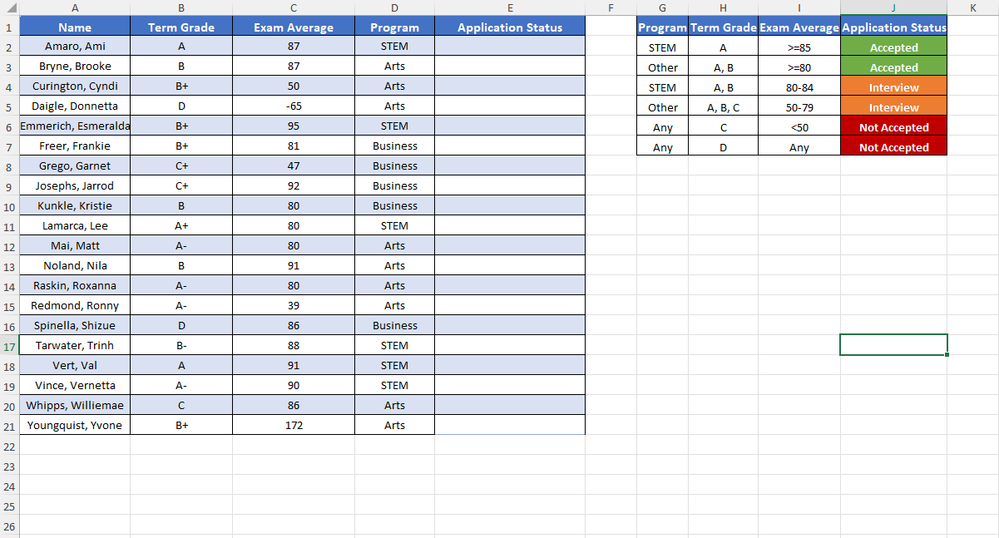
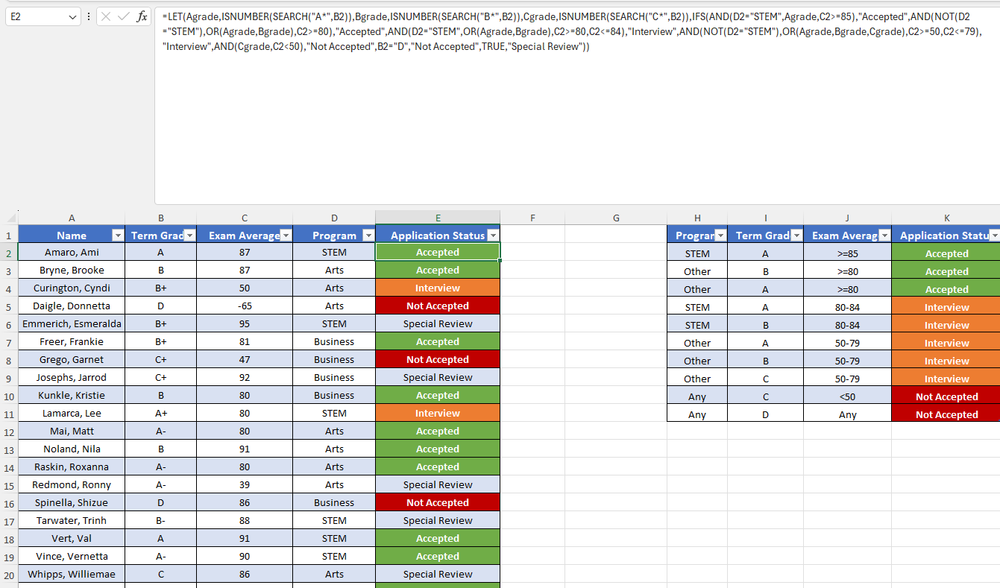

# Excel Challenge #19: Using Advanced Logic to Return Different Results

This repository contains my solution to the Excel Challenge #19 from GoSkills. This challenge focuses on complex multi-criteria boolean evaluations, nested logical programming, and the implementation of tiered filtering arrays to handle variable conditional outcomes within academic database models.

## 📋 Task Overview

The project handles an admissions dataset tracking college student applicants applying for specialized educational disciplines (Arts, Business, or STEM). Processing and determination of the official entry evaluation must be executed automatically within the Application Status column based on variable criteria combinations mapping past performance grades against examination scoring ranges.

### 🎯 Key Objectives:
1. **Multi-Variable Logic Architecture:** Enforce exact validation parameters that dynamically calculate student enrollment evaluations based on specific rule groups.
2. **STEM Program Restrictions:** Route STEM candidates to an "Accepted" status only if they hold an "A" term grade AND score above 85 on the entry exam.
3. **General Program Criteria Mapping:** Evaluate alternate pathways (Arts or Business) to map candidates holding an "A" or "B" grade to "Accepted" if their test score sits at 80 or above.
4. **Interview Pipeline Routing:** Flag records for an "Interview" if a STEM student scores between 80–84 (with an A/B term grade), or if alternate pathways track scores between 50–79 (with an A/B/C term grade).
5. **Rejection Boundary Isolation:** Isolate and flag non-compliant profiles as "Not Accepted" automatically if an applicant holds a "C" term grade with an examination average under 50, or receives a "D" grade under any operational condition.

---

## 🛠️ Data Engineering & Analysis Steps

* **Nested Boolean Pipelines:** Deployed combinations of nested `IF`, `IFS`, `AND`, and `OR` functions to establish a precise operational checklist matrix.
* **Interval Value Categorization:** Structured sequential comparison thresholds within the formulas to isolate numeric intervals (such as bounding specific ranges like 80–84 or 50–79).
* **Multi-Criteria Branching:** Configured logical decision paths to split validation workflows based on different category attributes (`STEM` vs. `Other`).
* **Automated Data Processing:** Engineered the data cells to maintain interactive expansion capabilities, ensuring downstream calculations update upon the arrival of new entries.

---

## 🏆 FINAL SOLUTION

You can review and download the completed workbook containing the advanced logical criteria matrix and automated student evaluation scripts here:

👉 [Download excel-challenge-19-FINAL.xlsx](./19-Challenge_UsingAdvancedLogicToReturnDifferentResults/excel-challenge-19-FINAL.xlsx)