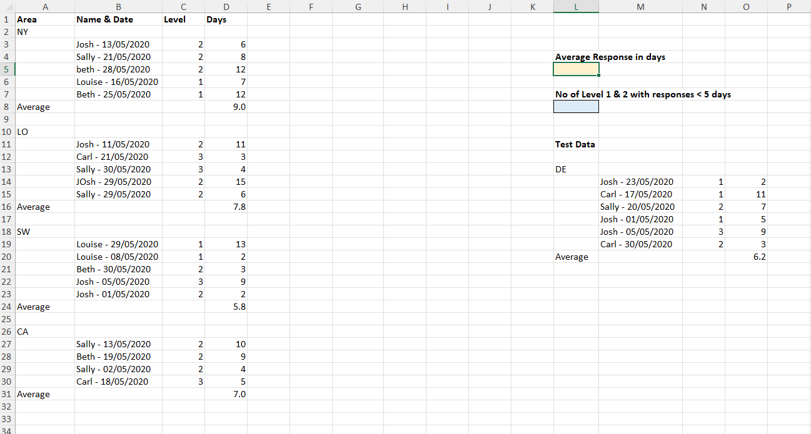
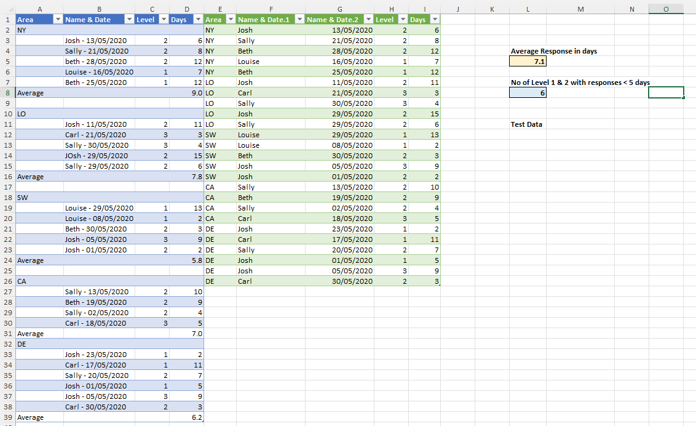
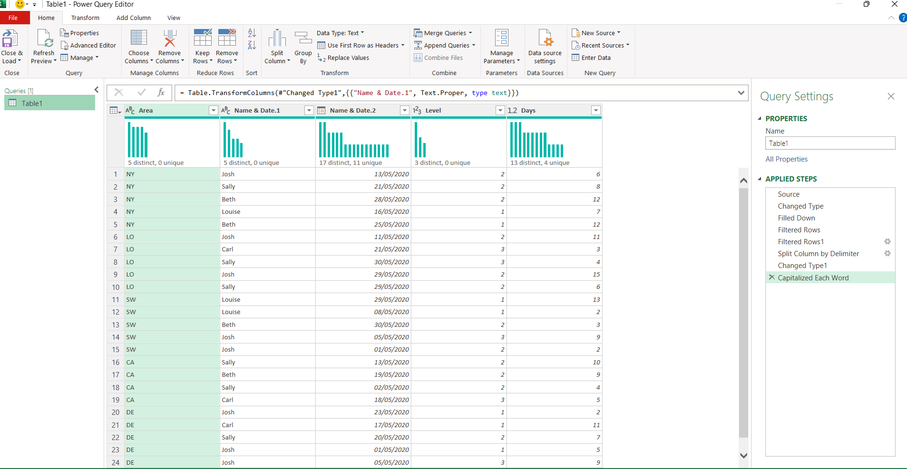

# Excel Challenge #2: Clean and Transform Data with Power Query

This repository contains my solution to the Excel Challenge #2 from GoSkills. This challenge focuses on data cleansing, shaping, and transforming messy, unformatted reports into a structured analysis-ready format using **Power Query**[cite: 2].

## 📋 Task Overview

The source file contains resolved issues data with several structural flaws[cite: 2]:
* **Structural Issues:** Area codes are isolated on their own rows instead of being a proper column feature[cite: 2].
* **Combined Data:** Names and transaction dates are merged into a single column with inconsistent delimiters (spaces, hyphens)[cite: 2].
* **Text Inconsistencies:** Names have irregular capitalization (e.g., `Josh`, `JOsh`, `beth`, `Beth`)[cite: 2].
* **Irrelevant Rows:** The raw export includes blank rows and calculated sub-average rows that obstruct proper database operations[cite: 2].

### 🎯 Key Objectives:
1. Load the messy dataset into Power Query and clean it according to database best practices[cite: 2].
2. Calculate the **Average Response Time** in days[cite: 2].
3. Calculate the total **number of Level 1 or Level 2 issues** that were resolved in **less than 5 days**[cite: 2].
4. Ensure the solution dynamically handles and processes additional test data appended to the source table[cite: 2].

---

## 🛠️ Power Query Transformation Steps

* **Fill Down:** Applied the `Fill Down` operation on the Area column to fix the isolated row structure.
* **Filtering Rows:** Filtered out null values and rows containing "Average" to keep only raw data records[cite: 2].
* **Splitting Columns:** Separated the `Name & Date` column by non-digit to digit transitions / delimiters to isolate team member names from dates[cite: 2].
* **Text Transformation:** Transformed the text format to `Capitalize Each Word` to ensure uniform naming conventions[cite: 2].
* **Data Type Allocation:** Set exact data types (Whole Numbers for Days/Levels, Date format for transaction entries).

---

## 🏆 FINAL SOLUTION

You can review and download the spreadsheet containing the complete Power Query steps and key questions answered here:

👉 [Download excel-challenge-2-FINAL.xlsx](./2-Challenge_CleanAndTransformWithPowerQuery/excel-challenge-2-FINAL.xlsx)