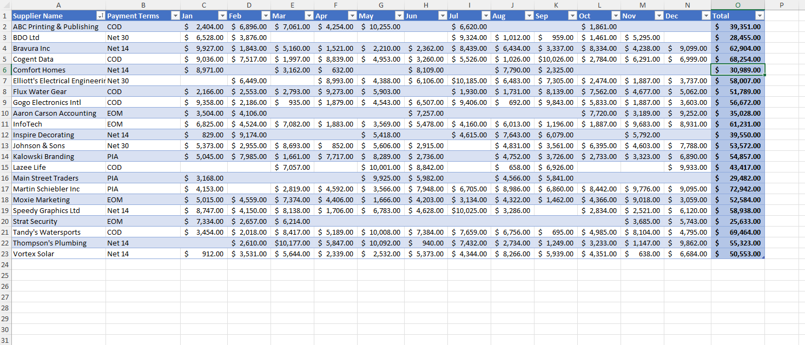
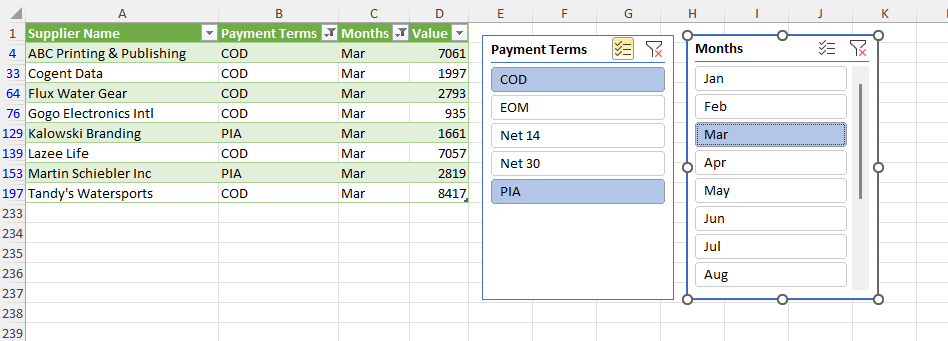

# Excel Challenge #21: Unpivoting Data Within a Table

This repository contains my solution to the Excel Challenge #21 from GoSkills[cite: 15]. This challenge focuses on data normalization, tabular restructuring (converting cross-tab matrices into raw linear ledgers), multi-criteria filtering, and ETL pipelines using Power Query or advanced dynamic arrays[cite: 15].

## 📋 Task Overview

The project presents a cross-tabulated expense matrix containing 22 product/service suppliers[cite: 15]. While the table maps critical operational headers such as payment terms (COD, PIA, EOM) and monthly expense accounts across adjacent columns, its horizontal structure restricts granular categorical filtering and downstream relational querying[cite: 15].

### 🎯 Key Objectives:
1. **Data Normalization (Unpivoting):** Transform the wide cross-tabulated matrix into a narrow, vertical layout where rows are split into independent records containing standardized categorical columns.
2. **Temporal Target Filtration:** Structure the normalized output to dynamically isolate specific operations, such as identifying all suppliers who issued invoices during the month of June[cite: 15].
3. **Payment Term Isolation:** Filter and audit specific operational subsets, particularly isolating vendors requiring payment in advance (PIA)[cite: 15].
4. **Multi-Criteria Querying:** Configure a flexible filtering layout capable of combining multiple constraints simultaneously across distinct record attributes[cite: 15].

---

## 🛠️ Data Engineering & Analysis Steps

* **ETL Matrix Transposition:** Loaded the raw horizontal wide-table into Power Query and executed an "Unpivot Columns" operation to isolate months, metrics, and supplier attributes into normalized attributes[cite: 15].
* **Dynamic Array Querying:** Alternatively engineered the relational schema using modern dynamic expressions (like `FILTER` combined with boolean logic matrices) to achieve programmatic slicing on the flat data[cite: 15].
* **Relational Layer Modeling:** Standardized unpivoted columns into clear entity properties: `Supplier`, `Payment Terms`, `Month`, and `Expense Amount`[cite: 15].

---

## 🏆 FINAL SOLUTION

You can review and download the completed workbook containing the unpivoted relational table structure and multi-criteria extraction tools here:

👉 [Download excel-challenge-21-FINAL.xlsx](./21-Challenge_UnpivotingDataWithinATable/excel-challenge-21-FINAL.xlsx)