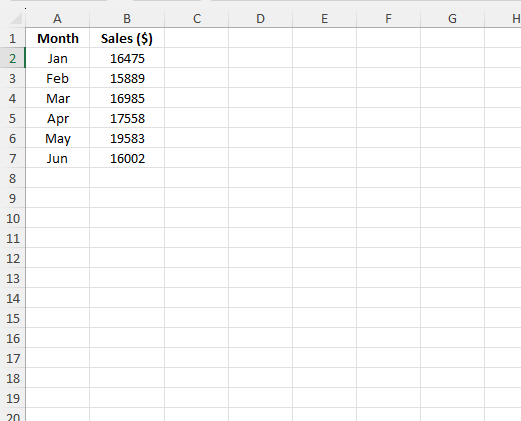
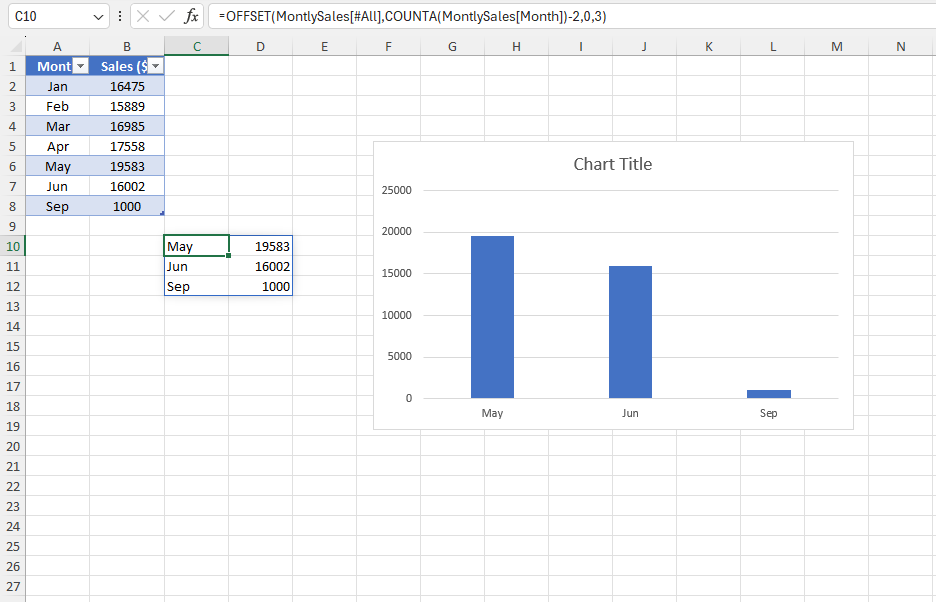

# Excel Challenge #22: Create a Dynamic Excel Chart Range

This repository contains my solution to the Excel Challenge #22 from GoSkills. This challenge focuses on dynamic range isolation, time-series data visualization, automated dashboard rendering, and variable text header manipulation using advanced dynamic arrays or offset reference formulas.

## 📋 Task Overview

The project handles a sales tracking ledger organized chronologically by month. The corporate reporting objective is to design a rolling time-series chart that isolates and displays data strictly for the three most recent months in the dataset. The system must operate automatically, meaning that when a new month's sales metrics are appended to the columns, the chart window must slide forward and self-update while dynamically adjusting its main title header.

### 🎯 Key Objectives:
1. **Sliding Window Data Extraction:** Formulate a dynamic boundary mechanism to identify and extract only the last three chronological entries from the growing monthly dataset.
2. **Dynamic Chart Range Mapping:** Bind the graphical visualization engine to this variable boundary layer so that the plot adapts instantly upon the arrival of new data.
3. **Automated Header Synced Text:** Program the main chart title to update its text string automatically to reflect the changing active reporting parameters.
4. **Hands-Off Data Continuity:** Build the entire calculation pipeline to scale seamlessly without requiring structural edits or manual chart data-range adjustments.

---

## 🛠️ Data Engineering & Analysis Steps

* **Dynamic Array Array Extraction:** Utilized modern array functions (such as `TAKE` combined with `SORT` or index boundaries) to cleanly isolate the final 3 rows of records from the dataset.
* **Named Range References:** Alternatively engineered dynamic structural anchors using volatile tracking formulas (like `OFFSET` layered with `COUNTA`) to feed a shifting range vector into the chart series variables.
* **String-Merged Header Models:** Combined logical text formulas with automated date values to produce a variable title bar string that reflects the active window timeline.
* **Chronological Ingestion Control:** Setup specific structured cells to guarantee that newly added records are instantly indexed and pushed to the visualization viewport.

---

## 🏆 FINAL SOLUTION

You can review and download the completed workbook containing the sliding three-month sales monitor and dynamic charting array here:

👉 [Download excel-challenge-22-FINAL.xlsx](./22-Challenge_CreateADynamicExcelChartRange/excel-challenge-22-FINAL.xlsx)