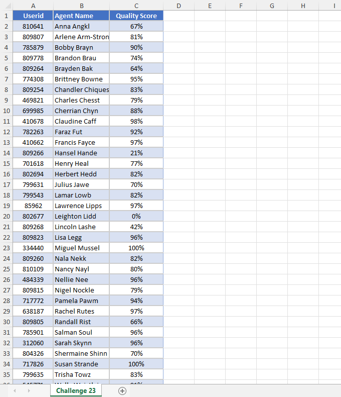
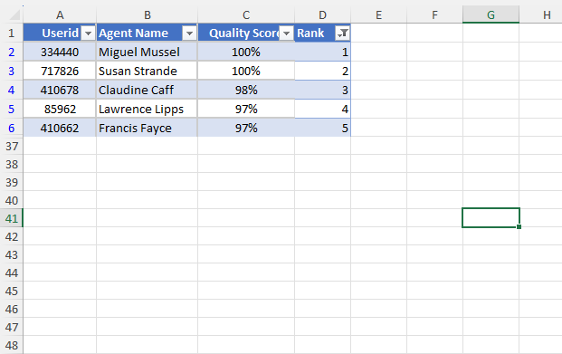
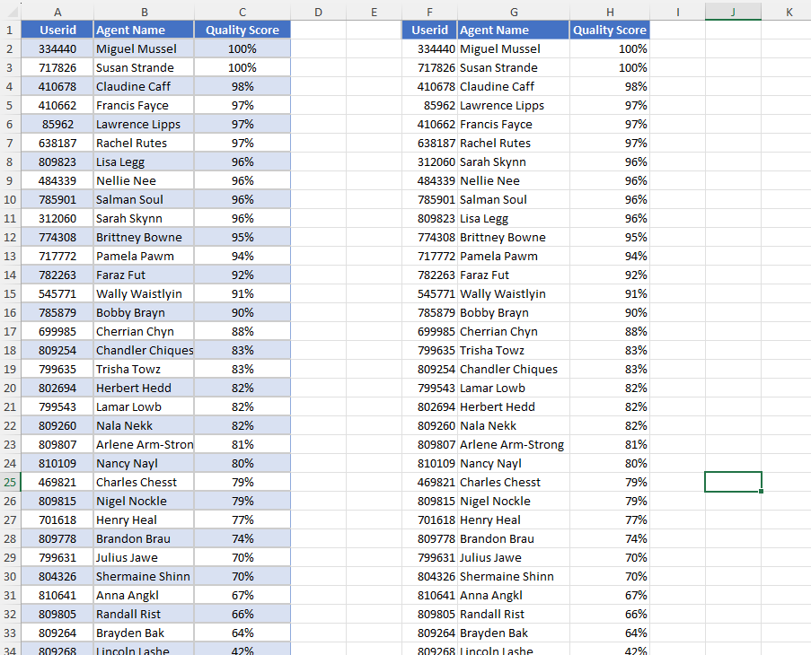

# Excel Challenge #23: How to Break Ties When Ranking

This repository contains my solution to the Excel Challenge #23 from GoSkills[cite: 15]. This challenge focuses on statistical ranking methodologies, data sorting logic, tie-breaking algorithms, and the comparative deployment of classic calculation formulas vs. modern dynamic array models[cite: 15].

## 📋 Task Overview

The project handles a customer service performance ledger tracking agent identifiers alongside their corresponding percentages inside a Quality Score column[cite: 15]. The core analytical objective is to isolate a leaderboard demonstrating the top 5 operational agents[cite: 15]. However, traditional ranking functions generate duplicates when identical percentage values appear together, making it critical to establish a precise tie-breaking logic layer[cite: 15].

### 🎯 Key Objectives:
1. **Top 5 Leaderboard Extraction:** Identify and extract the top 5 customer service agents based entirely on their performance metrics[cite: 15].
2. **Programmatic Tie-Breaking:** Formulate a mathematical method to assign unique rank values when multiple agents achieve duplicate Quality Scores[cite: 15].
3. **Threshold Overrun Resolution:** Establish clear logic rules to handle and sort instances where more than 5 agents qualify within the primary top score boundaries[cite: 15].
4. **Methodology Performance Evaluation:** Compare old-school calculation blocks (such as helper columns) against new-school dynamic arrays to analyze operational pros and cons[cite: 15].

---

## 🛠️ Data Engineering & Analysis Steps

* **Unique Rank Generation:** Engineered an un-duplicated ranking sequence by combining standard indexing functions (like `RANK` or `RANK.EQ`) with cell-frequency metrics (`COUNTIF` using expanding ranges) to break performance ties safely[cite: 15].
* **Dynamic Dataset Sorting:** Alternatively deployed modern dynamic array expressions (such as `SORT` and `FILTER` wrapped with `LARGE` parameters) to process data sorting logic on the fly without extra helper fields[cite: 15].
* **Statistical Tiering Matrix:** Structured an isolated leaderboard matrix that references unique calculated ranks to cleanly extract names, user IDs, and exact scores[cite: 15].

---

## 🏆 FINAL SOLUTION

You can review and download the completed workbook containing the duplicate-safe ranking models and top 5 agent dashboards here:

👉 [Download excel-challenge-23-FINAL.xlsx](./23-Challenge_HowToBreakTiesWhenRanking/excel-challenge-23-FINAL.xlsx)