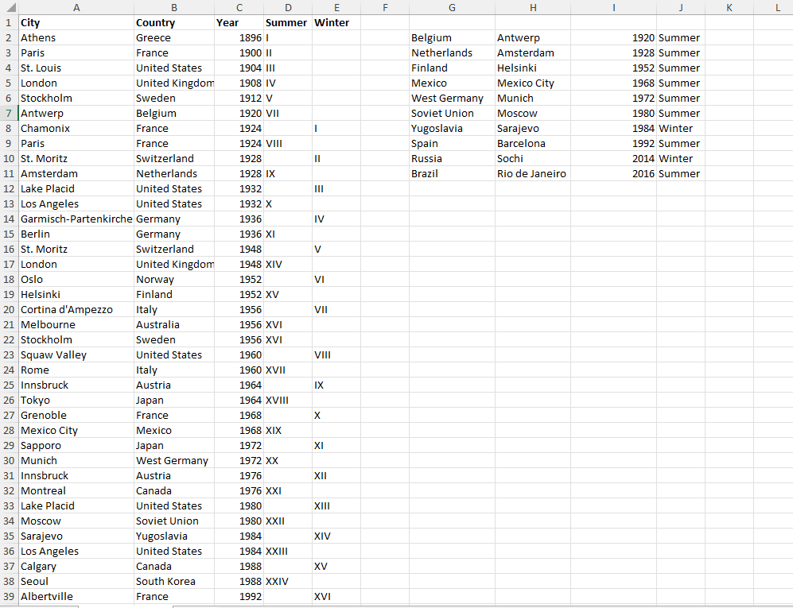
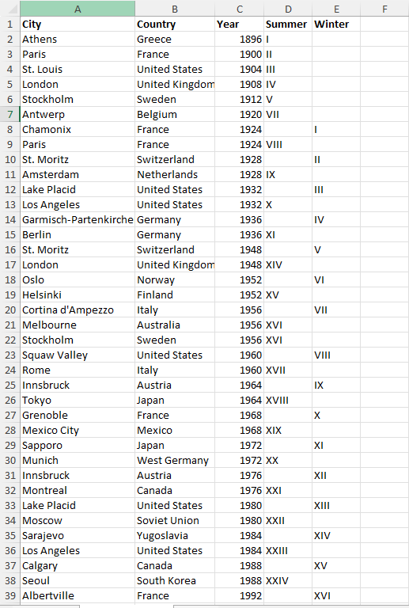

# Excel Challenge #24: Extract Unique Values From a Dataset

This repository contains my solution to the Excel Challenge #24 from GoSkills. This challenge focuses on data extraction, frequency analysis filtering, dynamic array relational lookups, and chronological matrix mapping within historical datasets.

## 📋 Task Overview

The project handles an extensive historical ledger containing records of Olympic Games host locations. The primary analytical objective is to isolate data trends with a strict operational rule: identify and extract records exclusively for countries that have hosted an Olympic game exactly once throughout history.

### 🎯 Key Objectives:
1. **Frequency-Based Extraction:** Scan the master country array to isolate and extract a standalone list of countries with a single occurrence count.
2. **Relational Attribute Retrieval:** Connect the extracted unique country values back to the core matrix to return the exact corresponding host city.
3. **Chronological Parameter Mapping:** Query the source database to return the precise year in which those specific games were executed.
4. **Boolean Property Tracking:** Verify and indicate whether the extracted unique games belonged to the Summer or Winter seasonal cycle.

---

## 🛠️ Data Engineering & Analysis Steps

* **Dynamic Unique Slicing:** Applied modern dynamic array functions using custom frequency constraints (such as nesting `UNIQUE` with an exactly-once parameter rule or filtering via `COUNTIF` constraints) to isolate single-time host nations.
* **Multi-Property Relational Lookups:** Deployed advanced exact-match lookup array functions (`XLOOKUP`) to map extracted country entities against the dataset rows, pulling corresponding tabular properties across multiple adjacent headers.
* **Database Matrix Parsing:** Structured clean validation formulas to correctly identify column indicators, converting messy timeline lists into an organized relational database layout.

---

## 🏆 FINAL SOLUTION

You can review and download the completed workbook containing the unique array filter matrix and isolated single-host Olympic dashboards here:

👉 [Download excel-challenge-24-FINAL.xlsx](./24-Challenge_ExtractUniqueValuesFromADataset/excel-challenge-24-FINAL.xlsx)