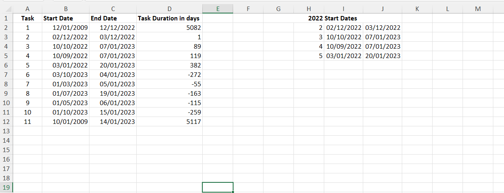

# Excel Challenge #25: Convert Dates Stored as Text

This repository contains my solution to the Excel Challenge #25 from GoSkills[cite: 16]. This challenge focuses on data cleaning, date serial type conversion, text parsing, and operational time-frame filtration within project tracking data matrices[cite: 16].

## 📋 Task Overview

The project handles an operational project dataset containing individual records mapped to task names, start dates, end dates, and durations[cite: 16]. The primary analytical objective is to isolate and extract only the tasks that started during the year 2022[cite: 16]. However, multiple date cells are incorrectly stored as raw text strings or use mixed separators, making direct data filtering impossible without prior data normalization[cite: 16].

### 🎯 Key Objectives:
1. **Identify Anomalous Dates:** Detect and flag text-formatted date representations or unrecognized date syntax profiles within the dataset[cite: 16].
2. **Date Format Standardization:** Convert raw text strings and irregular delimiters into standard, valid Excel serial numbers[cite: 16].
3. **Operational Criteria Filtering:** Structure a relational query layer to parse the sanitized timelines and isolate records matching the year 2022[cite: 16].
4. **Data Pipeline Maintenance:** Set up the conversion blocks to ensure task lists scale efficiently without manually disrupting adjacent duration parameters[cite: 16].

---

## 🛠️ Data Engineering & Analysis Steps

* **Text-to-Date Conversion Pipelines:** Utilized advanced date serialization techniques (such as multiplying text ranges by `1`, applying the `DATEVALUE` function, or utilizing Text to Columns formatting masks) to convert static strings into functional numerical parameters[cite: 16].
* **Temporal Part Parsing:** Deployed explicit date functions (such as `YEAR` or formatting extractions) to isolate the year parameter from the cleansed timeline column[cite: 16].
* **Relational Record Slicing:** Programmed structured filtering parameters to sweep the normalized tables and extract rows satisfying the 2022 timeline target boundary[cite: 16].

---

## 🏆 FINAL SOLUTION

You can review and download the completed workbook containing the converted date model and isolated 2022 task dashboard here:

👉 [Download excel-challenge-25-FINAL.xlsx](./25-Challenge_ConvertDatesStoredAsText/excel-challenge-25-FINAL.xlsx)