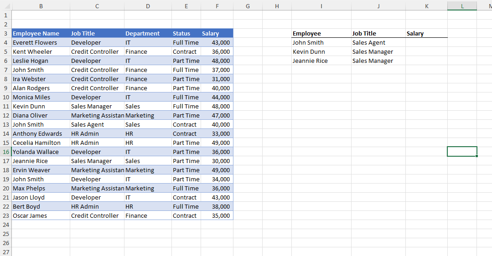
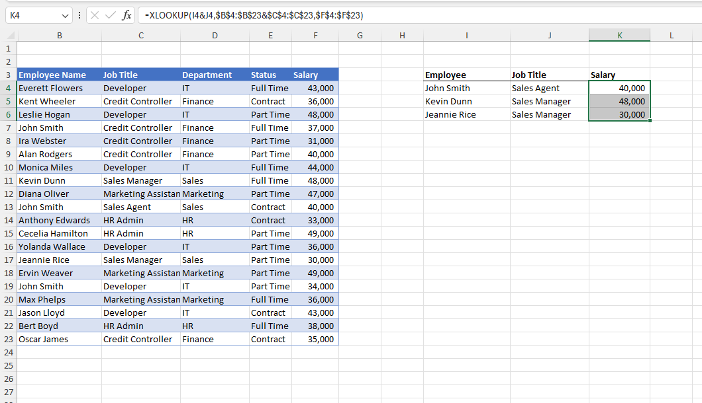

# Excel Challenge #26: VLOOKUP With Duplicates

This repository contains my solution to the Excel Challenge #26 from GoSkills[cite: 16]. This challenge focuses on relational data lookups, multi-criteria key construction, database normalization techniques, and overcoming the standard single-match limitations of vertical lookup functions within corporate HR databases[cite: 16].

## 📋 Task Overview

The project handles an HR operational dataset where the Sales Manager requires a precise list of all employees in the Sales Team and their corresponding salaries to conduct a strategic pay review[cite: 16]. The primary data extraction objective is compromised by duplicate data properties—specifically, the presence of multiple distinct employees sharing the common name "John Smith"[cite: 16]. Standard lookup rules fail because they stop at the first matching string instance[cite: 16].

### 🎯 Key Objectives:
1. **Deduplicated Key Architecture:** Extend the native capabilities of lookup workflows to identify and isolate specific records among identical string fields[cite: 16].
2. **Column K Formula Engineering:** Write a robust data-retrieval formula in Column K that references the target Employee cell in Column I to yield the correct salary result[cite: 16].
3. **Helper Column Normalization:** Implement an isolated data engineering step using a dedicated helper column to generate unique primary keys[cite: 16].
4. **Drag-Safe Formula Scaling:** Ensure the final syntax uses correct relative and absolute range references to maintain structural integrity when dragged down Column K[cite: 16].

---

## 🛠️ Data Engineering & Analysis Steps

* **Composite Key Structuring:** Created a specialized helper column combining multiple record attributes (such as joining Name with an occurrence count via `COUNTIF` or blending with another distinct column) to establish an entirely unique lookup identifier array[cite: 16].
* **Exact Match Matrix Lookup:** Programmed expanded `VLOOKUP` syntax mapping the target candidate against the freshly generated composite key matrices[cite: 16].
* **Positional Index Optimization:** Adjusted column index parameter flags to extract salary figures from the normalized database tables without throwing range errors[cite: 16].

---

## 🏆 FINAL SOLUTION

You can review and download the completed workbook containing the unique composite key layout and duplicate-safe salary lookup engine here:

👉 [Download excel-challenge-26-FINAL.xlsx](./26-Challenge_VLOOKUPWithDuplicates/excel-challenge-26-FINAL.xlsx)