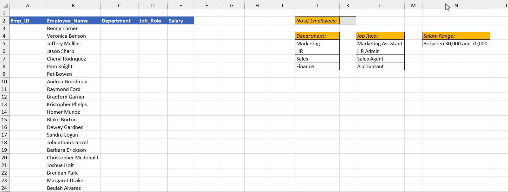
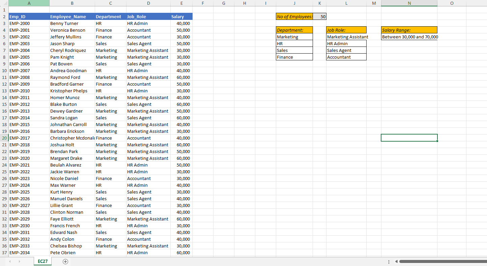

# Excel Challenge #27: Create a Dataset Using Random Selection

This repository contains my solution to the Excel Challenge #27 from GoSkills. This challenge focuses on programmatic data generation techniques, dynamic array formulas, random selection automation, and building a structured corporate dataset from scratch using advanced Excel functions.

## 📋 Task Overview

The project involves building a synthetic operational HR dataset to practice data engineering and spreadsheet skills. Starting with a predefined list of employee names, the objective is to programmatically populate all remaining empty attributes (`Emp_ID`, `Department`, `Job_Title`, and `Salary`) using scalable formulas and structured reference lookups.

### 🎯 Key Objectives:
1. **Dynamic Alphanumeric ID Generation (`Emp_ID`):** Automate a sequential tracking ID starting precisely at `EMP-2000`, incrementing by 1 for each subsequent employee record.
2. **Randomized Categorical Distribution (`Department`):** Use random selection logic to distribute employees across 4 core organizational units: *HR, Sales, Marketing, and Finance*.
3. **Relational Data Mapping (`Job_Title`):** Program a conditional mechanism ensuring that each employee's assigned job title (*HR Admin, Sales Agent, Marketing Assistant, Accountant*) strictly matches their randomized department.
4. **Bounded Numeric Synthesis (`Salary`):** Synthesize random salary figures strictly constrained within a `$30,000` to `$70,000` payroll bracket.
5. **Discrete Value Multipliers:** Apply rounding constraints so that every generated salary figure lands perfectly on a `$1,000` multiplier.
6. **Dataset Stabilization:** Permanently freeze the generated rows by stripping out underlying volatile functions to ensure data integrity and prevent recalculation.

---

## 🛠️ Data Engineering & Formula Approach

* **Sequential Tracking Arrays:** Leveraged the `SEQUENCE` dynamic array function combined with text formatting operators to build a continuous, auto-incrementing key array (`"EMP-"&SEQUENCE(No_Of_Employees, 1, 2000)`).
* **Volatile Randomization Matrices:** Implemented functions like `CHOOSE` paired with `RANDBETWEEN` (or an `INDEX` array picker) to dynamically pull and distribute categorical department fields.
* **Conditional Key Matching:** Structured standard relational lookups (`XLOOKUP` or `VLOOKUP`) against the target criteria to map corresponding functional titles without overlapping errors.
* **Constrained Numeric Simulation:** Combined standard random math boundaries (`RANDBETWEEN(30, 70) * 1000` or nested `MROUND` configurations) to simulate realistic payroll inputs that respect structural multiplier rules.
* **Formula Deprecation:** Applied a data-hardening step (Copy -> Paste Special as Values) to remove performance-heavy dynamic formulas, keeping the database perfectly static for practice use.

---

## 🏆 FINAL SOLUTION

The workbook layout contains the functional data generation engine, complete with the lookup infrastructure, reference matrices, and finalized static tables.

👉 [Download excel-challenge-27-FINAL.xlsx](./27-Challenge_CreateDatasetUsingRandomSelection/excel-challenge-27-FINAL.xlsx)