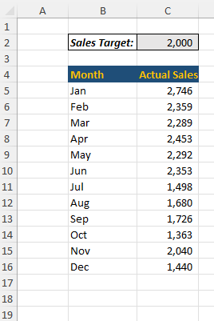
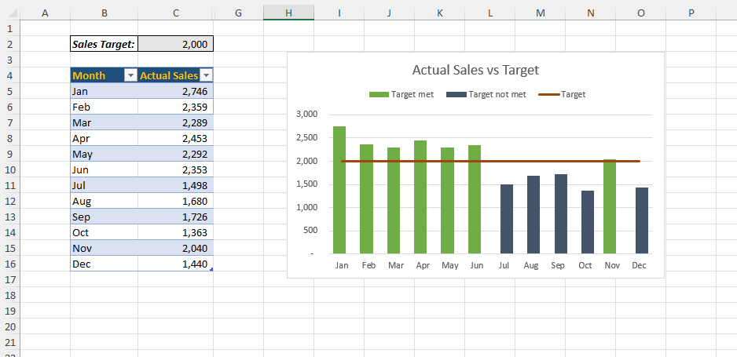

# Excel Challenge #28: Create a Column Chart With Conditional Formatting

This repository contains my solution to the Excel Challenge #28 from GoSkills[cite: 3]. This challenge focuses on data visualization techniques, combo chart architecture, conditional chart formatting using logical series separation, and building dynamic, interactive dashboards in Excel[cite: 3].

## 📋 Task Overview

The project handles monthly sales performance monitoring where the Sales Team Manager requires an intuitive visual dashboard[cite: 3]. The objective is to evaluate individual or regional actual sales data against a volatile, shifting baseline target of $2000[cite: 3]. The core challenge lies in the fact that native Excel column charts do not support standard conditional formatting rules directly, requiring an analytical data engineering workaround[cite: 3].

### 🎯 Key Objectives:
1. **Combo Chart Architecture:** Build a clustered column chart where individual performance metrics are represented by vertical bars, while the static baseline sales target is plotted as a continuous reference line[cite: 3].
2. **Dynamic Series Logic (Conditional Colors):** Implement formula-driven data preparation so that the chart columns automatically shift color based on whether the actual sales met or fell short of the designated target[cite: 3].
3. **Volatile Target Automation:** Ensure the entire chart layout dynamically updates its thresholds and line height automatically when the baseline target value is adjusted in cell C2[cite: 3].
4. **Data Hiding Resiliency (Bonus):** Configure the chart settings so that hidden rows or columns within the source data table do not break the chart layout, allowing the visualization to remain perfectly intact[cite: 3].

---

## 🛠️ Data Engineering & Charting Steps

* **Logical Series Separation:** Created auxiliary data helper columns separating actual sales values into distinct "Met Target" and "Below Target" arrays using logical `IF` statements.
* **Overlapped Column Configuration:** Programmed a combo chart structure with 100% series overlap, forcing the conditional columns to seamlessly mask each other and simulate dynamic color shifting.
* **Dynamic Target Line Integration:** Mapped an unbroken secondary data series referencing cell C2, converting its chart type to a straight line to act as a moving performance threshold[cite: 3].
* **Hidden Cell Plotting Optimization:** Adjusted the workbook's "Select Data" advanced properties to enable rendering of data from hidden rows and columns, ensuring absolute structural safety.

---

## 🏆 FINAL SOLUTION

