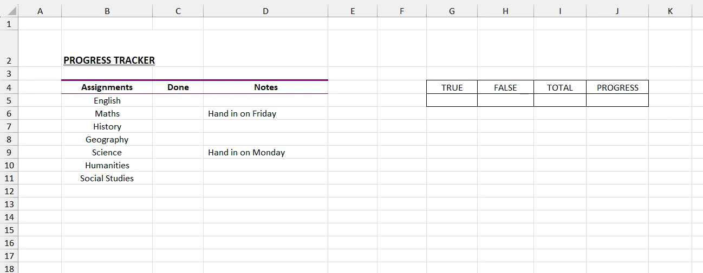
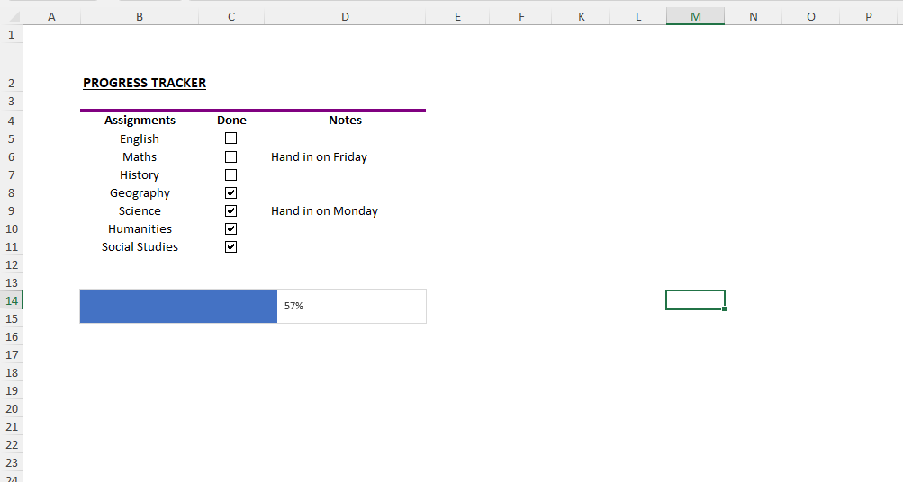

# Excel Challenge #29: Make a Progress Bar in Excel

This repository contains my solution to the Excel Challenge #29 from GoSkills. This challenge focuses on interactive UI controls, tracking automation, data validation layers, and creating visually dynamic progress bars directly integrated within task management models.

## 📋 Task Overview

The project involves creating a student assignment tracking template designed to visually monitor course progress. Users require an intuitive dashboard where ticking an individual assignment checkbox updates a custom-built progress bar indicating the exact overall completion percentage. The objective must be achieved using native formatting tools while maintaining a clean, professional aesthetic.

### 🎯 Key Objectives:
1. **Interactive Form Control Integration:** Deploy functional checkboxes across the task table layout to register active assignment milestones.
2. **Boolean Data Hidden Architecture:** Map each user checkbox directly to an underlying boolean cell control, ensuring the generated `TRUE`/`FALSE` text outputs are completely hidden from the user interface.
3. **Dynamic Percent Calculations:** Build an internal calculation layer that programmatically calculates the precise percentage of completed tasks relative to total assignments.
4. **Resilient Progress Bar Rendering:** Construct a persistent, reactive progress indicator bar that remains fully visible even if the underlying background calculations matrix is hidden from view.
5. **Advanced Visual Feedback (Bonus):** Inject custom conditional formatting layers to trigger a modern grayed-out, strikethrough font conversion on any assignment label once its milestone is checked.

---

## 🛠️ Data Engineering & Visual Design Steps

* **Interactive Interface Control Linkage:** Provisioned Form Control checkboxes directly over target tracking rows, establishing clean cell linkages to generate background binary variables (`TRUE` or `FALSE`).
* **UI Text Suppression Masking:** Applied personalized cell formatting syntax (e.g., `;;;`) to the boolean link vectors, fully suppressing the text layer from the frontend layout without breaking formula accessibility.
* **Proportional Performance Tracking:** Deployed an analytical summary framework using `COUNTIF` and `COUNTA` aggregates to derive active progress values (`=COUNTIF(Range, TRUE) / COUNTA(Range)`).
* **Dynamic Data-Bar Customization:** Programmed a standalone percentage cell using specialized Conditional Formatting Data Bars, overriding minimum and maximum parameters to fixed values of 0 and 1 to anchor the filling scale.
* **Cross-Row Strikethrough Logic:** Programmed expression-driven conditional styles applied across assignment text strings, linking font mutations directly to active boolean criteria values.

---

## 🏆 FINAL SOLUTION

