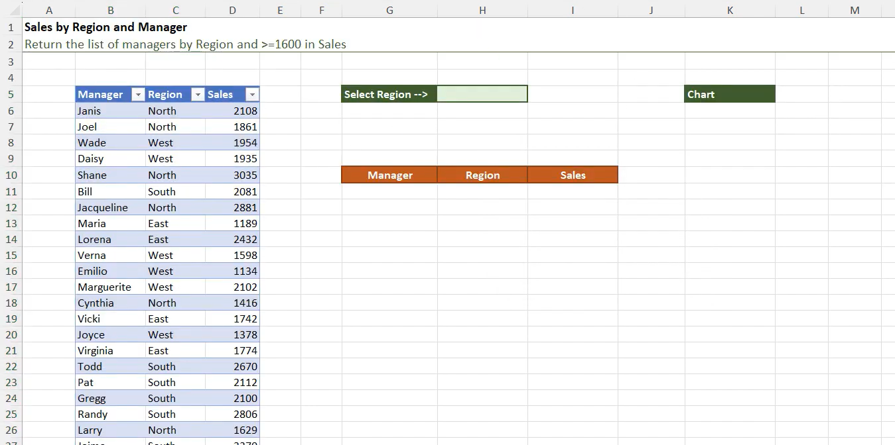
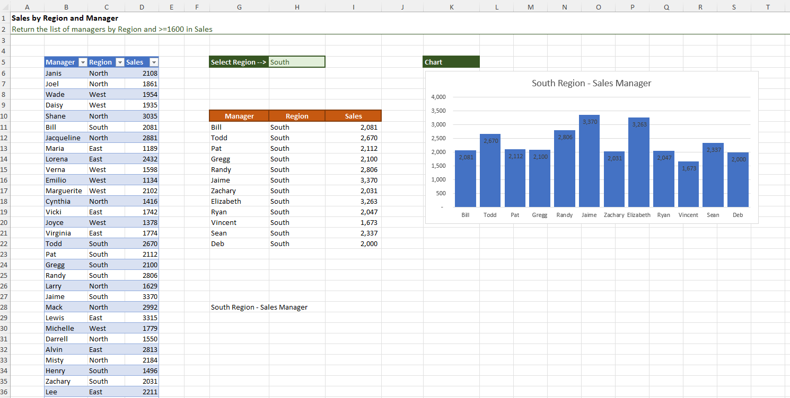

# Excel Challenge #30: Create a Dynamic Chart Using Multiple Criteria

This repository contains my solution to the Excel Challenge #30 from GoSkills. This challenge focuses on multi-criteria data filtering, dynamic array extraction, relational data sorting, and creating interactive visualization dashboards where chart components adapt automatically to user inputs.

## 📋 Task Overview

The project handles regional performance analysis based on a tracking dataset that documents total sales generated by managers across four key territories: North, South, East, and West. The manager requires an interactive analytical summary dashboard showing a precise breakdown of professionals within a selectable region whose sales meet or exceed a specific performance target of $1600. The filtered results must render inside a summary table and map onto a simple column chart.

### 🎯 Key Objectives:
1. **Interactive Multi-Criteria Extraction:** Build a robust filtering layer that isolates database rows matching two specific criteria simultaneously: the chosen target region and sales values $\ge \$1600$.
2. **Absolute Schema Scalability:** Engineer formulas using modern dynamic arrays so that the calculated ranges expand or contract fluidly if new manager records are added to the source dataset.
3. **Dynamic String Concatenation:** Configure a reactive chart title that morphs programmatically to reflect whichever regional attribute is currently selected by the user.
4. **Advanced Ordered Arrays (Bonus):** Inject a positional sorting layer into the pipeline to automatically organize the output table from largest to smallest based on generated sales metrics.

---

## 🛠️ Data Engineering & Charting Steps

* **Logical Matrix Filtering:** Deployed the modern `FILTER` array function, implementing boolean multiplication logic `(Region_Range = Selected_Region) * (Sales_Range >= 1600)` to execute complex, multi-criteria data extraction.
* **Array-Driven Chart Sourcing:** Linked the active column chart series parameters directly to the spilled array anchor cell reference (e.g., `A2#`), forcing the graphic dimensions to scale dynamically with the output rows.
* **Reactive Typography Formula:** Programmed an expression-driven title string inside a cell using text concatenation (`="Sales Performance - " & Selected_Region & " Region"`), binding the chart title element directly to this variable.
* **Nested Analytical Sorting:** Wrapped the primary extraction mechanism within a high-performance `SORT` index array function, setting the column index flag to the sales metric vector and ordering parameters to descending (-1).

---

## 🏆 FINAL SOLUTION

