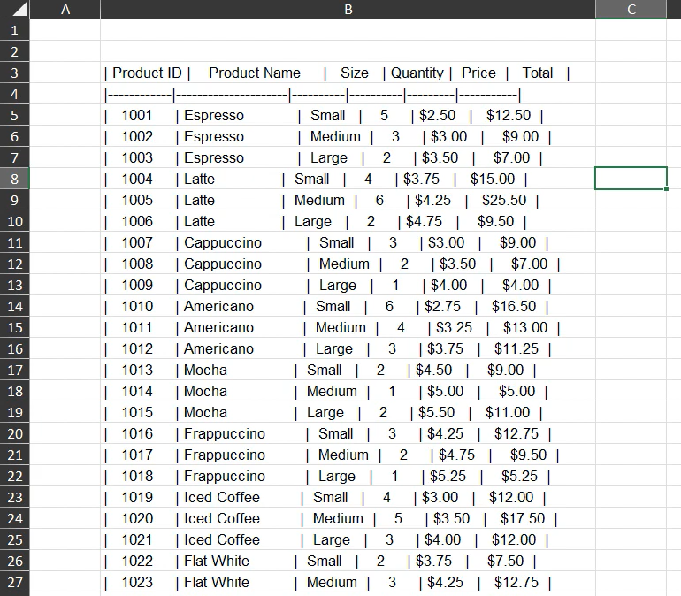
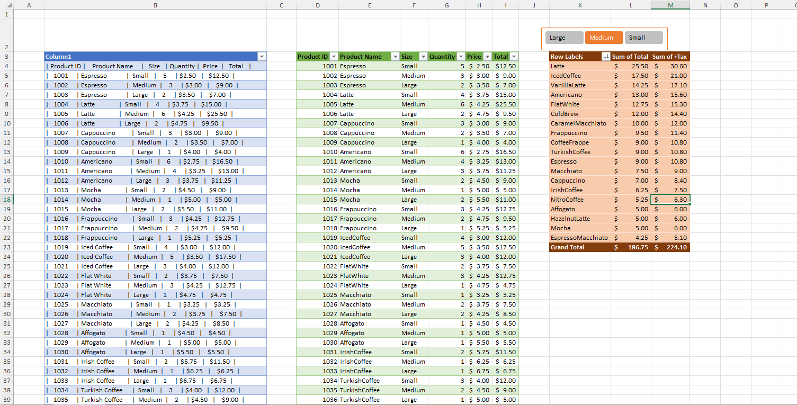

# Excel Challenge #31: Data Analysis with Power Query and Pivot Tables

This repository contains my solution to the Excel Challenge #31 from GoSkills. This challenge focuses on end-to-end data engineering pipelines inside Excel—covering raw data extraction, structural cleaning via Power Query, relational table loading, and advanced data modeling using customized Pivot Tables and interactive slicers.

## 📋 Task Overview

The project handles operational sales data from a coffee shop, which was exported from a third-party POS system into a highly unstructured format. The primary business objective is to construct an analytical Pivot Table to evaluate total sales distribution across various coffee types aggregated by drink size. However, the initial dataset contains severe structural anomalies that compromise direct evaluation.

### 🎯 Key Objectives:
1. **Single-Column Unpacking:** Parse and split concatenated text attributes where all target data fields are erroneously joined inside one single column string.
2. **Structural Record Truncation:** Clean the source table schema by locating and purging unneeded or corrupt rows that distort calculation boundaries.
3. **Whitespace Normalization:** Wipe out irregular trailing, leading, and continuous redundant spaces scattered across header labels and data vectors.
4. **Relational Table Deployment:** Convert and load the transformed Power Query data model back into the workbook environment as a normalized Excel table.
5. **Advanced Pivot Modeling:** Build a summarized view sorting coffee types by sales performance, using custom styles (dark orange, banded rows) and accounting metrics with two decimal places.
6. **Dynamic Dashboard Controls:** Implement a horizontally oriented, header-free, dark orange interactive Slicer positioned over the Pivot Table to slice metrics by size fluidly.
7. **Calculated Field Engineering:** Inject a custom formula directly into the data cache to calculate gross operational revenue including a 20% tax multiplier.

---

## 🛠️ Data Engineering & Analytical Steps

* **Delimiter Extraction Parsing:** Used Power Query's "Split Column by Delimiter" tool to unpack the raw concatenated strings into structured fields.
* **Text Trimming and Cleaning:** Deployed `Text.Trim` and `Text.Clean` transformations within the Power Query M-engine to eliminate erratic spacing and unprintable characters.
* **DataType Optimization:** Re-allocated structural data type definitions to newly generated columns (e.g., Integer for quantities, Currency for prices) before executing the workbook data load.
* **Calculated Cache Synthesis:** Programmed an analytical field layer inside the Pivot Table utilizing the formula `= Total * 1.20` to account for the gross tax addition.
* **Slicer Layout Reconstruction:** Modified the Slicer property matrix to expand grid columns horizontally, disabling header visibility flags and matching the dark orange aesthetic theme.

---

## 🏆 FINAL SOLUTION

