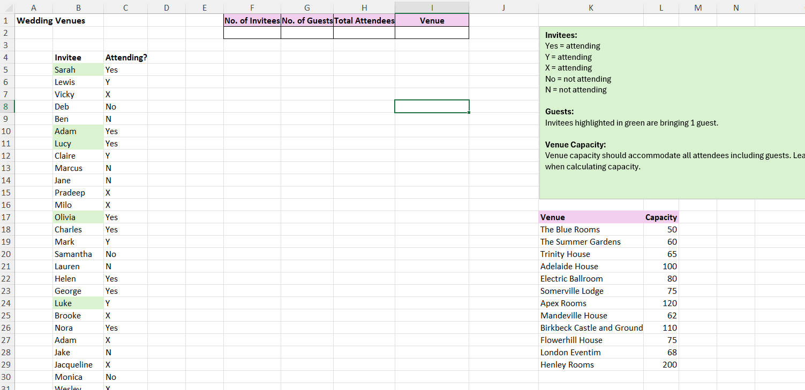
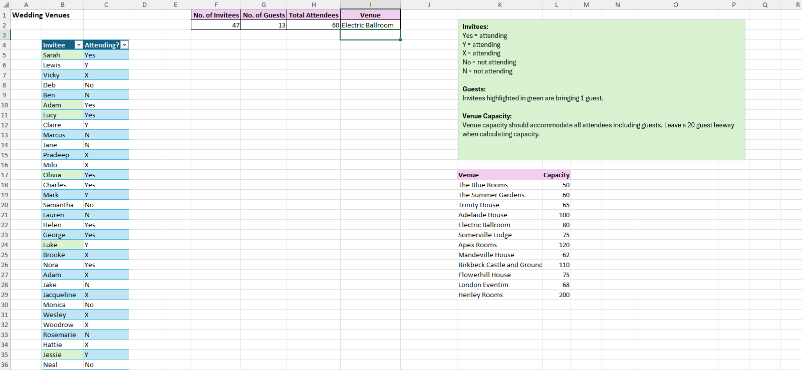

# Excel Challenge #32: Counting Values That Meet Conditions

This repository contains my solution to the Excel Challenge #32 from GoSkills. This challenge focuses on multi-criteria logical counting, normalization of inconsistent text strings, evaluation of cell background color markers, and dynamic data-driven venue mapping using relational lookup functions.

## 📋 Task Overview

The project handles logistical planning for a wedding reception venue capacity mapping. We are given a registration roster where invitation response data in Column C is highly inconsistent, using multiple non-standard string entries ("Yes", "Y", "X") to denote attendance confirmation, and other strings ("No", "N") to denote absence. Additionally, conditional formatting style markers (cells highlighted in green) flag invitees who are bringing an extra guest. The goal is to programmatically compute precise attendee sums and map the total requirement against a capacity table to identify a valid venue in cell I2.

### 🎯 Key Objectives:
1. **Inconsistent String Ingestion (`No. of Invitees`):** Construct an open logical aggregation mechanism to recognize and sum all varying positive attendance inputs ("Yes", "Y", "X") while disregarding negative inputs.
2. **Color-Coded Variable Extraction (`No. of Guests`):** Isolate and count specific records marked via visual formatting layers (green fill) that indicate supplementary guest allocations.
3. **Buffer Capacity Risk Formulation (`Total Attendees`):** Aggregate the verified invitee and guest arrays, injecting an additional static safety buffer of +20 potential attendees to account for late rsvp shifts.
4. **Relational Threshold Allocation (`Venue`):** Program a relational evaluation system in cell I2 to automatically scan a reference table of candidate venues and extract the appropriate facility that safely meets the dynamic capacity requirement.

---

## 🛠️ Data Engineering & Formula Approach

* **Multi-Criteria Wildcard Summation:** Combined standard array constants with the `COUNTIF` function (e.g., `SUM(COUNTIF(Range, {"Yes","Y","X"}))`) to seamlessly normalize and aggregate erratic text properties in a single formula string.
* **Metadata Style Parsing:** Utilized an auxiliary helper property column or an expression-based logical link to check the conditional formatting state (green row profiles) to systematically extract binary guest allocations without manual tracking.
* **Risk-Adjusted Capacity Formulation:** Established the final attendance baseline using a consolidated mathematical expression (`= Invitees_Count + Guests_Count + 20`).
* **Exact Match Next-Larger Thresholding:** Programmed an advanced `XLOOKUP` routine mapping the target total attendee metric against the candidate venue capacity array, configuring match mode parameters to `1` to fetch an exact match or the next larger operational facility.

---

## 🏆 FINAL SOLUTION

