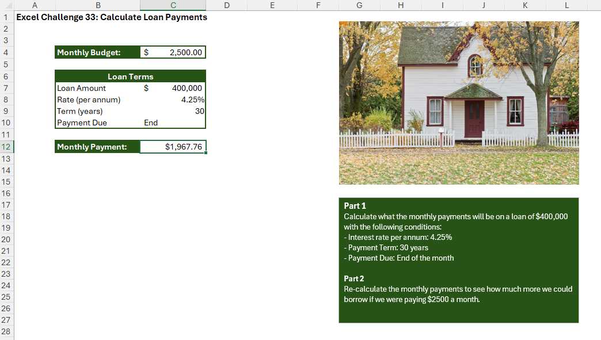

# Excel Challenge #33: What-If Analysis to Calculate Monthly Payments

This repository contains my solution to the Excel Challenge #33 from GoSkills. This challenge focuses on financial data modeling, periodic loan amortization metrics, risk-adjusted budget forecasting, and executing backward-engineering calculations using native Goal Seek tools.

## 📋 Task Overview

The project handles financial scenario planning for a residential property purchase. [cite_start]The initially proposed bank package demands an optimization review based on a structural mortgage configuration [cite: 1186, 1187][cite_start]: a principal loan balance of $400,000 [cite: 1186, 1188][cite_start], an annual interest rate of 4.25% (per annum) [cite: 1189][cite_start], and a fixed payment lifecycle spanning 30 years [cite: 1190][cite_start], with all installments arriving at the end of each month period[cite: 1191]. [cite_start]Given a strict internal hard budget constraint of $2500.00 per month [cite: 1192][cite_start], the task is divided into a two-part financial simulation query[cite: 1164, 1165].

### 🎯 Key Objectives:
1. [cite_start]**Periodic Amortization Formulation (Part 1):** Calculate the exact monthly installment rate to gauge affordability against the operational budget line[cite: 1194, 1195].
2. [cite_start]**Frequency Standardization:** Convert annual banking attributes (interest rates, years) into localized, monthly calculation variables[cite: 1197].
3. [cite_start]**Sign-Inversion Accounting Formatting:** Structure the financial output string so that the final calculated monthly payment represents a clean positive scalar[cite: 1199].
4. [cite_start]**Backward Goal-Seeking Synthesis (Part 2):** Leverage advanced What-If Analysis data modules to pinpoint the maximum affordable loan capacity if monthly allocations are stretched up to the absolute budget ceiling of $2500.00[cite: 1201, 1203].

---

## 🛠️ Data Engineering & Financial Steps

* [cite_start]**Standardized PMT Configuration:** Programmed the core analytical payment framework utilizing the `=PMT(Rate/12, Nper*12, -Pv)` expression model [cite: 1213][cite_start], converting annual percentage steps into monthly components and setting future value targets to zero[cite: 1197, 1198].
* [cite_start]**Inverted Present Value Anchoring:** Prefaced the primary loan value cell reference inside the formula parameter array with a negative mathematical sign (`-Pv`) to force a positive outcome vector[cite: 1199].
* [cite_start]**What-If Optimization Loop:** Executed Excel's relational `Goal Seek` iterative module, targeting the newly created `PMT` calculation cell as the core baseline variable[cite: 1215].
* [cite_start]**Convergent Root Finding:** Configured Goal Seek arguments to force-set the outcome calculation value precisely to `2500` [cite: 1203] [cite_start]by systematically adjusting and recalculating the original principal Present Value balance cell[cite: 1203].

---

## 🏆 FINAL SOLUTION

