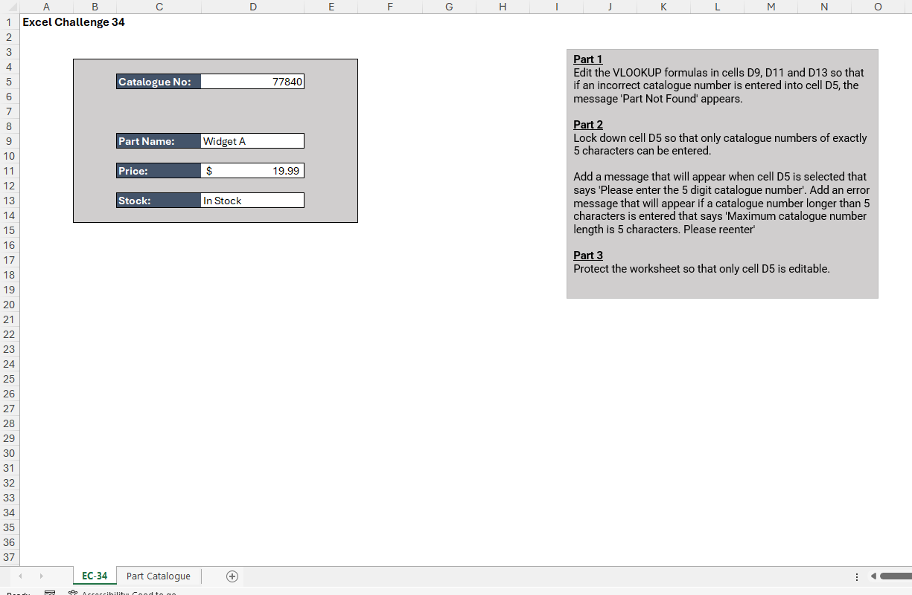
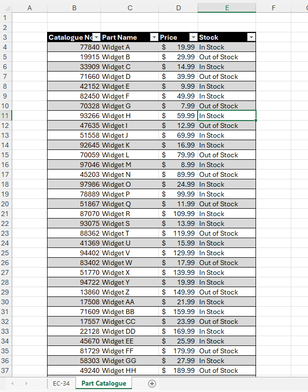
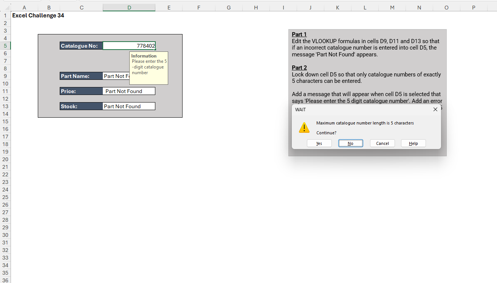

# Excel Challenge #34: Advanced Data Validation

This repository contains my solution to the Excel Challenge #34 from GoSkills. This challenge focuses on robust error handling in lookup formulas, cell-length text restrictions, personalized data-entry instruction prompts, and secure worksheet layer protection.

## 📋 Task Overview

The project handles an operational part-search form for a warehouse database that tracks and ships hardware components across the country. The form allows users to input a specific serial string into cell D5 to instantly retrieve attributes such as Part Name, Price, and Stock Status from a master catalog. The objective is to secure the frontend template against data mutation, eliminate unsightly breakdown errors, and guide manual data-entry operations using multi-layered validation logic.

### 🎯 Key Objectives:
1. **Lookup Error Interception (Part 1):** Intercept default `#N/A` breaks triggered by unlisted or missing serial entries within the lookup matrices, replacing them with a meaningful user notification: `"Part Not Found"`.
2. **String Length Enforcement (Part 2):** Restrict input cells so that users can only commit alphanumeric entries that match a strict length boundary of exactly 5 characters.
3. **Contextual Instruction Prompts:** Deploy an automated frontend hover tip reading `"Please enter the 5-digit catalogue number"` to guide warehouse data entry when the target cell is selected.
4. **Hard Validation Fail Messages:** Design a rigid pop-up alert reading `"Maximum catalogue number length is 5 characters"` to reject any input that exceeds the 5-character limit.
5. **Granular Interface Protection (Part 3):** Establish a functional worksheet security lock that blocks changes across formula containers and structural labels, leaving only cell D5 completely unlocked for user interaction.

---

## 🛠️ Data Engineering & Validation Steps

* **Graceful Exception Handling:** Wrapped the native retrieval framework within an exact-match `IFERROR` or `IFNA` handler (e.g., `=IFERROR(VLOOKUP(D5, Part_Catalogue, Col, FALSE), "Part Not Found")`), transforming raw programmatic faults into clean interface strings.
* **Text Length Data Constraint:** Implemented Data Validation rules on cell D5, setting the criteria evaluation to allow "Text Length" restricting parameters exactly equal to `5`.
* **Frontend Tooltip Initialization:** Programmed the integrated "Input Message" attribute panel inside the validation wizard to project a floating metadata note upon active cell focus.
* **Exception Reject Notification:** Customized the active validation "Error Alert" dialog style to "Stop" mode, matching the operational warning body to the designated instruction text.
* **Selected Layout Unlocking:** Modified cell formatting properties specifically for container cell D5 to uncheck its "Locked" attribute status, followed by applying the complete "Protect Sheet" module without password enforcement.

---

## 🏆 FINAL SOLUTION

