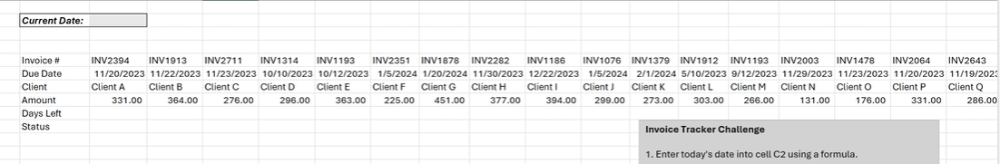
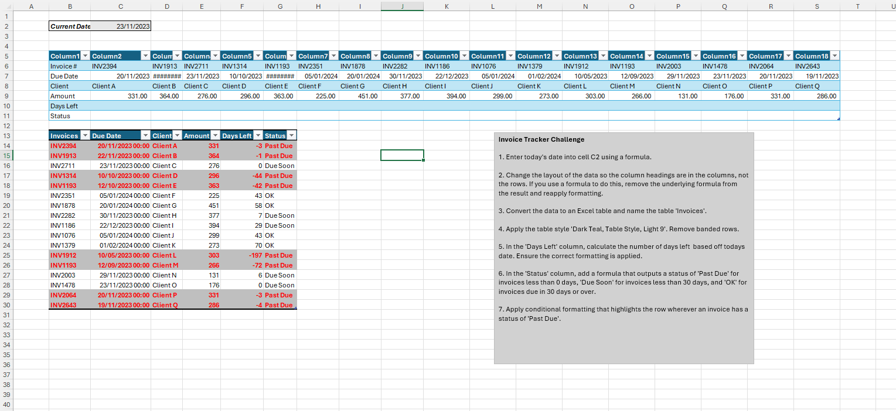
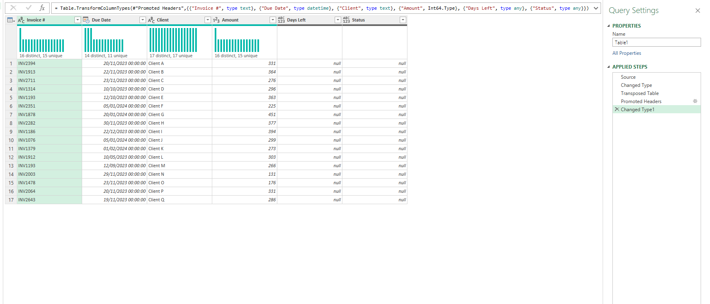

# Excel Challenge #35: Create an Invoice Tracker

This repository contains my solution to the Excel Challenge #35 from GoSkills. This challenge focuses on data restructuring via data transposition, aging analysis calculations using volatile date tracking, multi-tier conditional evaluation, and applying row-level expressions within conditional formatting rules.

## 📋 Task Overview

The project handles an operational finance dataset containing raw invoice tracking information imported from an external billing system. The raw layout is poorly structured, running completely horizontally with column headers mapped across rows, and is interrupted by unreadable blank records. The primary core objective is to flip this structure into a standard vertical database layout, clean anomalies, compute aging metrics relative to a dynamic current date cell, and visually flag overdue accounts.

### 🎯 Key Objectives:
1. **Dynamic Volatile Date Anchor (Task 1):** Initialize cell C2 with an automated date tracking expression that continuously yields the present calendar date.
2. **Schema Alignment & Transposition (Task 2):** Pivot the horizontal matrix into a structured vertical data model where historical records fill individual rows and properties populate distinct columns.
3. **Database Cleansing & Normalization:** Purge erratic zero strings from empty columns, delete structural blank spaces, and reapply consistent number formatting matrices across the dataset.
4. **Structured Table Definition (Task 3):** Convert the transformed rows into an official Excel Table named `Invoices`, applying a customized `Dark Teal, Table Style, Light 9` theme while toggling off banded rows.
5. **Aging Metric Formulation (Task 4):** Program a column-wide mathematical expression under `Days Left` to find the exact timeline remaining between an invoice's fixed due date and cell C2.
6. **Multi-Tier Conditional Logic:** Establish logical sorting strings under `Status` to bin rows as `"Past Due"`, `"Due Soon"`, or `"OK"` using precise numeric aging thresholds.
7. **Expression-Driven Row Formatting (Task 5):** Inject a specialized conditional style that tracks cell values and dynamically highlights the **entire row container** if an invoice enters `"Past Due"` status.

---

## 🛠️ Data Engineering & Analytical Steps

* **Dynamic Timeline Synchronization:** Anchored the system timeline using the `=TODAY()` formula framework inside cell C2 to fuel all subsequent calculation steps.
* **Layout Transposition Execution:** Leveraged advanced pasting tools (Paste Special -> Transpose) or functional array models to flip data paths, followed by stripping out performance-heavy fluid tracking links where necessary.
* **Structural Table Packaging:** Selected the cleaned vertical grid boundaries and instantiated an organized data object, utilizing the properties tab to override style options to the requested dark teal layout.
* **General Format Adjustments:** Reset the `Days Left` cell format explicitly to `General` to avoid the common date formatting inheritance bug that triggers hashtag symbols.
* **Nested Conditional Binning:** Programmed a nested logical expression model under the table layer: `=IF([@[Days Left]]<0, "Past Due", IF([@[Days Left]]<30, "Due Soon", "OK"))`.
* **Row-Level Formula Pinning:** Opened the conditional formatting formula wizard, designing a custom evaluation rule targeting the target status vector using mixed cell references (`=$F5="Past Due"`) to force formatting changes to span horizontally across entire target rows.

---

## 🏆 FINAL SOLUTION

