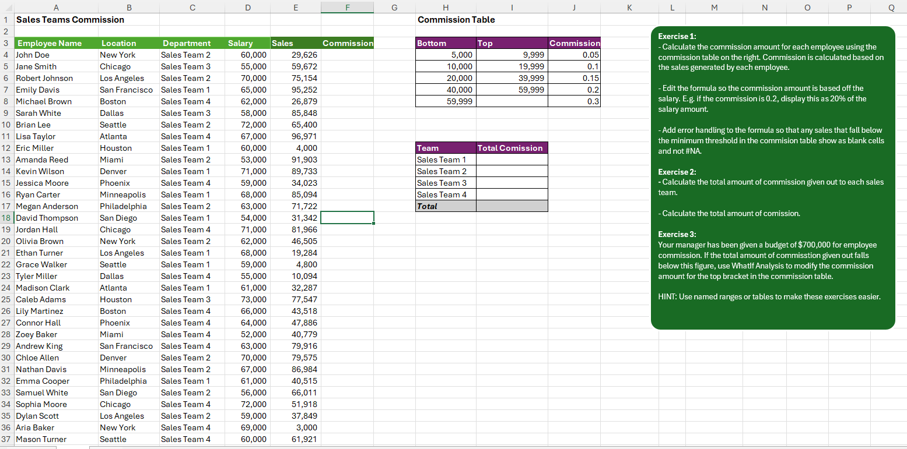
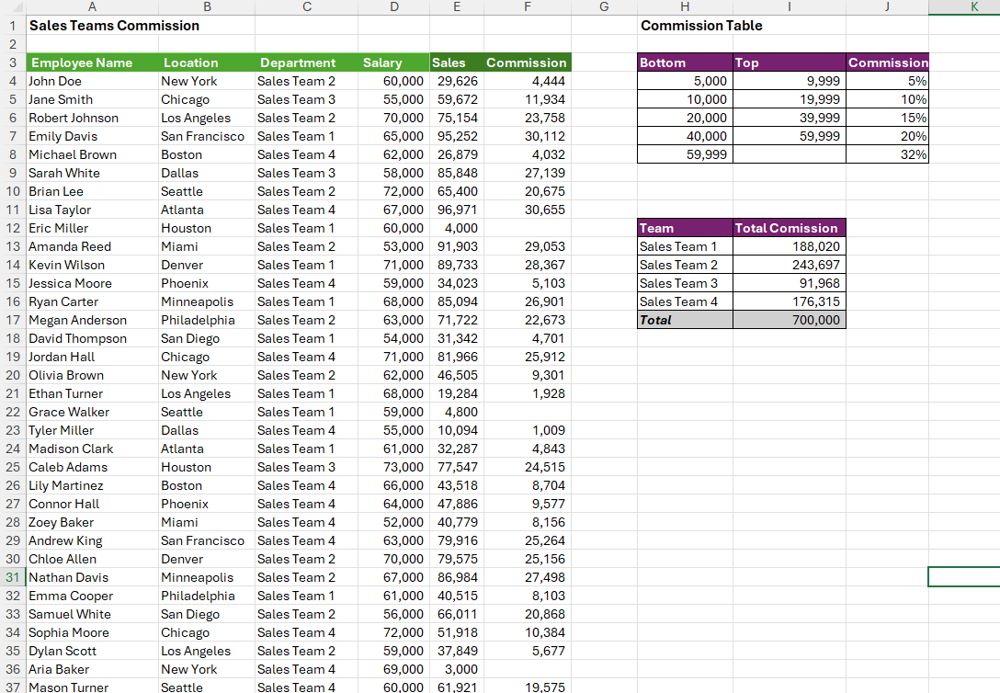

# Excel Challenge #36: Calculate and Maximize Commission With What-If Analysis

This repository contains my solution to the Excel Challenge #36 from GoSkills. This challenge focuses on numerical search mapping across range thresholds, relational team-level mathematical summaries, error mitigation within dynamic calculation tables, and maximizing financial distributions up to a strict target threshold using backward optimization engines.

## 📋 Task Overview

The project handles annual payroll optimization for an organization's sales teams to distribute end-of-year commissions based on individual revenue metrics. The challenge is split into multiple programmatic exercises. Starting with historical sales tables and an approximate interval commission matrix, the goal is to extract tier metrics, multiply variables to produce localized monetary valuations, aggregate cross-sectional team results, and fine-tune premium parameters to fully exhaust a management commission budget constraint of $700,000.

### 🎯 Key Objectives:
1. **Tiered Interval Rate Extraction (Exercise 1):** Map progressive employee sales figures against a separate relational commission scale where rate tiers are logged as decimal thresholds.
2. **Monetary Valuation Scaling:** Modify primary formulas to multiply raw generated revenue against the fetched percentage coefficients to display actual localized cash values.
3. **Programmatic Fault Mitigation:** Integrate an error-handling layer to isolate unmapped or broken records, replacing ugly `#N/A` anomalies with clean empty text properties.
4. **Sub-Sectional Team Summaries (Exercise 2):** Construct an isolated summary matrix computing total payouts grouped specifically by individual sales teams, culminating in a complete global total in cell I17.
5. **Goal-Seeking Premium Optimization (Exercise 3):** Utilize specialized analytical What-If tools to scale the global commission metric precisely up to the target budget of $700,000 by adjusting the top-tier variable in cell J8.

---

## 🛠️ Data Engineering & Financial Steps

* **Approximate Match Lookup Sorting:** Applied standard lookup functions (`XLOOKUP` or `VLOOKUP`) against the database matrix, configuring operational match mode parameters to `-1` to execute clean interval tracking across progressive financial categories.
* **Inline Arithmetic Expansion:** Expanded the lookup string syntax to append a direct multiplier against the target employee row vector (`=Sales_Cell * Lookup_Function`), translating raw decimal coefficients into active cash metrics.
* **Blank Exception Handling:** Wrapped the core formula array inside an `IFERROR` or `IFNA` conditional branch to catch unmatched properties and enforce a quiet space response (`""`).
* **Conditional Array Aggregations:** Structured a summary data framework using `SUMIF` or `SUMIFS` criteria filters, passing the target team string labels to aggregate total group payouts.
* **Budget Convergence Iteration:** Initiated Excel's internal `Goal Seek` system optimization wizard, establishing cell I17 as the dependent evaluation target, setting its absolute value parameter to `700000`, and designating the top-tier bracket percentage cell J8 as the mutable driving argument.

---

## 🏆 FINAL SOLUTION

