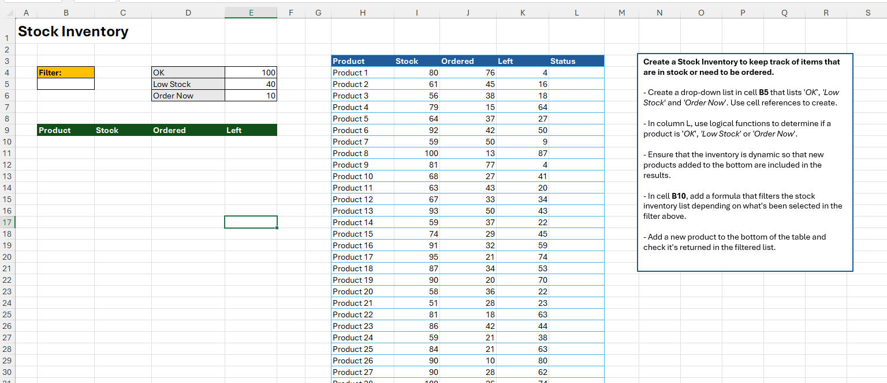

# Excel Challenge #37: Keeping Track of Inventory

This repository contains my solution to the Excel Challenge #37 from GoSkills. This challenge focuses on building a dynamic stock inventory database, implementing multi-level logical condition mapping, generating interactive dropdown data filters, and deploying scalable array extraction engines using native Excel functions.

## 📋 Task Overview

The project handles small-business inventory optimization and warehouse tracking controls. The primary business goal is to build a reliable monitoring asset that flags exactly when product quantities enter critical ranges. The database logic relies on custom operational parameters where inventory volume determines a specific categorization rule set. The workflow involves setting up frontend filter cells, calculating live status outputs, and ensuring the core schema automatically scales when manual entries expand.

### 🎯 Key Objectives:
1. **Cell-Referenced Dropdown Filtering (Task 1):** Deploy an interactive dropdown mechanism in cell B5 that references specific matrix cells to toggle between key criteria choices: `'OK'`, `'Low Stock'`, or `'Order Now'`.
2. **Logical Threshold Evaluation (Task 2):** Program a column-wide conditional equation under `Status` that cross-examines the residual item volumes against the reference parameters in cells E4:E6.
3. **Absolute Schema Scalability (Task 3):** Construct all underlying spreadsheet layers and inventory calculations dynamically to accommodate real-time structural additions without formula breakdown.
4. **Isolated Data Extraction (Task 4):** Embed a robust array-filtering expression in cell B10 that isolates and extracts rows matching the selected dropdown criteria, omitting the status column from the output layout and appending a customized text override (`"No Records"`) for empty arrays.
5. **Dynamic Expansion Integrity (Task 5):** Verify operational stability by appending a brand-new component to the bottom rows, proving that the array engine picks up the added record seamlessly.

---

## 🛠️ Data Engineering & Formula Approach

* **Dynamic Data Validation Linking:** Configured a custom List validation container in cell B5, binding its origin parameter array directly to cell references containing categorical labels to suppress text hardcoding.
* **Interval-Based Category Allocation:** Structured nested logical evaluation formulas (such as `IFS` or nested `IF` configurations) inside the data grid, checking product metrics against fixed absolute references (`$E$4:$E$6`) to route items into their correct state.
* **Spilled Matrix Querying:** Deployed the modern `FILTER` array query engine in cell B10, targeting specifically requested column ranges while setting criteria parameters to track cell B5 (`Status_Range = B5`).
* **Empty Array Fallback Injection:** Enhanced the dynamic extraction syntax by passing a strict text argument (`"No Records"`) into the final parameter slot of the `FILTER` structure to mitigate standard `#CALC!` extraction errors gracefully.
* **Automatic Table Bound Tracking:** Converted the core database block into a structural Excel table asset, ensuring that adding any subsequent inventory record down the block automatically inherits formulas and expands downstream arrays.

---

## 🏆 FINAL SOLUTION

