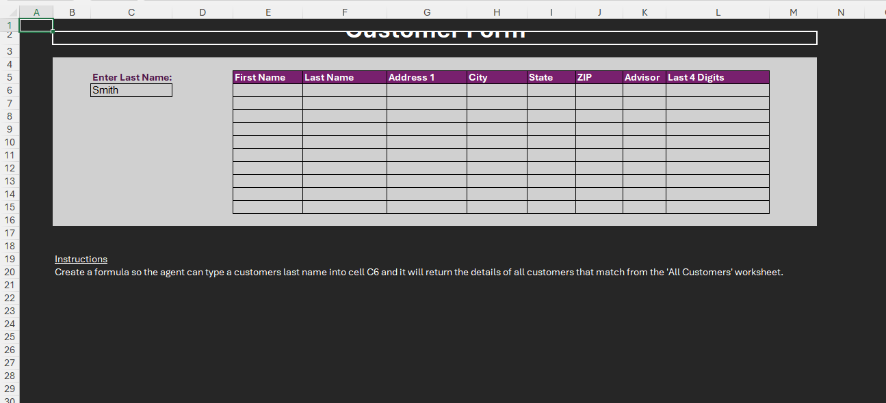
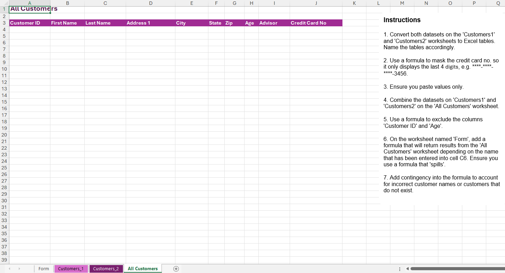
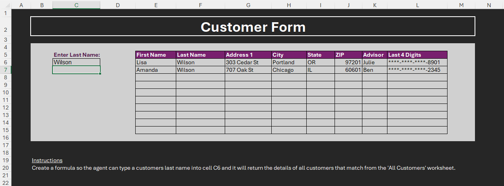
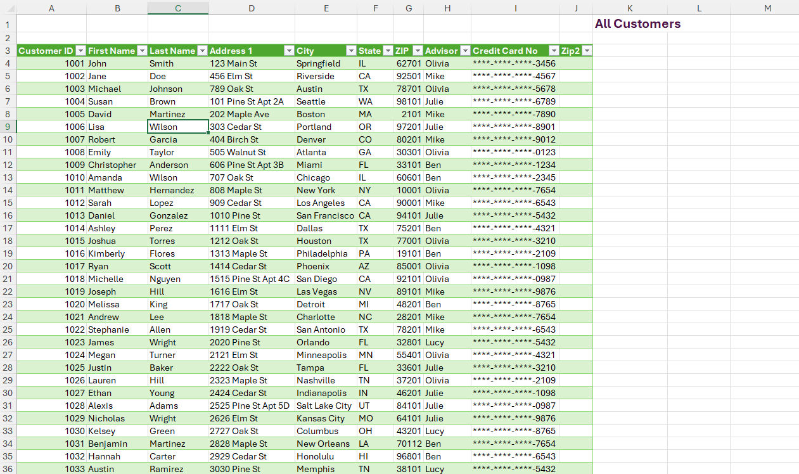

# Excel Challenge #38: Data Lookup From Multiple Sources

This repository contains my solution to the Excel Challenge #38 from GoSkills. This challenge focuses on multi-source data consolidation, vertical array stacking, string masking text security formulas, algorithmic column filtering, and building an automated identity verification search tool utilizing dynamic array mechanics.

## 📋 Task Overview

The project handles an operational customer identity mapping workflow inside an inbound contact center. Incoming callers are greeted by support agents whose core responsibility is to direct them to their assigned sales advisor. The baseline raw data properties are fragmented, split evenly across two disconnected source domains: `Customers 1` and `Customers 2`. The objective is to build a centralized database pipeline that merges these resources, runs text masking on sensitive fields, strips unnecessary tracking indices, and exposes a spill-capable customer query interface inside a frontend customer form.

### 🎯 Key Objectives:
1. **Database Schema Transformation (Task 1):** Structure both separate raw datasets into independent Excel Tables explicitly named `Customers1` and `Customers2`.
2. **PII String Masking Enforcement (Task 2):** Secure financial data properties by masking complete account numbers with asterisks (`****`), leaving strictly the trailing 4 digits exposed for support identification purposes.
3. **Multi-Source Data Consolidation (Task 3):** Merge the data records from `Customers1` and `Customers2` into a unified ledger positioned on the `All Customers` worksheet.
4. **Structural Dimensionality Reduction (Task 4):** Filter out database properties such as `Customer ID` and `Age` from the data pipeline, extracting exclusively the columns required by the contact form.
5. **Dynamic Fault-Tolerant Spill Form (Task 5):** Deploy an array lookup formula in cell C6 that auto-spills all matching records if duplicate last names are detected, incorporating an error mitigation block to handle typos or missing accounts cleanly.

---

## 🛠️ Data Engineering & Formula Approach

* **Granular Text Manipulation Masking:** Programmed an analytical text masking string combining string repetition with localized extraction tools (e.g., `REPT("*", LEN(CC_Cell)-4) & RIGHT(CC_Cell, 4)`), forcing systematic data sanitization.
* **Vertical Amalgamation Stacking:** Applied the modern dynamic array function `VSTACK` to structurally append the dataset boundaries into a singular relational table block without copy-paste interactions (`=VSTACK(Customers1, Customers2)`).
* **Positional Index Slicing:** Leveraged the high-performance column picking array tool `CHOOSECOLS` to mathematically filter the combined matrix, passing explicit numerical indexing coordinates (e.g., column mapping sequences) to isolate core attributes while dropping unneeded fields.
* **Anchor Spill Array Extraction:** Programmed a standard `FILTER` expression referencing input cell C6 to isolate target profiles (`LastName_Range = C6`).
* **Relational Typo Fallback Handling:** Integrated an expression boundary fallback directly within the dynamic array query string, configuring the if_empty parameter string to project an instructive prompt if validation checks fail or fields are empty.

---

## 🏆 FINAL SOLUTION

