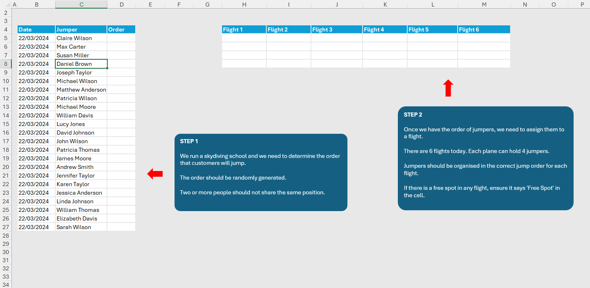
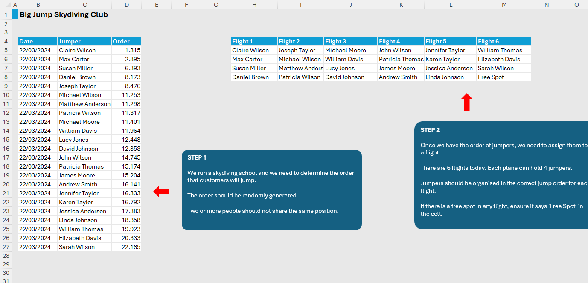

# Excel Challenge #39: Generate Unique Random Values

This repository contains my solution to the Excel Challenge #39 from GoSkills. This challenge focuses on dynamic array sorting randomization, generating unique non-repeating tracking metrics, multi-flight schedule layout transformations, and deploying structured array logic to handle empty dashboard boundaries gracefully.

## 📋 Task Overview

The project handles an operational morning flight assignment schedule for the "Big Jump Skydiving Club". The tracking ledger documents 23 scheduled clients lined up for parachute jumps. The administration requires a two-step mathematical pipeline. First, every jumper must be allocated a unique, non-repeating sequence rank to eliminate conflicts, followed by sorting the master table by this position. Second, the ordered jumper records must split fluidly into a separate multi-flight board mapping 6 active aircraft departures, where each hull caps at exactly 4 passengers.

### 🎯 Key Objectives:
1. **Deduplicated Non-Repeating Sequence (Step 1):** Program an automated generation matrix inside Column D that distributes random, distinct position integers across all 23 active rows without repeating values.
2. **Volatile Function Pasteurization:** Stabilize performance across the active lookup database by safely replacing highly volatile dynamic calculation rows with static values before ordering.
3. **Multi-Column Matrix Wrapping (Step 2):** Reshape the sorted list into a 6-column matrix representing flights, distributing passengers into chunks of 4.
4. **Alphanumeric Fallback Tokenization:** Intercept empty structural slots across unfulfilled plane capacities, programmatically substituting zero values or blanks with a `"Free Spot"` interface string.

---

## 🛠️ Data Engineering & Scheduling Steps

* **Unique Array Sort Extraction:** Combined standard row-indexing sequences with sorting matrices (such as utilizing `SORTBY` paired with an array of `RANDARRAY` variables) to generate a fully shuffled, non-repeating integer vector spanning from 1 down to the maximum row bounds.
* **Calculation Freezing Serialization:** Executed a standard text hardening operation (Copy -> Paste Special as Values) across Column D to terminate background processor-heavy volatile recalculation loop iterations.
* **Two-Dimensional Matrix Wrapping:** Leveraged advanced dimensional reshaping array tools like `WRAPCOLS` or `WRAPROWS` to dynamically partition the vertical list of sorted jumper strings directly into a fixed 6-column departure grid.
* **Empty Boundary Constraint Tuning:** Embedded an `IF` statement or an explicit error interceptor condition within the structural wrapping pipeline to force vacant terminal blocks to yield a custom text property (`"Free Spot"`) instead of zero strings or blank voids.

---

## 🏆 FINAL SOLUTION

