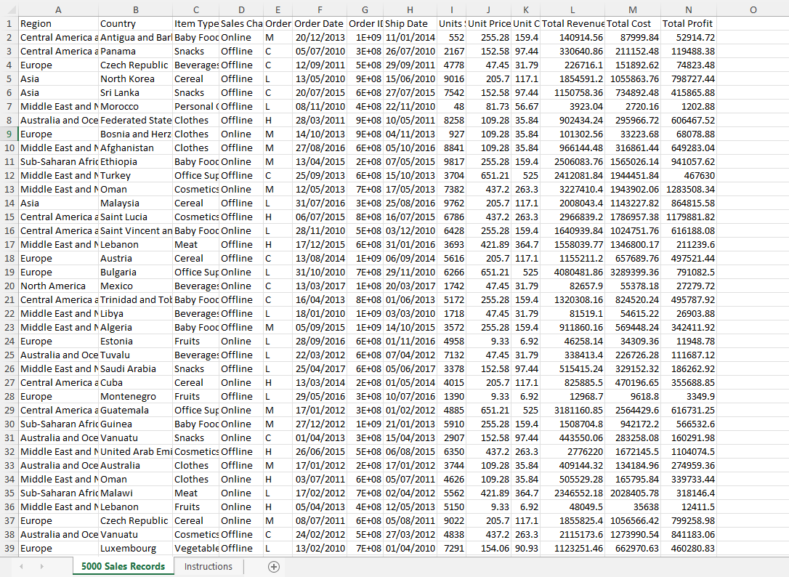
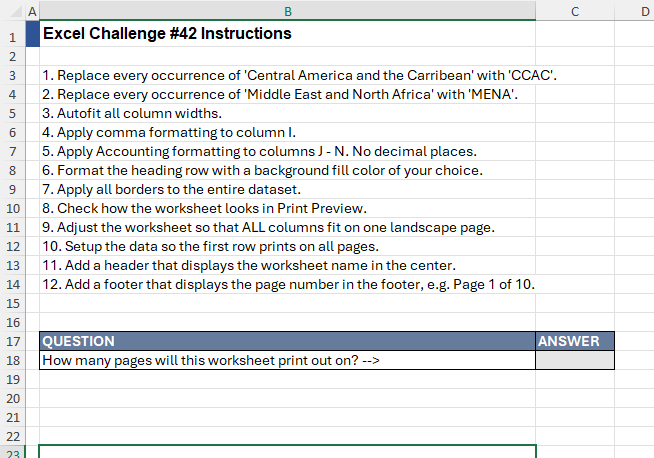
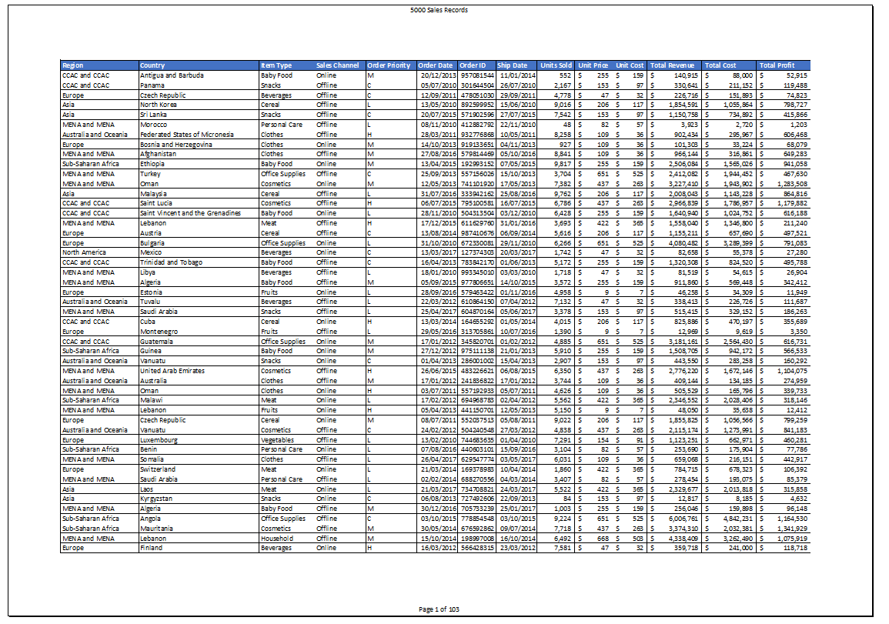

# Excel Challenge #42: Prepare an Excel Worksheet for Printing

This repository contains my solution to the Excel Challenge #42 from GoSkills. This challenge focuses on enterprise spreadsheet design normalization, data sanitization via global text replacements, financial notation formatting, and print-layout configuration for massive relational datasets.

## 📋 Task Overview

The project handles print optimization and restructuring for a massive dataset containing 5,000 rows of raw sales entries. The current worksheet configuration is entirely unreadable: formatting definitions are inconsistent, numeric records lack structured separators, and physical column headers drop off page borders during layout rendering. The operational objective is to sanitize regional text variables, adjust spatial data layouts, establish clear sheet aesthetics, and enforce pagination structures to preserve visibility across all target print zones without compromising original text scale.

### 🎯 Key Objectives:
1. **Global Text Sanitization (Task 1):** Map and replace long descriptive strings in Column A with standardized organizational acronyms (`'Central America and the Caribbean'` to `'CCAC'` and `'Middle East and North Africa'` to `'MENA'`).
2. **Column Autofit Optimization (Task 2):** Autofit all column widths simultaneously to eliminate clipped values and remove truncated text displays across the grid.
3. **Structured Financial Formatting (Task 3):** Standardize data interpretation rules by injecting comma notation to Column I and pure Accounting formatting styles to columns J:N, completely dropping trailing decimal fractions.
4. **Grid Matrix Styling (Task 4):** Define visual boundaries across the data by painting a clean solid color fill over the main header row and binding the entire dataset inside visible solid line borders.
5. **Horizontal Column Locking (Task 5):** Reconfigure the print canvas setup to ensure columns A:N lock horizontally inside a single page width, allowing rows to spill cleanly across multiple pages without splitting column tables.
6. **Repeat Header Matrix:** Force the primary header fields to automatically copy and render at the summit of every single physical printed sheet.
7. **Dynamic Page Metadata (Task 6):** Embed structural document headers containing the centered worksheet label, coupled with a page tracking footer running a standard `"Page 1 of X"` evaluation pattern.
8. **Final Template Auditing (Task 7 & 8):** Verify complete operational visibility inside the Print Preview panel and submit the required solution code inside cell C18 of the instructions sheet.

---

## 🛠️ Data Engineering & Layout Steps

* **Massive Search and Replace Execution:** Called global Find & Replace macro controls exclusively on Column A, swapping out performance-heavy regional text paths for lightweight uppercase indicators (`CCAC`, `MENA`).
* **Column Bound Adjustments:** Highlighted the complete grid framework and triggered an automatic layout autofit sequence to resolve tracking breaks and text overflow clipping.
* **Numeric Field Truncation:** Modified localized cell formats, setting Column I to integer structures using standard thousands separators, and locking columns J:N to currency matrices without decimal steps.
* **Print Area Margin Scaling:** Launched the Page Setup configuration panel, changing the orientation to Landscape to accommodate columns A:N, and anchoring the scaling ratio to "Fit All Columns on One Page".
* **Row-Pinning Print Configurations:** Utilized the "Print Titles" engine under the sheet parameter tab, setting the absolute row identifier vector (`$1:$1`) into the "Rows to repeat at top" command link slot.
* **Dynamic Canvas Canvas Fields:** Opened the Page Layout view window, injecting the internal variable token `&[Tab]` inside the center header slot, while mapping combined dynamic variables `Page &[Page] of &[Pages]` inside the lower footer margin blocks.

---

## 🏆 FINAL SOLUTION

