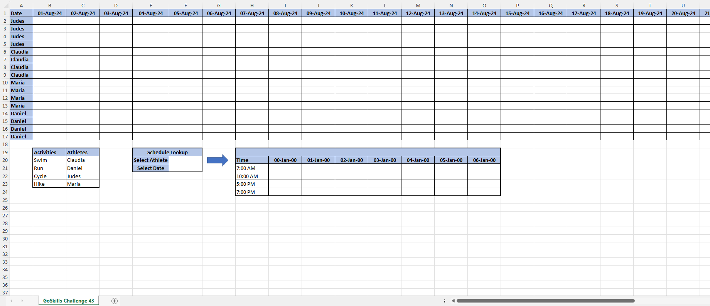
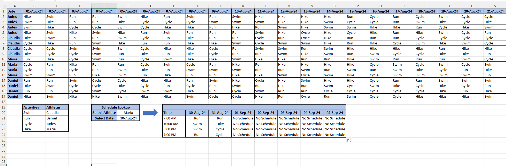

# Excel Challenge #43: Assign Random Values From a List

This repository contains my solution to the Excel Challenge #43 from GoSkills. This challenge focuses on building a dynamic, automated scheduling system that leverages modern dynamic array functions, data validation structures, and robust logical error-handling to randomize athlete training rosters across an entire month.

## 📋 Task Overview

The project requires the development of a hands-free, automated schedule for four athletes over the month of August. Each day, every athlete must be assigned one of four distinct training activities (`Swimming`, `Running`, `Cycling`, and `Hiking`) without manual duplication or static entry. Additionally, the worksheet must provide an interactive lookup engine allowing users to select parameters from localized drop-down boxes to render a rolling 7-day personalized agenda, complete with date verification guards.

### 🎯 Key Objectives:
1. **Dynamic Random Schedule Generation (Task 1):** Implement matrix-wide Excel formulas to dynamically shuffle and assign four distinct training activities across a multi-column, 31-day operational grid without manual entry.
2. **Interactive Roster Drop-Down Lookup (Task 2):** Construct a data-validated selection system where picking an athlete and a base date automatically spills a personalized, sequential 7-day activity forecast.
3. **Out-of-Bounds Error Sanitization (Task 3):** Embed criteria-driven logical handling to intercept target evaluation lookups that fall outside the active calendar month, gracefully outputting a `"No schedule"` string vector instead of breaks or native spreadsheet errors.
4. **Final Template Validation:** Confirm complete formula fluidity, verify dependency chains under active parameter changes, and submit the functional template within the repository tracking pipeline.

---

## 🛠️ Data Engineering & Lookup Steps

* **Dynamic Array Matrix Shuffling:** Deployed a combination of advanced dynamic array mechanics—utilizing functions such as `RANDARRAY` or `SORTBY` indexed against the core activity array—to instantly populate the monthly operational matrix with unique, non-repeating daily workloads per athlete.
* **Granular Parameter Data Validation:** Configured active Data Validation lists on the lookup interface to provide clean drop-down components for selecting specific athlete dimensions and date parameters.
* **Rolling Roster Extraction Routing:** Embedded a robust multi-criteria extraction formula utilizing `XLOOKUP` or `INDEX/MATCH` wrappers combined with date progression vectors (`Date + 0` through `Date + 6`) to pull a fluid 7-day sequential workload block.
* **Fault-Tolerant Logical Defenses:** Encapsulated lookup engines inside logical boundary tests (`IF`, `ISERROR`, or `IFNA`) to cross-reference targeted dates against the active August boundaries, guaranteeing seamless formatting transitions when lookups breach boundary thresholds.

---

## 🏆 FINAL SOLUTION

