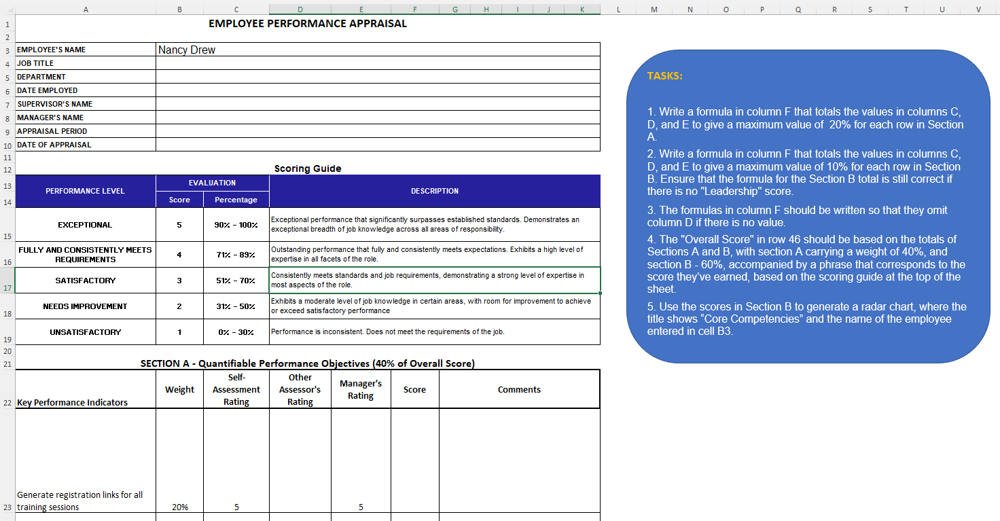
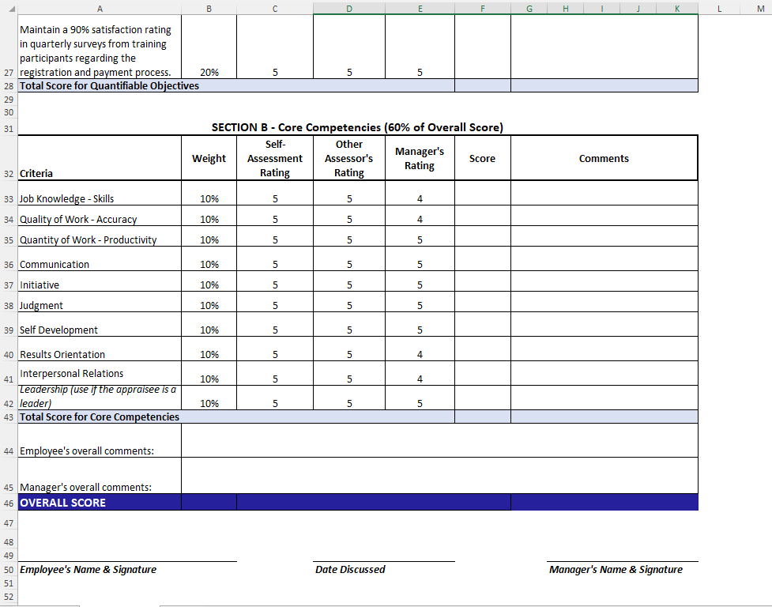
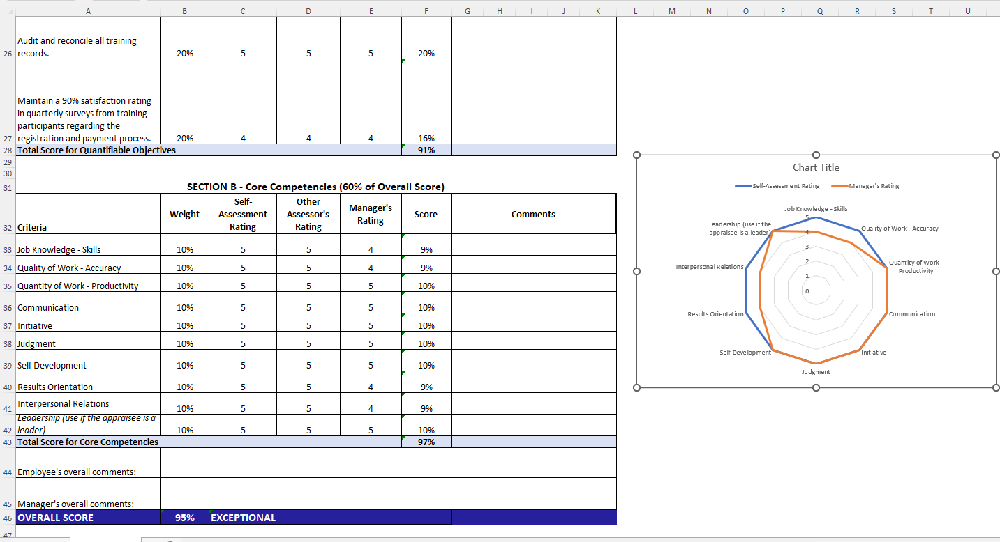

# Excel Challenge #44: Dynamic Filtering and Sorting

This repository contains my solution to the Excel Challenge #44 from GoSkills. This challenge focuses on leveraging advanced dynamic array logic, deploying dynamic search criteria parsing, and constructing automated multi-tiered sorting arrays to clean and isolate real-world corporate records.

## 📋 Task Overview

The project handles structural extraction and real-time report updating from a master company roster database. The objective is to design a light, non-destructive data filtering engine where typing raw criteria into interactive setup blocks instantly populates sorted structural lists, eliminating static data isolation methods. The solution must extract a distinct subset of workers matched by location parameters, clean broken database entries, and dynamically order the output rows alphabetically by multiple columns.

### 🎯 Key Objectives:
1. **Multi-Criteria Dynamic Extraction (Task 1):** Apply dynamic array functions to evaluate a master employee roster and extract records based on variable user input strings, ensuring immediate cascading dataset transformations.
2. **Automated Two-Tier Database Sorting (Task 2):** Implement nested sorting workflows that sequence the isolated array matrix by two structural columns (sorting primarily by Department, and secondarily by Employee Name) in a synchronized ascending order.
3. **Empty Value Sanitization (Task 3):** Structure logical filters to identify and handle empty fields within the source data matrix, preventing blank row injections from corrupting the clean visual output.
4. **Final Sheet Blueprint Auditing:** Validate formula performance against varying search parameters, maintain data integrity constraints, and deliver the final architecture inside the challenge repository.

---

## 🛠️ Data Engineering & Extraction Steps

* **Array-Based Dataset Filtration:** Built an integrated data extraction layer using the `FILTER` function to parse the entire corporate table against structural criteria parameters.
* **Complex Multi-Tiered Array Sorting:** Nested the filtered matrix inside the `SORT` or `SORTBY` engine, routing multi-index column arrays to align rows sequentially across primary and secondary fields.
* **Logical Null Value Interception:** Connected robust inclusion conditions (`<>""`) within the logical evaluation arguments to strip empty rows and filter out incomplete database fields from the final interface.
* **Dynamic Search Parameter Linkage:** Anchored the criteria conditions to active input cells, allowing instant, real-time formula recalculations when parameters are edited.

---

## 🏆 FINAL SOLUTION

