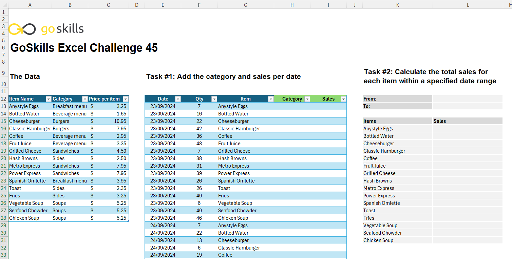
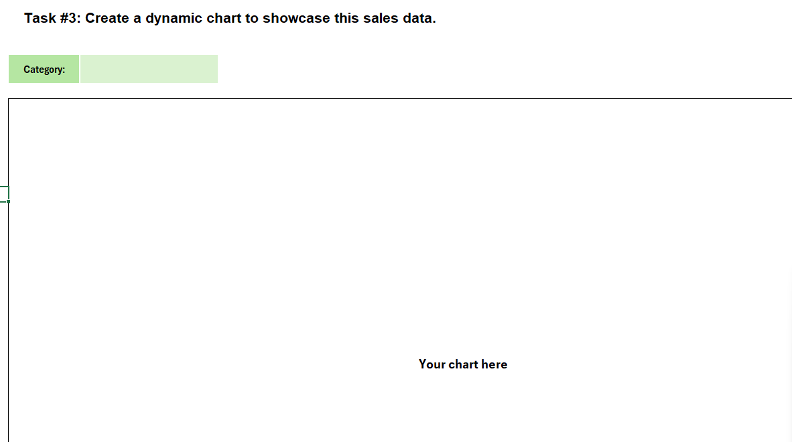
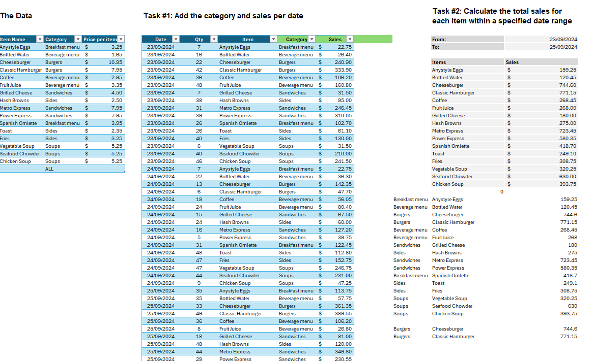
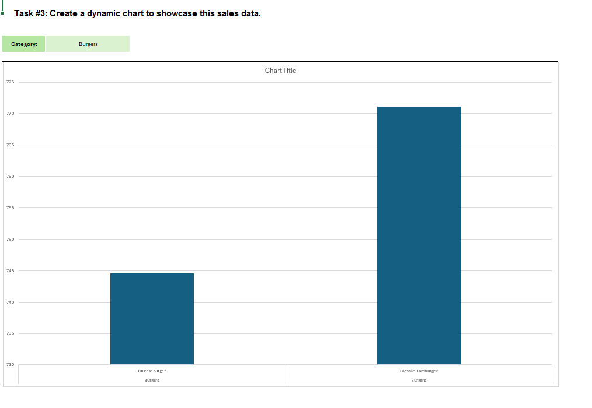

# Excel Challenge #45: Create an Interactive Sales Chart

This repository contains my solution to the Excel Challenge #45 from GoSkills. This challenge focuses on relational data mapping, conditional multi-criteria aggregation, and advanced dynamic array management to construct a fully interactive sales reporting dashboard and chart without using PivotTables.

## 📋 Task Overview

The project handles structural unification and dashboard rendering for a small restaurant's transactional logs. It processes two separate tracking sheets: a menu price index cataloged by product categories, and a daily sales registry tracking volumes over a specified period. The operational objective is to bypass static summary tables by writing responsive formulas that map classification fields, calculate gross revenue metrics, and stream data directly into a self-adjusting, sorted dashboard matrix synced to interactive date and category drop-down selectors.

### 🎯 Key Objectives:
1. **Relational Field Enrichment (Task 1):** Map cross-reference keys to inject organizational categories into the transactional log, and evaluate gross performance by calculating itemized revenue based on quantities and unit pricing.
2. **Multi-Criteria Date Bound Filtering (Task 2):** Implement dynamic data validation boundaries allowing users to isolate specified date ranges, triggering automated, real-time formula recalculations for total sales.
3. **Descending Dynamic Visualization (Task 3):** Structure a dedicated dashboard array that automatically strains and sorts items in descending order of performance, resizing dynamically according to category definitions without rendering trailing empty slots or broken zero lines.
4. **Comprehensive Consolidated Reporting:** Inject a global `"All"` parameter option into the evaluation matrix to combine disparate categorization blocks into a single consolidated corporate sales visualization.

---

## 🛠️ Data Engineering & Charting Steps

* **Cross-Table Formula Extraction:** Employed index-matching logic and multiplication formulas (`VLOOKUP`, `XLOOKUP`, or `INDEX/MATCH`) to enrich the raw transaction tables with appropriate classifications and scale itemized sales numbers.
* **Variable Timeline Summation:** Implemented relational aggregation arrays using conditional bounded functions (`SUMIFS`) to dynamically sum total sales between the target "From" and "To" input parameters.
* **Auto-Collapsing Sorting Matrices:** Deployed advanced array filters and sorting mechanisms (`FILTER` and `SORT`) to isolate active items, align performance in descending order, and truncate empty data spaces from the backend data source.
* **String-Concatenated Chart Headers:** Developed an automated naming expression utilizing text joining methods (`&` or `CONCATENATE`) to bind active dates and category parameters directly into the display title of the visualization engine.

---

## 🏆 FINAL SOLUTION

