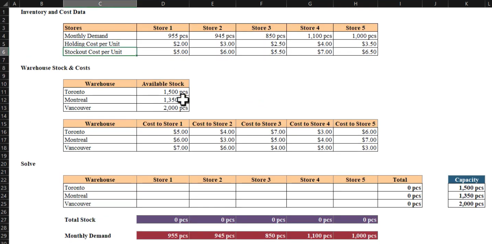
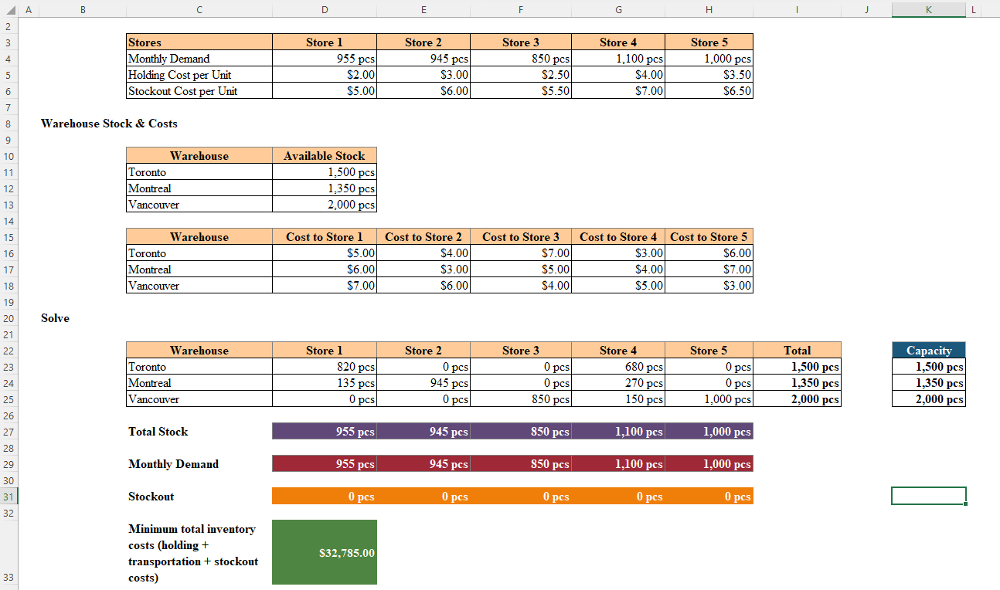

# Excel Challenge #46: Inventory Optimization With Excel Solver

This repository contains my solution to the Excel Challenge #46 from GoSkills. This challenge focuses on prescriptive analytics, linear programming optimization, multi-node supply chain allocation, and constraint-based financial modeling using the Excel Solver Add-In.

## 📋 Task Overview

The project handles logistical optimization and cost-minimization for a multi-regional supply network consisting of three corporate distribution hubs (Toronto, Montreal, and Vancouver) supplying five retail outlets (Store 1 to Store 5). The operational objective is to bypass arbitrary distribution methods by establishing a mathematically optimal shipping matrix that satisfies localized customer demand and respects regional warehouse supply limits while minimizing the cumulative operational cost profile (holding fees, stockout penalties, and line-haul transportation expenses).

### 🎯 Key Objectives:
1. **Multi-Store Demand Satisfaction (Constraint 1):** Structure the allocation network variables to ensure that the total units channeled to each of the 5 retail locations match or exceed monthly customer demand parameters to eliminate inventory deficits.
2. **Warehouse Capacity Constraints (Constraint 2):** Enforce strict capacity limits across the variable matrix so that the sum of distributed outflows from any given supply warehouse does not breach its fixed physical stock levels.
3. **Integer Allocation Enforcement (Constraint 3):** Apply integer constraint structures (`int`) across the decision variables to restrict solutions to whole shipping units, eliminating unrealistic fractional freight values.
4. **Composite Cost Minimization:** Formulate an objective target function that groups variable holding overheads, stockout penalties, and transportation routing rates into a single minimized cost ledger.

---

## 🛠️ Data Engineering & Optimization Steps

* **Linear Programming Solver Engineering:** Initialized and configured the Excel Solver engine parameters, mapping the target function cell to "Min" and assigning the cross-sectional supply matrix as variable changing cells.
* **Network Constraint Definition:** Synthesized structural array inequalities inside the Solver parameters, cross-referencing marginal totals against active localized demand matrices and warehouse capacity thresholds.
* **Discrete Variable Lockdowns:** Appended strict parameter definitions to restrict the changing cell ranges to positive integers, ensuring valid business routing execution and eliminating negative allocations.
* **Simplex LP Resolution Execution:** Configured the underlying solver processing algorithm to Simplex LP (Linear Programming) to calculate the absolute mathematical global optimum solution path efficiently.

---

## 🏆 FINAL SOLUTION

