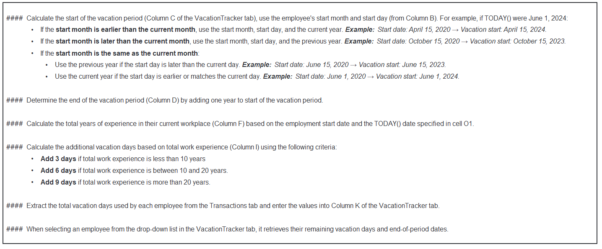
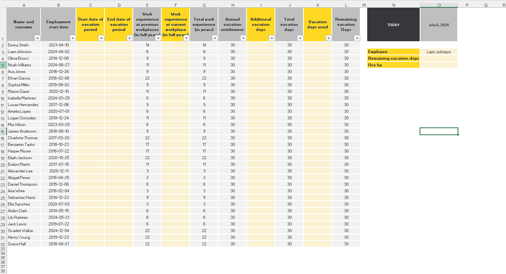
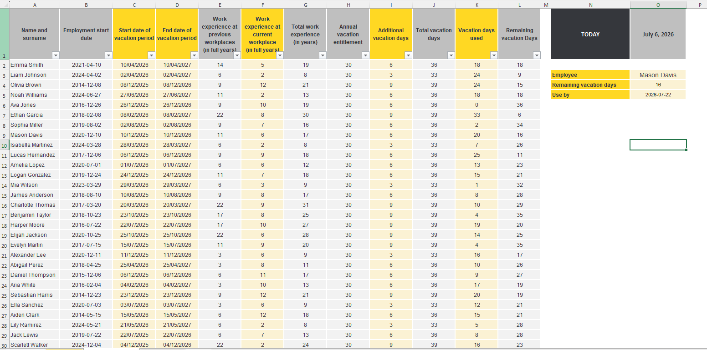

# Excel Challenge #47: Calculate Vacation Entitlement

This repository contains my solution to the Excel Challenge #47 from GoSkills. This challenge focuses on temporal data modeling, advanced logical date expressions, cross-sheet relational lookups, and transactional database validation frameworks tailored for enterprise human resources data management.

## 📋 Task Overview

The project requires the development of an automated employee time-off ledger across three dedicated relational worksheets: a foundational rules guidelines panel, a master summary tracking console, and an operational transactional data sheet. The objective is to build an error-free auditing pipeline that dynamically tracks utilized vacation periods, extracts remaining time-off allocations, computes strict expiration deadlines, and restricts transactional data entries via complex multi-date eligibility parameters.

### 🎯 Key Objectives:
1. **Dynamic Vacation Balances (Task 1):** Construct formula architectures to isolate total accumulated time off against aggregated historical entries, providing immediate insight into an employee's remaining vacation days.
2. **Automated Redemption Expiration Routing (Task 2):** Deploy advanced date manipulation metrics to determine and display the exact regulatory deadline by which an employee must redeem their current accrued time-off pools.
3. **Six-Month Employment Data Validation (Task 3):** Implement strict conditional restrictions on transactional entry tables, utilizing data validation logic to ensure the initial time bucket rejects dates that fall within the first six months of a worker's employment start date.
4. **Relational Multi-Sheet Integration:** Wire robust lookup expressions to cleanly aggregate raw data clusters from the transactional sheet directly into individual employee summary profiles without schema breaks.

---

## 🛠️ Data Engineering & Validation Steps

* **Relational Transaction Summarization:** Implemented criteria-driven conditional aggregation wrappers (`SUMIF` or `SUMIFS`) to extract and consolidate time blocks from the transactional journal into the master spreadsheet console.
* **Complex Temporal Calculations:** Utilized specific financial and HR date configurations (`EDATE`, `DATEPLUS`, or `YEARFRAC`) to model rolling accrual schedules and pin absolute calendar expiration limits based on hiring variables.
* **Proactive Gatekeeper Validation:** Anchored customized Data Validation formulas to column entries, parsing active row values against structural hire dates (`=Cell_Date >= EDATE(Hire_Date, 6)`) to lock out unauthorized early leave entries.
* **Dynamic Record Indexing Loops:** Wrapped internal matrix extractions in advanced matching functions (`XLOOKUP`, `INDEX`, or `VLOOKUP`) to maintain seamless reference flows across disparate document tables.

---

## 🏆 FINAL SOLUTION

