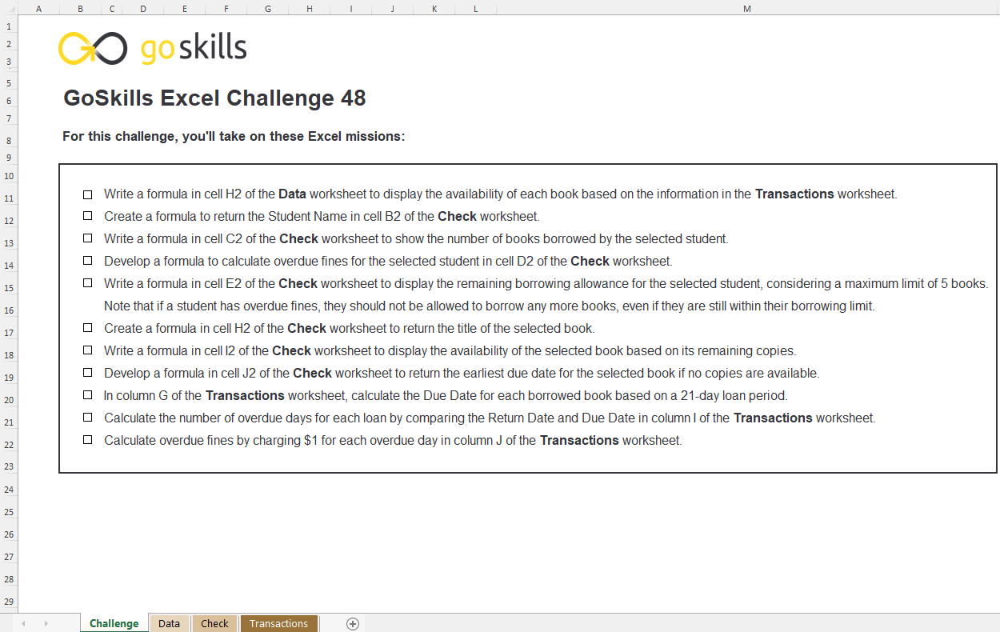
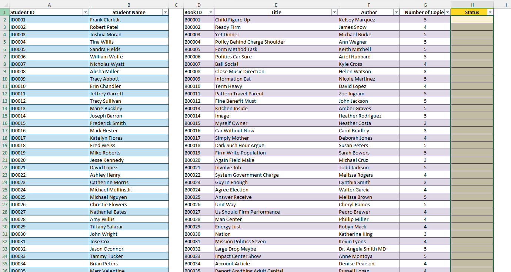
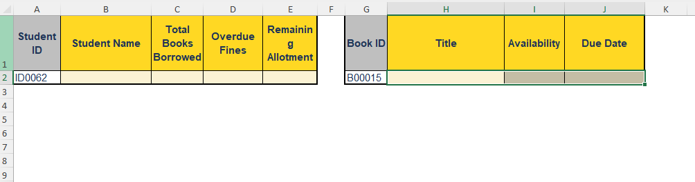
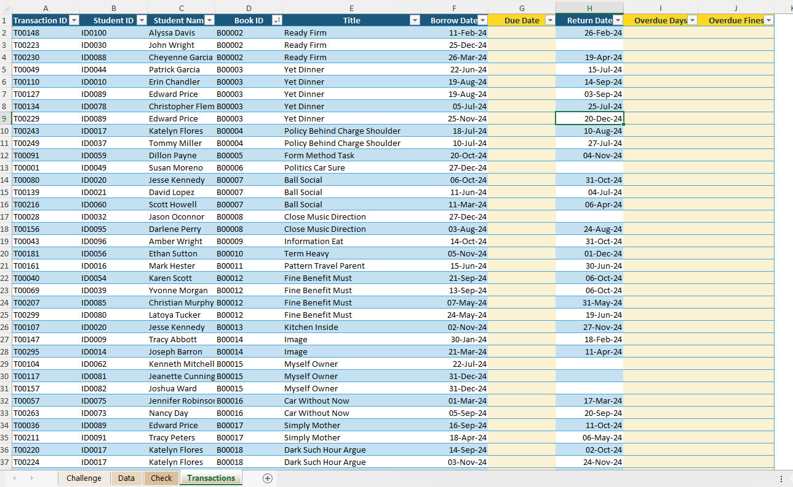
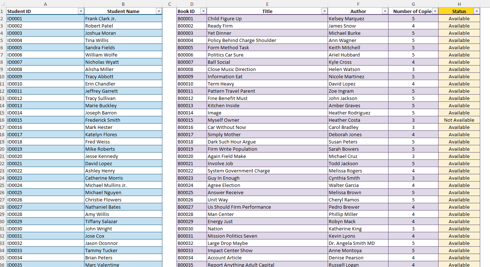
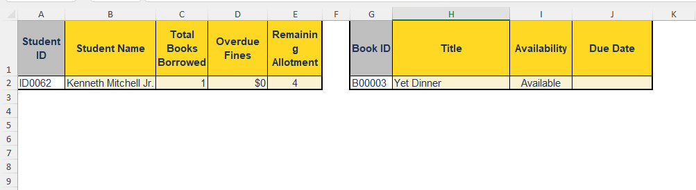
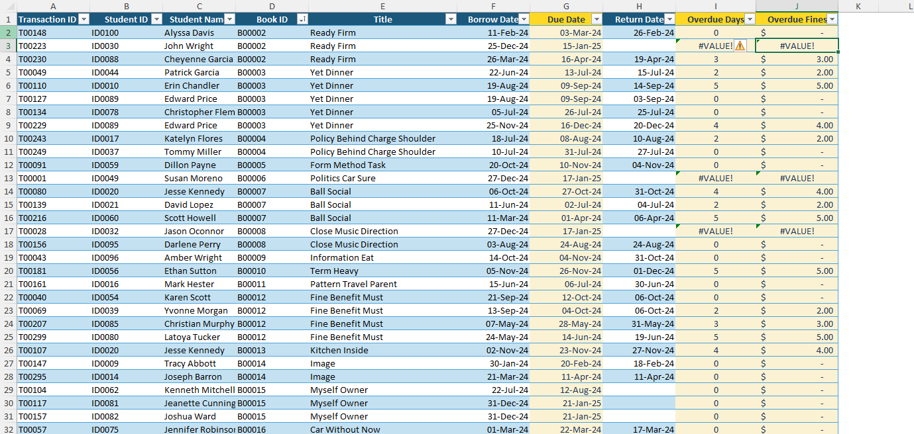

# Excel Challenge #48: Build a Library Book Tracker

This repository contains my solution to the Excel Challenge #48 from GoSkills. This challenge focuses on operational relational tracking databases, multi-criteria relational counts, conditional user-clearance checks, and localized predictive date lookups using nested spreadsheet functions.

## 📋 Task Overview

The project requires the development of an integrated library transaction ledger to automate loans, track deadlines, and handle queries for 100 students managing up to five simultaneous book allocations. Operating across separate relational tables (`Data`, `Transactions`, and `Check`), the objective is to eliminate manual auditing by writing dynamic formulas that evaluate volume inventories against real-time checkouts, enforce conditional safety limits on borrowing allowances, and construct an interactive product availability query dashboard.

### 🎯 Key Objectives:
1. **Inventory Stock Status Automation (Task 1):** Populate a real-time availability column (`"available"` vs. `"not available"`) by cross-referencing total structural copy limits against active, non-returned records.
2. **Student Allowance Verification (Task 2):** Construct a validation engine that parses a student's portfolio, instantly flags overdue fines, tracks total volumes on loan, and determines additional borrowing eligibility based on a strict 5-book constraint threshold.
3. **Earliest-Return Query Matrix (Task 3):** Design a localized search terminal that validates book titles and, if out of stock, computes and outputs the earliest date the title will become available based on active return schedules.
4. **Relational Condition Auditing:** Build robust formula networks that remain structurally sound across varying parameters, avoiding schema breaks during high-volume entries.

---

## 🛠️ Data Engineering & Tracking Steps

* **Multi-Criteria Transaction Counting:** Deployed relational counting matrices (`COUNTIFS`) across the transactional registry to isolate current borrowed copies against master catalog capacities.
* **Bounded Clearance Gatekeeping:** Embedded logical constraint models (`IF` matched with conditional threshold checks) to compare active loan parameters against fixed limits, isolating student clearance flags.
* **Chronological Return Routing:** Programmed array search filters (`MIN`, `XLOOKUP`, or `INDEX/MATCH` combinations) to isolate active return schedules, fetching the minimum expiration timestamp for out-of-stock titles.
* **Dynamic Index Dashboarding:** Linked parameters to centralized dashboard input strings, allowing user-driven dropdown alterations to instantly trigger matrix-wide formula updates.

---

## 🏆 FINAL SOLUTION

