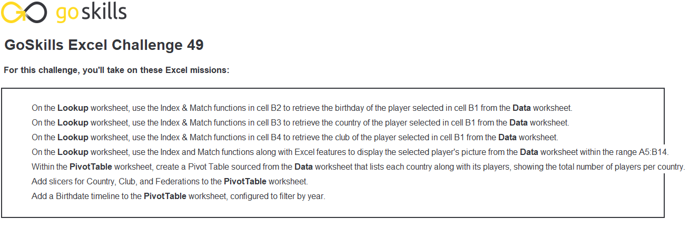
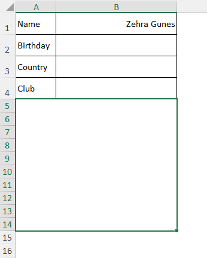
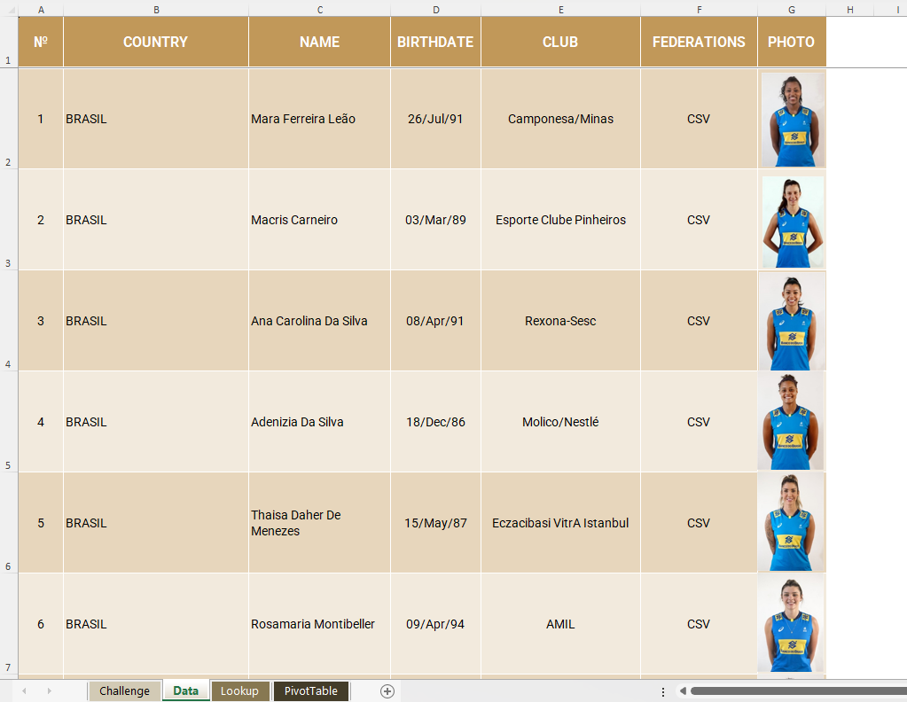
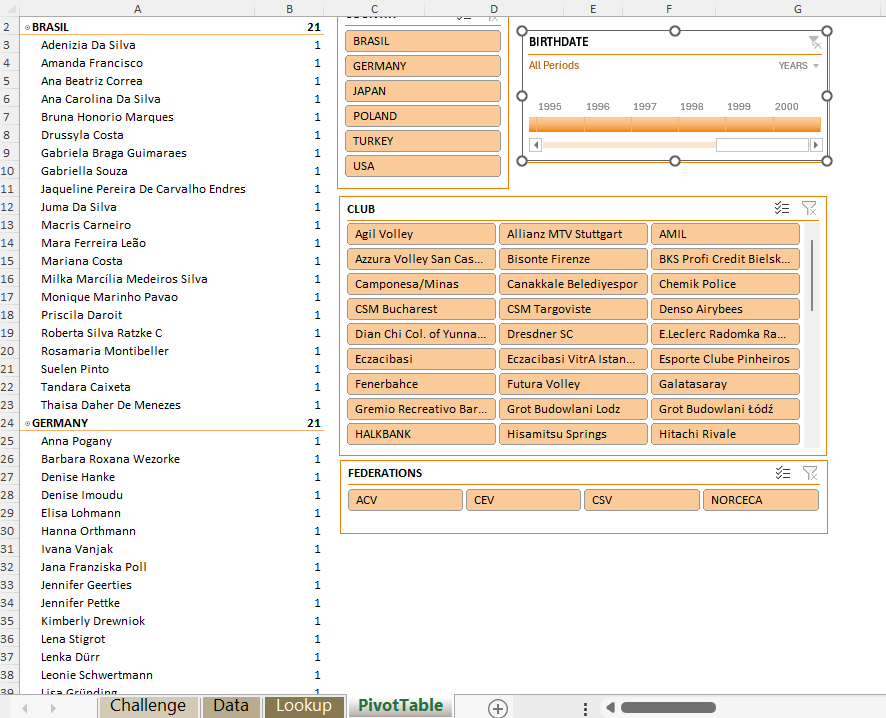
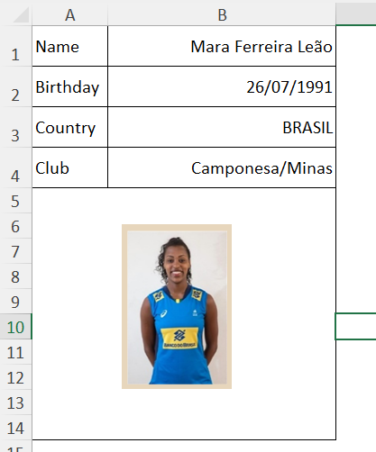

# Excel Challenge #49: Create a Dynamic Lookup Tool With Images

This repository contains my solution to the Excel Challenge #49 from GoSkills[cite: 7]. This challenge focuses on advanced structural lookups, dynamic image reference routing via named expressions, interactive data aggregation with PivotTables, and localized timeline data-slice analysis[cite: 7].

## 📋 Task Overview

The project requires building a rich player info lookup dashboard that dynamically aggregates player profiles and graphical headshots across four structural tracking sheets (`Challenge`, `Data`, `Lookup`, and `PivotTable`). Since Excel lacks a native cell image extraction function, the operational objective is to bypass this limitation by constructing fluid formula workarounds that map text metadata alongside corresponding images while engineering an analytical reporting view for historical player trend evaluations[cite: 7].

### 🎯 Key Objectives:
1. **Multi-Format Player Metadata Retrieval (Task 1):** Connect structured data-retrieval mechanisms that parse interactive user name selections to instantly fetch player text metadata (`Birthday`, `Country`, and `Club`).
2. **Dynamic Picture Lookup Routing (Task 1):** Build an active image referencing pipeline that maps graphical headshots directly into the workspace frame, swapping matching player portraits automatically[cite: 7].
3. **Multi-Slicer PivotTable Interface (Task 2):** Construct an optimized analytical PivotTable that organizes player counts by national origin, supported by contextual filtering slicers (`Country`, `Club`, and `Federation`).
4. **Chronological Age-Profile Slicing (Task 2):** Implement an active Birthday Timeline component bound to the pivot data to provide on-the-fly chronological parsing by year of birth[cite: 7].

---

## 🛠️ Data Engineering & Lookup Steps

* **Nested Matrix Lookup Orchestration:** Deployed robust reference formula clusters utilizing a flexible `INDEX` and `MATCH` combination to scan the raw information table and route matching athlete properties to the front-end dashboard.
* **Dynamic Graphic Object Binding:** Defined an explicit workbook Named Formula (`PlayerPicture`) pointing to an index mapping expression, and bound the image container canvas object directly to this named rule to create automated, fluid portrait re-rendering[cite: 7].
* **Cross-Sectional Pivot Summarization:** Initialized a responsive summary framework on the PivotTable tab, designating Country records as grouping dimensions and applying count aggregates over primary keys.
* **Multi-Dimensional Interface Slicing:** Contextually linked descriptive data dimensions into interactive visual Slicers and timeline filters, enabling non-destructive data filtering with immediate dashboard alignment[cite: 7].

---

## 🏆 FINAL SOLUTION

