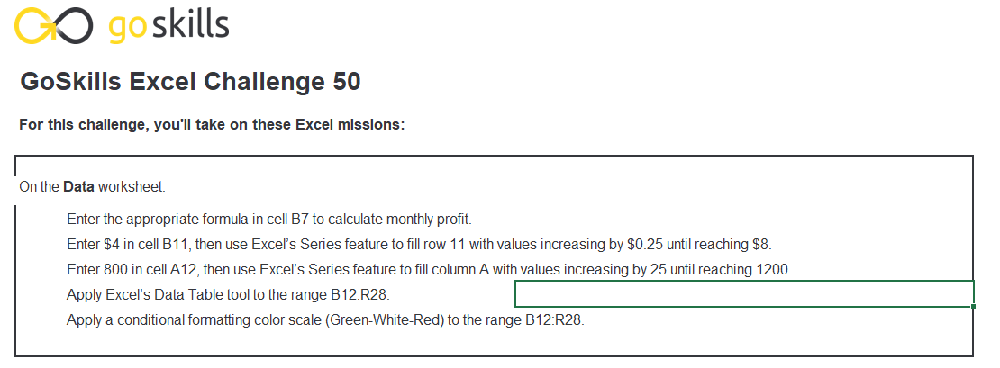
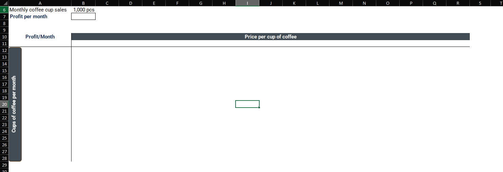
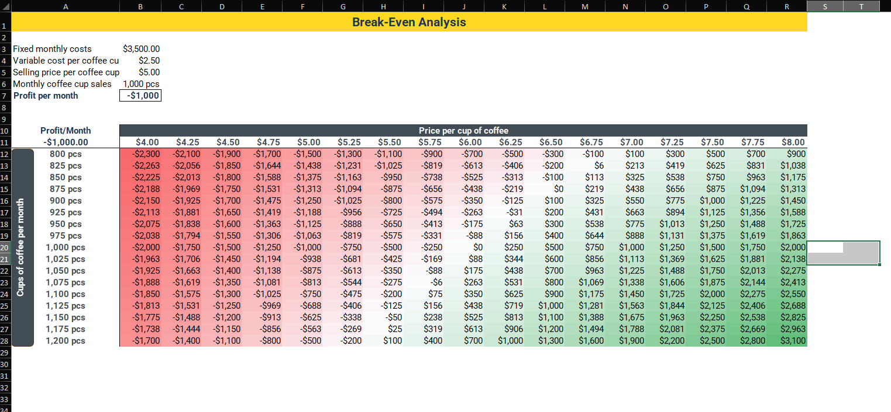

# Excel Challenge #50: Break-Even Analysis Using Data Tables

This repository contains my solution to the Excel Challenge #50 from GoSkills[cite: 8]. This challenge focuses on financial modeling, operational sensitivity forecasting, macro-driven data matrix generation, and multi-variable scenario auditing using Excel What-If Analysis Data Tables[cite: 8].

## 📋 Task Overview

The project requires developing a robust operational simulation model for a commercial coffee house to establish structural relationships between volatile consumer retail pricing and fluctuating physical sale metrics[cite: 8]. Splitting operations across two dedicated worksheets (`Challenge` and `Data`), the system computes corporate profit parameters by contrasting aggregate fixed monthly expenses with itemized unit metrics[cite: 8]. The core objective is to build a two-variable sensitivity simulation matrix that maps break-even intersection lines where total net margin values match zero exactly, backed by conditional alerting states to filter fiscal performance profiles[cite: 8].

### 🎯 Key Objectives:
1. **Formula-Driven Gross Revenue Tracking (Task 1):** Implement baseline margin equations to aggregate fixed monthly overheads against itemized sales volumes and pricing criteria to evaluate net operational yields[cite: 8].
2. **Automated Vector Interval Population (Task 2):** Populate dimensional matrix metrics via system series functions, setting a horizontal selling price line from `$4` to `$8` (in `$0.25` steps) and vertical volume thresholds from `800` to `1,200` units (in steps of `25` units)[cite: 8].
3. **Multi-Variable Matrix Sensitivity Shifting (Task 3):** Construct a non-destructive, two-variable What-If Analysis Data Table to dynamically calculate cross-sectional net margin adjustments across all variable pairings[cite: 8].
4. **Visual Risk Profile Segregation (Task 4):** Embed criteria-based Conditional Formatting configurations across the simulation fields, establishing explicit green fills for net income states, crimson masks for deficits, and blank fills to isolate the break-even zero axis[cite: 8].

---

## 🛠️ Data Engineering & Scenario Steps

* **Baseline Income Modeling:** Designed a standard cost-accounting expression in cell `B7` ($ \text{Profit} = \text{Volume} \times (\text{Price} - \text{Variable Cost}) - \text{Fixed Costs} $) to calculate immediate localized store margins[cite: 8].
* **Macro Series Range Expansion:** Executed the native Excel "Series" generation routine over row `11` and column `A` to project precise interval steps without risk of manual typing entry breaks[cite: 8].
* **What-If Calculation Interlocking:** Anchored the full cross-sectional grid boundary to the `B7` root formula, engaging the "Data Table" parameter command tool with row variables mapped to unit pricing and column variables mapped to monthly volumes[cite: 8].
* **Dual-Condition Logical Formatting:** Applied strict conditional expressions ($ >0 $ and $ <0 $) to route real-time surface colorings over the simulation canvas while shielding structural zero markers from receiving disruptive color assignments[cite: 8].

---

## 🏆 FINAL SOLUTION

