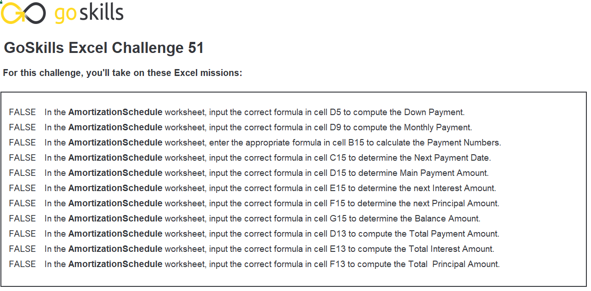
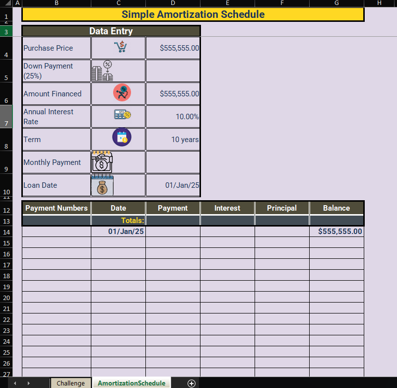
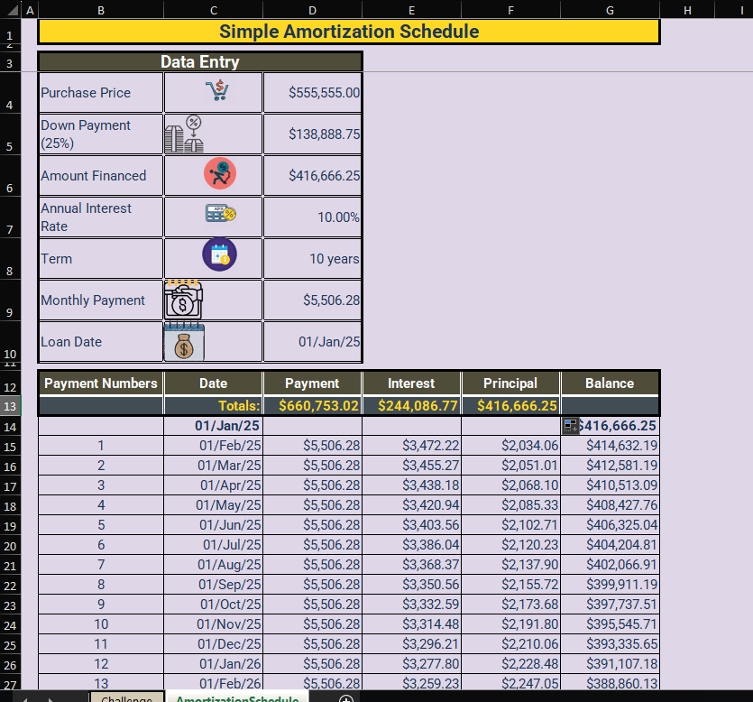

# Excel Challenge #51: Build an Amortization Schedule

This repository contains my solution to the Excel Challenge #51 from GoSkills[cite: 9]. This challenge focuses on financial modeling, credit facility structures, loan repayment forecasting, and dynamic temporal cash flow scheduling using native financial spreadsheet functions[cite: 9].

## 📋 Task Overview

The project requires constructing a comprehensive, automated amortization schedule to evaluate a fixed-rate real estate loan proposal[cite: 9]. The model handles a property purchase price of `$555,555` with a `25%` cash down payment, financing the remaining principal balance over a `10-year` term at an annual interest rate of `10%`[cite: 9]. The operational objective is to design a dynamic template that automatically structures monthly payment intervals, calculates segmented interest-principal ratios, tracks declining principal tracking lines, and maintains strategic alignment with long-term real estate alternative evaluations[cite: 9].

### 🎯 Key Objectives:
1. **Principal Loan Configuration (Task 1):** Compute the net financed principal total by extracting a precise `25%` down payment deduction from the initial base price[cite: 9].
2. **Fixed Payment Calculation (Task 2):** Implement professional financial function engines to determine the flat monthly payment obligation needed to clear the debt over a 120-period lifetime[cite: 9].
3. **Monthly Chronological Sequencing (Task 3):** Structure dynamic date arrays that initiate the active repayment cycle on `February 1, 2025`, and accurately project cascading monthly increments until maturity[cite: 9].
4. **Segmented Cash Flow Amortization (Task 4):** Write continuous tracking matrix layers that isolate interest payments, compute principal reductions, and adjust remaining balances for every distinct period[cite: 9].

---

## 🛠️ Data Engineering & Financial Steps

* **Down Payment Margin Factoring:** Developed explicit equations to compute net credit balances, stripping out localized down payment fields from gross property assets ($ \text{Loan Principal} = \$555,555 \times (1 - 0.25) $)[cite: 9].
* **Annuity Payment Modeling:** Applied the native `PMT` function inside cell `D9` using fractional monthly intervals ($ \text{Rate} / 12 $) and complete term limits ($ \text{Years} \times 12 $) to lock down constant aggregate installments[cite: 9].
* **Dynamic Time Series Projection:** Deployed sequential temporal functions (`EDATE` or custom date sequences) from cell `C15` down, formatting text strings to cleanly advance monthly timestamps across a rolling calendar sequence[cite: 9].
* **Granular Component Isolation:** Maintained strict balance book auditing parameters across rows by driving standard financial component functions—utilizing `IPMT` to isolate interest outlays and `PPMT` to calculate individual principal repayments[cite: 9].

---

## 🏆 FINAL SOLUTION

