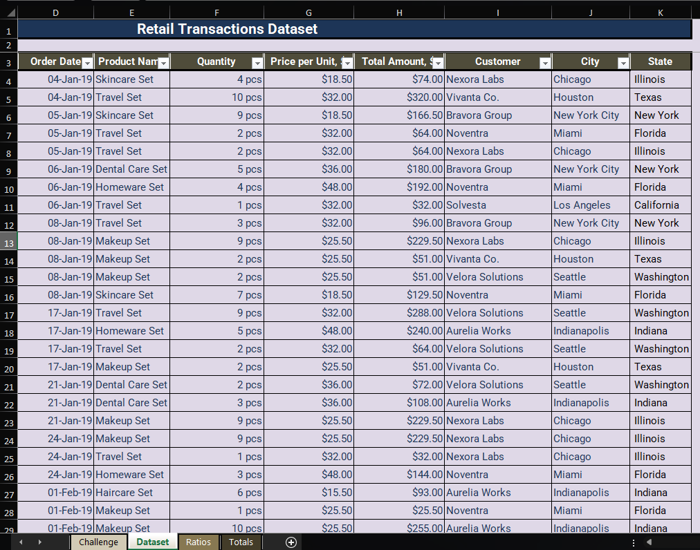
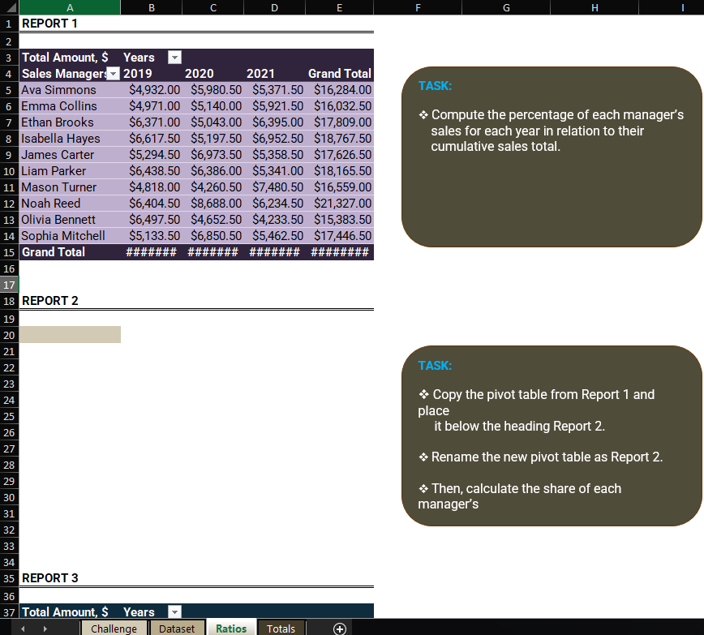
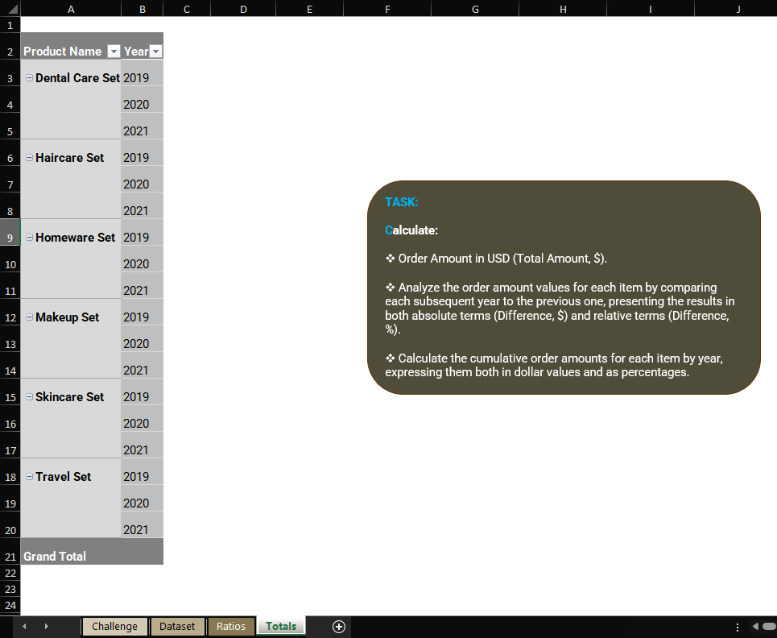
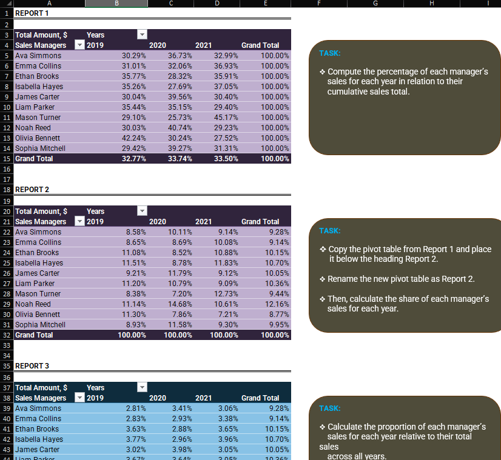
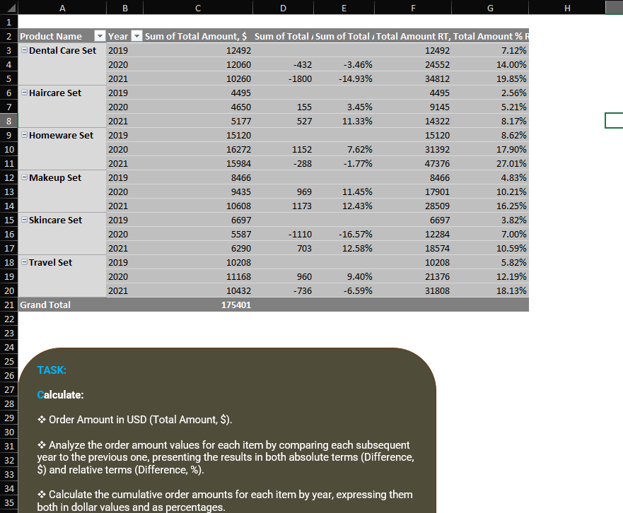

# Excel Challenge #52: Data Analysis With PivotTables

This repository contains my solution to the Excel Challenge #52 from GoSkills[cite: 10]. This challenge focuses on enterprise corporate data aggregation, advanced PivotTable configurations, year-over-year operational variance reporting, and multi-dimensional sales performance ranking workflows[cite: 10].

## 📋 Task Overview

The project handles detailed sales operations auditing and product performance trend metrics for ExcelWorld Co. over a multi-year period[cite: 10]. Navigating separate tracking worksheets (`Ratios` and `Totals`), the analytical objective is to transform raw transactional line entries into actionable executive summaries[cite: 10]. The process avoids static hardcoded cells by configuring dynamic, multi-tier PivotTable calculation views to evaluate team market-share ratios, rank account managers, track year-over-year volumetric variations, and chart cumulative structural product contributions[cite: 10].

### 🎯 Key Objectives:
1. **Manager Multi-Year Sales Allocation:** Configure calculation settings within PivotTables to isolate individual team members' annual sales weights relative to their cumulative lifetime output[cite: 10].
2. **Dynamic Performance Leaderboard Ranking:** Construct continuous multi-year rank parameters that automatically order sales managers based on absolute annual turnover, assigning the top performing resource to the 1st tier[cite: 10].
3. **Year-over-Year Delta Variance Auditing:** Build absolute ($) and relative (%) structural field deltas across consecutive calendar years to calculate exact product volume variance shifts[cite: 10].
4. **Cumulative Matrix Contribution Tracking:** Deploy dynamic multi-period running totals alongside percentage contributions to evaluate cumulative item trends systematically[cite: 10].

---

## 🛠️ Data Engineering & Analysis Steps

* **Advanced Pivot Field Re-Calculation:** Leveraged standard PivotTable data display modes ("Show Values As") to instantly overlay relative configurations like `% of Row Total` and `% of Column Total` over raw dollar arrays[cite: 10].
* **Leaderboard Rank Configuration:** Programmed dynamic ranking criteria using the `"Rank Largest to Smallest"` calculation rule, indexing output nodes across multi-year temporal vectors[cite: 10].
* **Automated Comparative Delta Mapping:** Initialized custom YoY difference metrics by deploying the `"Difference From"` and `"% Difference From"` computation models, using Year as the base field and setting the reference parameter to `Previous`[cite: 10].
* **Running Total Aggregation Routing:** Set up compound contribution streams across product categories using the specialized `"Running Total In"` and `"% Running Total In"` options to model rolling baseline distributions cleanly[cite: 10].

---

## 🏆 FINAL SOLUTION

